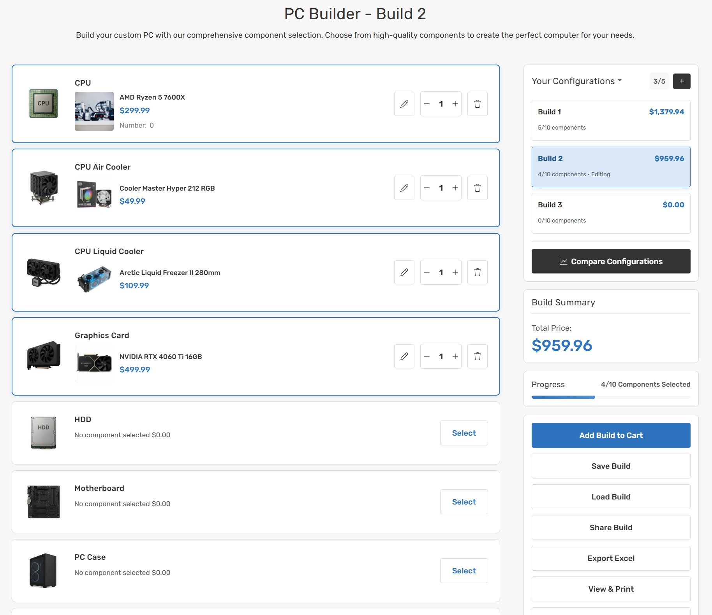

# Release Notes

## 1.2.2 (10-03-2025)
- Fix currency symbol and add to cart url for product card rendered by graphql

## 1.2.1 (09-12-2025)
- Add theme settings: show custom fields on card.
- Add a section to display the payment promotion widget in the cart drawer.

## 1.2.0 (08-01-2025)
- Complete PC Builder Feature + Laptops Theme Variant Implementation (#108)

  

  

- Add card style options and header font settings in theme editor.

  

- Add custom fields and starting price label in theme editor.

  

- Update button styles and add input radius settings in theme editor.
- Update theme editor to add section alignment and brand styles.

  

  

- Add theme editor for product_col_l, product_col_xl.
- Update customer reviews widget styles and introduce new responsive design elements.
- Style callout icons widgets for laptop variant.
- Style leaderboard for laptop variant.
- Update product columns config for laptop variant.

## 1.1.0 (05-09-2025)
- Release Sofas style
- add option to display video on hover product card
- update product card image display to use object-fit: cover for better visual presentation
- [CORNERTSONE] Quick pay buttons are seen on PDP before 'required' option selection (#105)
- [CORNERTSONE] Update to support multiple date fields and remove blank space (#106)

## 1.0.1 (04-18-2025)
- fix leaderboard banner content direction not follow widget settings
- fix modal of configure product options in cart cannot scroll on mobile at first time
- disable debug log
- fix close icon of modifier modal overlaps in quick-view modal
- fix old price not strike-through on Safari/iOS
- fix option not display as stepper in edit cart item popup
- tweak spacing of cart drawer popup

## 1.0.0 (04-02-2025)
- initial release
