# Usage Guide

## Get Started

Thanks for using our theme!

To set up the theme exactly like our demo stores, you may need to install the our free app **[PapaThemes Widgets](https://www.bigcommerce.com/apps/papathemes-widgets/)**. This app provides additional widgets to build the content in Page Builder visually without coding skill. 

For displaying your Instagram photos on your website, you can use our free tool **[PapaThemes Instagram](https://instagram.papathemes.com/)**. We will guide you step by step later in this manual.

### Customizing Typography, Fonts and Colors

Customizing Typography, Fonts and Colors, Buttons in **Page Builder** > **Theme Styles** > **General**. There are dozens of options to help you customize your website beautifully and uniquely.

### Customizing Checkout Page's Typography and Colors

Customizing the checkout page's typography and colors in **Page Builder** > **Theme Styles** > **Optimized Checkout**

### Installing PapaThemes Widgets App

Find and install **[PapaThemes Widgets](https://www.bigcommerce.com/apps/papathemes-widgets/)** app from [BigCommerce Apps Marketplace](https://www.bigcommerce.com/apps/).

After installed, go to your admin page, on the left sidebar, click **Apps** >** My Apps**, click **Launch** button of PapaThemes Widgets app to open the app:


Then click the Install buttons in turn to install all available widgets:


Go to **Storefront** > **My Themes** > click **Customize** in dropdown menu of Dinosaur theme to open Page Builder. Select any theme style to start:


Verify the widgets installed successfully if they appear in Page Builder:


## Setting Up Glasses Style Home Page

To start customizing the theme, login to your admin panel, go to **Storefront** > **My Themes**, click **Customize** button next to theme thumbnail.

### Multistore guide


To display the multistore guide on top header, drag and drop the HTML widget to the corresponding position, paste the given code below to the HTML editor, then click Save HTML button.

```html
<div class="header-multi-storefront">
<a href="/bath/">Shop Kid</a>
<a class="active-page">Shop Men</a>
<a href="/kitchen/">Shop Women</a>
</div>

```

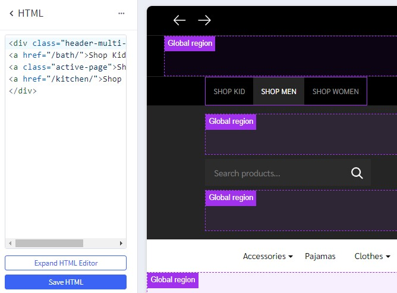

### Header


To configure the header, click on **Theme Styles** > **Header** section, here you can config the header colors, store logo position and size.

**User Navigation** allows to change colors of the icon phone, cart.

**Top Bar** section allows to change color of this top bar.

**Watch the instruction video:**

<iframe width="760" height="515" src="https://www.youtube.com/embed/AFpgodrjqxg?si=5kDqYIO4jkK4WyX5" title="YouTube video player" frameborder="0" allow="accelerometer; autoplay; clipboard-write; encrypted-media; gyroscope; picture-in-picture; web-share" allowfullscreen></iframe>

To edit the background of the top header, click on Theme **Styles** > **Header**. Dinosaur theme provides users with three options to change the background by modifying the **Background Image Link** field as shown below:

- `blank`: leave the field empty, the background will be specified follow **Background color** field.


- `default`: Top header will use the default image of the theme to set as background header.


- `link`: Top header will be the link you provided in the input to set the background.


#### Quick search

**Quick Search** allows user to change the colors of the search form.

To configure the **Quick Search**, click on **Theme Styles** > **Header**. In **Quick Search** section you can change text colors, hover, border, and background of the search field.

To change popular search keywords, type your text in **popular search keywords** field as picture below.


#### Main Navigation

**Main Navigation** allows to customize this navigation bar like changing the menu type to column, dropdown menu or mega menu; changing colors of the top menu as well as the sub-menus. There is an option "**Hide webpage links**" that allows to hide the static web page links on the main navigation.

To configure the Main navigation, click on **Theme Styles** > **Header**. In **Main navigation** section you can change:

- **Root menu item color**: text color of root menu item.

- **+ Hover**: text color on hover on the root menu item.

- **+ Background**: background color of sub menu block.

- **+ Border color**: border-color bottom of main navigation.

- **Sub menu item color**: text color of the submenu item.

- **+ Hover**: text color on hover on the submenu item.

- **+ Background**: background color of the submenu item.


To config style of main navigation, click on **Theme Styles** > **Header**. In **Main navigation** select **Menu style**. The theme offer 3 option as below:

- `Mega menu`: show submenu under Mega menu style. **Mega menu** allow user insert banner and product into it


- `Dropdown`: show sub-menu item as dropdown style.


- `Column`: show sub-menu item as column style.


To create banner on Megamenu, in **Header** find and checked **Show widgets in mega menu** to show **edit menu widget** button.

Click on **edit menu widget** button to open Mega menu in design mode.


To customize Banner on bottom of sub menu on mobile. Drag and drop **Flex Banners | PapaThemes Beautify** into corresponding position:


In **Column 1**, set padding = `0`.

Click **Settings** of **Flex Banners | PapaThemes Beautify**. In `Row wrap`, choose `Row no wrap on table` and `Row no wrap on mobile`.


Remove all banner except banner 1. Selet your image want to upload. Set `Image width` = `350px`, `Image height` = `209px`. Set `Border radius` = `0px`.

In **CONTENT**, hide `Heading text`.


Duplicate 1 banner to 2 banners.

To hide on desktop and show on mobile. Drag and drop **Responsive | PapaThemes** on top **Flex Banners | PapaThemes Beautify** created.

In **Screen Size 1**. Set `Max` = `800px` and set `Display` = `Show`.

In **Screen Size 2**. Set `Min` = `801px` and `Max` = `0px`. Set `Display` = `Hide`.


#### Hide webpage links

To hide Weboage links such as **Contact us**, **About Us**, **Shipping and return** from header, in **Themes style** > **Header** Find **Hide Webpage links** option checked to hide all the links except **Categories** link.

If you only want to hide some specific links not all the link you can do following step:

- `+ Begining` field: input the order link you want to show.
- `+ Limit` field: input number web link you want to show after begining field.

For example: if you only want show **Theme Features** and **shipping & return**:
- Begining field: 2;
- limit field:  2;

Note: the order will only count non-categories link.

Before:


Affer:


**Watch the instruction video:**

<iframe width="760" height="515" src="https://www.youtube.com/embed/8gJ2qS92AUg?si=zJJ9CwFmVu0Jk1HQ" title="YouTube video player" frameborder="0" allow="accelerometer; autoplay; clipboard-write; encrypted-media; gyroscope; pictre-in-picture; web-share" allowfullscreen></iframe>

### Top Banner

Go back to **Storefront** > **My Themes** > click **Customize** button beside the theme thumbnail. You can see the top banner appears above the header. To change the colors of the top banner, go to **Theme Styles** > **General** > **Top banners** section. Here you can change the text color and the background color.

**Watch the instruction video:**

<iframe width="760" height="515" src="https://www.youtube.com/embed/NL1QiC3INpU?si=oMcyYeScMlBQl28f" title="YouTube video player" frameborder="0" allow="accelerometer; autoplay; clipboard-write; encrypted-media; gyroscope; picture-in-picture; web-share" allowfullscreen></iframe>


You can also create **top banner** by drag and drop **HTML widget** into corresponding position:

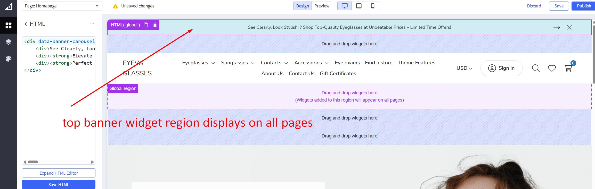

Enter your content inside `<p></p>`.

```html
<p>Get a discount with our limited time offer - Use code&nbsp;<strong>SAVE10</strong>&nbsp;for&nbsp;<strong>10%</strong>&nbsp;off your purchase!</p>
<p>Dive into our newest collection of eco-friendly products! Let's make a difference together.</p>
<p>Discover the beauty of handcrafted artisanal items in our latest collection. Every piece tells a story.</p>

```

### Ad Banner Top header

To display the ad banner appearing on all pages on the header, drag and drop the HTML widget to the corresponding position, paste the given code below to the HTML editor, then click Save HTML button.

```html
<p>STAY AHEAD OF THE STYLE CURVE WITH OUR LATEST ARRIVALS -<a href="/shipping-returns/" style="font-weight: 500"> Discover Now</a></p>
```

**Watch the instruction video:**

<iframe width="760" height="515" src="https://www.youtube.com/embed/bxD_I4ZbMi0?si=b9dDgPVcNsiazSX5" title="YouTube video player" frameborder="0" allow="accelerometer; autoplay; clipboard-write; encrypted-media; gyroscope; pictre-in-picture; web-share" allowfullscreen></iframe>

### Discount banner


Drag & drop **Responsive | PapaThemes** to the corresponding position. In **SCREEN SIZE 1** set **Min** = `320px`, set **Max** = `801px` and change **Display** = `Hide`. To hide banner in tablet and mobile.

Drag & drop **Flex Banners | PapaThemes Beautify** below **Responsive | PapaThemes** widget, remove all banner except banner 1. Set **Image width** = `1170px` and **Image height** = `100px`.

In **Border radius** set `0px`.

In **Content**, hide **Heading text**.

In **General**, choose edit **Padding**, **Desktop** set **Left** and **Right** = `0`, **Top** = `20`, **Bottom** = `20`.

**Watch the instruction video:**

### Main Carousel

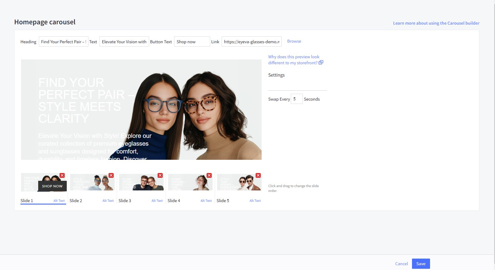

Upload the carousel images in **Storefront** > **Home Page Carousel**.

Go back to **Page Builder**, in **Theme Styles** > **Home Page**, make sure **Carousel** > **Show carousel** is selected. You can change the carousel styles and colors here.

To adjust the image height in mobile view, simply modify the **Mobile Image Height** to your preferred dimension.

**Watch the instruction video:**

<iframe width="760" height="515" src="https://www.youtube.com/embed/IvW6T-P3Oxs?si=vGlWYu6UDo4n11HP" title="YouTube video player" frameborder="0" allow="accelerometer; autoplay; clipboard-write; encrypted-media; gyroscope; pictre-in-picture; web-share" allowfullscreen></iframe>

### Policy Delivery and Hotline Banner


In **Page Builder**, drag & drop **Layout** widget to the corresponding position. In **Layout background**, select `Color` in **Background** and set **Background color** = `#252424`

Change **Column** = `1`, set **Padding** = `0 0 0 0`.

Drag & drop **Callout Icons | PapaThemes Beautify** widget. Delete all other callouts except the first one.

For the **Width**, select the unit `%` and specify the values for different devices as follows: **Desktop** = `25%`, **Tablet** and **Mobile** = `40%`.

In the **Padding** section, set the values for different devices as follows: **Desktop** = `30 30 30 30`, **Tablet** and  **Mobile** = `20 20 20 20`.


Select your desired icon in the **Icon** section.

If your desired icon is not available in the widget, select **Custom** in **Icon** and paste code svg in text box, click **Save HTML**. Paste the link into the designated Link box.

`Return & Exchange`:


```html
<svg width="41" height="41" viewBox="0 0 41 41" fill="none" xmlns="http://www.w3.org/2000/svg">
<path d="M20.5 8.45103C13.8561 8.45103 8.45103 13.8562 8.45103 20.5C8.45103 27.1438 13.8561 32.549 20.5 32.549C27.1438 32.549 32.5489 27.1438 32.5489 20.5C32.5489 13.8561 27.1438 8.45103 20.5 8.45103ZM20.5 30.1466C15.1808 30.1466 10.8534 25.8191 10.8534 20.5C10.8534 15.1809 15.1808 10.8534 20.5 10.8534C25.8192 10.8534 30.1466 15.1808 30.1466 20.5C30.1466 25.8192 25.8192 30.1466 20.5 30.1466Z" fill="#C72E2E"/>
<path d="M19.701 18.9634C19.701 18.6952 19.9469 18.4718 20.7179 18.4718C21.3995 18.4718 22.1258 18.6617 22.8968 19.0528L23.6902 17.1421C23.0533 16.7844 22.2487 16.5722 21.4218 16.4939V15.2983H19.8463V16.5163C18.0137 16.7732 17.0975 17.8348 17.0975 19.0975C17.0975 22.0139 21.4218 21.2206 21.4218 22.2039C21.4218 22.4721 21.1537 22.6285 20.405 22.6285C19.5446 22.6285 18.5613 22.3492 17.8238 21.9134L16.9745 23.8353C17.645 24.2488 18.7289 24.5505 19.8463 24.6175V25.802H21.4218V24.5617C23.1538 24.26 24.0254 23.2096 24.0254 22.0028C24.0254 19.1198 19.701 19.902 19.701 18.9634Z" fill="#C72E2E"/>
<path d="M40.8782 18.2724L38.4887 18.5365C38.9355 22.5788 37.9786 26.7111 35.7943 30.1722C33.5796 33.6811 30.1889 36.3408 26.2464 37.6614C24.359 38.2935 22.4202 38.5964 20.4999 38.5962C14.9568 38.5959 9.57724 36.0708 6.10081 31.6574H8.48105V29.2533H2.05302V35.9775H4.45713V33.4453C6.74961 36.2366 9.78777 38.4132 13.2372 39.6973C15.568 40.565 18.0268 41 20.4825 41C22.6928 41 24.9007 40.6475 27.0099 39.941C31.4761 38.445 35.3178 35.4314 37.8271 31.4554C40.3011 27.5356 41.3847 22.8538 40.8782 18.2724ZM5.12106 10.9781C7.33546 7.40032 10.7563 4.69256 14.7534 3.35358C18.6459 2.04982 22.7407 2.09122 26.5955 3.47369C29.6057 4.55331 32.2894 6.42754 34.3366 8.84894L32.0456 8.84814L32.0448 11.2522L38.5441 11.2544V4.83094H36.14V7.25931C33.825 4.53553 30.7989 2.42715 27.4071 1.21068C23.0392 -0.355725 18.3995 -0.403051 13.9899 1.07399C9.46177 2.59075 5.58615 5.65879 3.0769 9.71282C0.600326 13.7142 -0.433323 18.4739 0.166302 23.1151L2.55055 22.807C2.02147 18.712 2.93436 14.5111 5.12106 10.9781Z" fill="#C72E2E"/>
</svg>
```

`Quality guarantee`:


```html
<svg width="35" height="41" viewBox="0 0 35 41" fill="none" xmlns="http://www.w3.org/2000/svg">
<path d="M17.5 0L0 6.36899V20.5255C0 36.521 16.9823 40.873 17.1529 40.9168L17.5 41L17.8471 40.9168C18.0177 40.873 35 36.521 35 20.5255V6.36899L17.5 0ZM32.0833 20.5255C32.0833 33.192 19.8188 37.3193 17.5058 37.9848C15.2746 37.3237 2.91667 33.0826 2.91667 20.5255V8.4122L17.5 3.10569L32.0833 8.4122V20.5255Z" fill="#C72E2E"/>
<path d="M9.78104 19.4937L7.71896 21.5574L14.5833 28.4269L27.281 15.7196L25.219 13.656L14.5833 24.2997L9.78104 19.4937Z" fill="#C72E2E"/>
</svg>
```

`Free Delivery`:


```html
<svg width="58" height="39" viewBox="0 0 58 39" fill="none" xmlns="http://www.w3.org/2000/svg">
<path d="M57.3706 18.2462L53.8576 14.985C53.6181 14.7627 53.4344 14.487 53.3215 14.1802L50.5627 6.68298C50.1681 5.62638 49.4612 4.71521 48.5361 4.07091C47.611 3.42661 46.5116 3.07978 45.3846 3.07665H41.2046V1.90306C41.2046 1.39837 41.0043 0.914341 40.6477 0.557466C40.2911 0.200591 39.8075 0.000100328 39.3032 0.000100328H14.0416C13.6658 -0.00433001 13.303 0.13812 13.0304 0.397171C12.7578 0.656222 12.597 1.01145 12.582 1.38734C12.5785 1.57524 12.6124 1.76196 12.6818 1.93657C12.7513 2.11119 12.8548 2.27021 12.9863 2.40434C13.1178 2.53847 13.2748 2.64501 13.4479 2.71775C13.6211 2.79049 13.807 2.82796 13.9947 2.82797H38.3789V15.0973C38.3789 15.602 38.5792 16.086 38.9358 16.4429C39.2924 16.7998 39.776 17.0003 40.2803 17.0003H51.7636L55.1741 20.072V31.5302H52.0822C51.7743 30.1819 51.0182 28.9781 49.9376 28.1159C48.857 27.2537 47.5159 26.7841 46.1339 26.7841C44.7519 26.7841 43.4108 27.2537 42.3302 28.1159C41.2496 28.9781 40.4934 30.1819 40.1855 31.5302H30.6712C30.3633 30.1819 29.6072 28.9781 28.5266 28.1159C27.4459 27.2537 26.1049 26.7841 24.7228 26.7841C23.3408 26.7841 21.9998 27.2537 20.9191 28.1159C19.8385 28.9781 19.0824 30.1819 18.7745 31.5302H14.0415C13.6656 31.5258 13.3028 31.6683 13.0302 31.9274C12.7577 32.1865 12.5968 32.5418 12.582 32.9178C12.5785 33.1057 12.6124 33.2924 12.6818 33.467C12.7513 33.6416 12.8548 33.8006 12.9863 33.9348C13.1178 34.0689 13.2748 34.1754 13.4479 34.2481C13.6211 34.3209 13.807 34.3583 13.9947 34.3583H18.7983C19.1255 35.6832 19.8868 36.8602 20.9606 37.7015C22.0343 38.5429 23.3587 39 24.7225 39C26.0862 39 27.4106 38.5429 28.4843 37.7015C29.5581 36.8602 30.3194 35.6832 30.6466 34.3583H40.2096C40.5368 35.6832 41.2981 36.8602 42.3718 37.7015C43.4456 38.5429 44.77 39 46.1337 39C47.4974 39 48.8218 38.5429 49.8956 37.7015C50.9694 36.8602 51.7306 35.6832 52.0579 34.3583H56.0985C56.6028 34.3583 57.0864 34.1578 57.443 33.801C57.7996 33.4441 58 32.9601 58 32.4555V19.6605C57.9998 19.3938 57.9437 19.1301 57.8353 18.8865C57.7269 18.6429 57.5686 18.4248 57.3706 18.2462ZM41.2046 14.1728V5.9044H45.3846C45.9349 5.90591 46.4717 6.07524 46.9234 6.38983C47.375 6.70442 47.7202 7.14932 47.9128 7.66523L50.3212 14.1728H41.2046ZM24.7225 36.1717C24.0743 36.1717 23.4407 35.9794 22.9017 35.619C22.3628 35.2586 21.9427 34.7463 21.6947 34.147C21.4466 33.5476 21.3817 32.8882 21.5082 32.2519C21.6347 31.6157 21.9468 31.0313 22.4051 30.5726C22.8635 30.1139 23.4475 29.8015 24.0832 29.675C24.719 29.5484 25.3779 29.6134 25.9768 29.8616C26.5756 30.1099 27.0874 30.5303 27.4475 31.0697C27.8076 31.6091 27.9998 32.2432 27.9998 32.8919C27.9988 33.7615 27.6532 34.5952 27.0388 35.21C26.4244 35.8249 25.5914 36.1708 24.7225 36.1717ZM46.1338 36.1717C45.4856 36.1717 44.8519 35.9794 44.313 35.619C43.774 35.2586 43.3539 34.7464 43.1058 34.147C42.8578 33.5477 42.7929 32.8882 42.9193 32.252C43.0458 31.6157 43.3579 31.0313 43.8163 30.5726C44.2746 30.1139 44.8586 29.8015 45.4943 29.675C46.1301 29.5484 46.789 29.6134 47.3879 29.8616C47.9867 30.1099 48.4986 30.5303 48.8587 31.0697C49.2188 31.6091 49.411 32.2432 49.411 32.8919C49.41 33.7615 49.0644 34.5951 48.45 35.21C47.8356 35.8249 47.0026 36.1707 46.1338 36.1717Z" fill="#C72E2E"/>
<path d="M7.96133 10.7384H23.9842C24.3589 10.7384 24.7183 10.5894 24.9833 10.3242C25.2483 10.059 25.3972 9.69932 25.3972 9.32427C25.3972 8.94923 25.2483 8.58955 24.9833 8.32435C24.7183 8.05916 24.3589 7.91017 23.9842 7.91017H7.96133C7.58659 7.91017 7.22719 8.05916 6.9622 8.32435C6.69721 8.58955 6.54835 8.94923 6.54835 9.32427C6.54835 9.69932 6.69721 10.059 6.9622 10.3242C7.22719 10.5894 7.58659 10.7384 7.96133 10.7384ZM25.3972 17.1793C25.3972 16.8042 25.2483 16.4445 24.9833 16.1793C24.7183 15.9141 24.3589 15.7652 23.9842 15.7652H1.42564C1.23903 15.7635 1.05393 15.7988 0.881039 15.8691C0.708148 15.9395 0.550888 16.0433 0.418337 16.1748C0.285787 16.3063 0.180573 16.4627 0.108771 16.6351C0.0369685 16.8075 0 16.9924 0 17.1792C0 17.366 0.0369685 17.5509 0.108771 17.7233C0.180573 17.8957 0.285787 18.0521 0.418337 18.1836C0.550888 18.3151 0.708148 18.419 0.881039 18.4893C1.05393 18.5596 1.23903 18.5949 1.42564 18.5932H23.9842C24.3589 18.5932 24.7183 18.4443 24.9833 18.1791C25.2483 17.9139 25.3971 17.5543 25.3972 17.1793ZM16.4505 25.0342C16.4505 24.8486 16.4139 24.6647 16.3429 24.4931C16.2719 24.3216 16.1679 24.1657 16.0367 24.0344C15.9055 23.9031 15.7497 23.7989 15.5783 23.7279C15.4069 23.6568 15.2231 23.6203 15.0376 23.6203H5.21701C4.84447 23.6236 4.48832 23.774 4.22607 24.0389C3.96381 24.3037 3.81668 24.6615 3.81668 25.0343C3.81668 25.4072 3.96381 25.7649 4.22607 26.0297C4.48832 26.2946 4.84447 26.445 5.21701 26.4483H15.0376C15.4123 26.4483 15.7717 26.2993 16.0367 26.0341C16.3016 25.7689 16.4505 25.4093 16.4505 25.0342Z" fill="#C72E2E"/>
</svg>
```

`Hot line`:


```html
<svg width="48" height="42" viewBox="0 0 48 42" fill="none" xmlns="http://www.w3.org/2000/svg">
<path d="M41.5216 14.7448C41.133 10.8471 39.2884 7.2309 36.3461 4.59853C33.4038 1.96616 29.5738 0.505582 25.6 0.500488H22.4C18.4262 0.505582 14.5962 1.96616 11.6539 4.59853C8.71155 7.2309 6.86696 10.8471 6.4784 14.7448C4.72187 14.8701 3.07825 15.645 1.87687 16.9141C0.675491 18.1833 0.00509204 19.853 0 21.5887V26.72C0.00211736 28.5483 0.739958 30.301 2.05165 31.5938C3.36335 32.8866 5.14178 33.6138 6.9968 33.6159H11.2C11.6243 33.6159 12.0313 33.4497 12.3314 33.154C12.6314 32.8583 12.8 32.4572 12.8 32.039V16.2697C12.8 15.8515 12.6314 15.4504 12.3314 15.1547C12.0313 14.8589 11.6243 14.6928 11.2 14.6928H9.7104C10.1025 11.647 11.6071 8.84626 13.9427 6.81458C16.2782 4.78291 19.2848 3.65944 22.4 3.65433H25.6C28.7152 3.65944 31.7218 4.78291 34.0573 6.81458C36.3929 8.84626 37.8975 11.647 38.2896 14.6928H36.8C36.3757 14.6928 35.9687 14.8589 35.6686 15.1547C35.3686 15.4504 35.2 15.8515 35.2 16.2697V32.039C35.2 32.4572 35.3686 32.8583 35.6686 33.154C35.9687 33.4497 36.3757 33.6159 36.8 33.6159H38.1728C37.8191 34.9659 37.0215 36.1625 35.9047 37.0184C34.7879 37.8743 33.4147 38.3414 32 38.3466H28.8V36.7697C28.8 36.3515 28.6314 35.9504 28.3314 35.6547C28.0313 35.3589 27.6243 35.1928 27.2 35.1928C26.7757 35.1928 26.3687 35.3589 26.0686 35.6547C25.7686 35.9504 25.6 36.3515 25.6 36.7697V39.9236C25.6 40.3418 25.7686 40.7429 26.0686 41.0386C26.3687 41.3344 26.7757 41.5005 27.2 41.5005H32C34.2749 41.4979 36.4749 40.6992 38.2079 39.2468C39.9409 37.7944 41.0943 35.7826 41.4624 33.5701C43.2303 33.4582 44.889 32.6884 46.1028 31.4166C47.3166 30.1448 47.9947 28.466 48 26.72V21.5887C47.9949 19.853 47.3245 18.1833 46.1231 16.9141C44.9217 15.645 43.2781 14.8701 41.5216 14.7448ZM9.6 30.462H6.9968C5.99009 30.4612 5.02485 30.0667 4.31299 29.3651C3.60114 28.6635 3.20085 27.7122 3.2 26.72V21.5887C3.20085 20.5965 3.60114 19.6452 4.31299 18.9436C5.02485 18.242 5.99009 17.8475 6.9968 17.8466H9.6V30.462ZM44.8 26.72C44.7992 27.7122 44.3989 28.6635 43.687 29.3651C42.9752 30.0667 42.0099 30.4612 41.0032 30.462H38.4V17.8466H41.0032C42.0099 17.8475 42.9752 18.242 43.687 18.9436C44.3989 19.6452 44.7992 20.5965 44.8 21.5887V26.72Z" fill="#C72E2E"/>
</svg>
```

Select `Custom` for the **Text style**. In **Font weight** select `Bold`. Customize the text content and choose your preferred Text color.

Enable **Show text**, to display fist text right below the icon. Select `Custom` for the **Text style ** . Set the **Font size** = `16px` for desktop devices. Adjust the **Font size(Mobile)** = `10px`. Customize the text content and choose your preferred Text color


Enable **Show second text**, to display second text. Select `Custom` for the **Second text style**. Set the **Font size** = `14px` for desktop devices. Adjust the **Font size(Mobile)** = `10px`. Customize the text content and choose your preferred Text color.

To make the text color lighter, click on **Text color** then click `+` icon, choose your desired color and in section `A`, adjust to 0.6 to make the text lighter.


Duplicate callout 1, 3 times to create 3 similar icons. Change the image and link of the icons just created.

Watch the instruction video:

<iframe width="760" height="515" src="https://www.youtube.com/embed/OBCNgKE6GPQ?si=CUJp8nHvLZgJhbik" title="YouTube video player" frameborder="0" allow="accelerometer; autoplay; clipboard-write; encrypted-media; gyroscope; pictre-in-picture; web-share" allowfullscreen></iframe>

### Product By Category

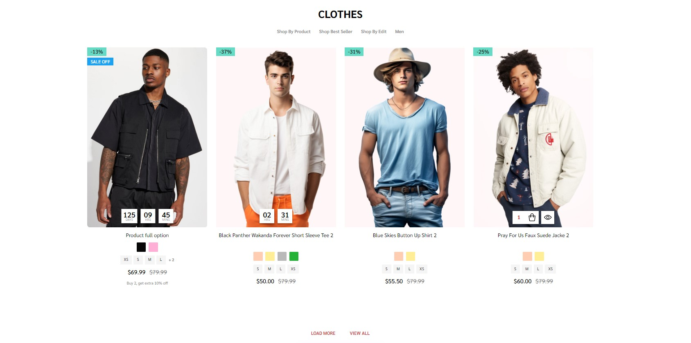

Navigate to **Theme Styles** > **Home Page** choose one of the sections and type `pbcst` to enable this block.

This section allow users to select categories, specify the number of products to be shown, and determine the number of sub-categories to display.

in **Theme styles** > **Home Page** find **Products by Category with Sorting Tabs**:

- Check the box labeled **Only load when scrolling to the viewport** to enhance site performance. The products in this block will load only when the user scrolls to this section.
- To specify the categories that should be displayed on the **Home Page**, enter the desired category IDs in the field below **Categories ID (separated by ,)**. Each ID should be separated by a comma. For example: 123,456,567.
- In the **Number of Categories** dropdown, select the desired number of categories to be displayed on the **Home Page**.
- **Default sorting** allows you to control the display of products within categories. You can choose from four options: `Newest`, `Featured`, `Best-selling`, and `Top-review`.
- Users can also adjust the number of products displayed on the Home Page by entering a number in the **Number of products** field
- Users can also specify the number of sub-categories to be displayed on the Home Page by entering a number in the **Number of subcategories** field.


### Featured Brands


**Featured brand** will automatic load all brands of your store.

To enable **Featured brand**, in **Theme Styles** > **Homepage** > **Section** choose one of sections and type `featured_brands` to enable this block.

To change color background of this section click on **Background** and select color fit to design.

This section allow user change section tiltle and display/hide brands logo, in **Hompage** find **Featured brand** type your text in **Heading** and checked the **Show brand logo** to display brands logo.

### Top Categories


**Top Categories** will automatic load first level categories of your store.

To enable **Top Categories**, in **Theme Styles** > **Homepage** > **Section** choose one of sections and type `top_categories` to enable this block.

To edit color background of sections **Top Categories**, select your color in **Background** and type empty input `Background Image` in **Top Categories**.


To edit background image of sections **Top Categories**. Dinosaur theme provides users with three options to change the background by modifying the **Background Image** field as shown below:

- `blank`: leave the field empty, the background will be specified follow **Background** field.

- `top-categories-men.png`: **Top Categories** will use the default image of the theme to set as background header.

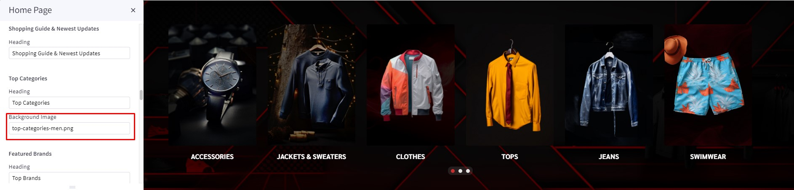

- `link`: **Top Categories** will be the link you provided in the input to set the background.


This section allow user change section tiltle, in **Hompage** find **Top Categories** type your text in **Heading**.

### Unique Sport-Inspired Fashion


Drag & drop **Layout widget** to the corresponding position, change **Column** = `1`, set **Padding** = `0 0 0 0`.

Drag & drop **Section Heading | PapaThemes Beautify** widget into the **Layout**. Typing your text (example "Unique Sport-Inspired Fashion"), select `custom` in **Text style** field, set **Font size** = `32px`, **Font size(Mobile)** = ` 20px`, **Font weight** = `Bold`, **Text color** = `#000000`, **Padding** = `10 0 40 0` and **Padding (Mobile)** = `18 0 18 0`.

Drag & drop **Product Tags PapaThemes Dinosaur** widget below **Section Heading | PapaThemes Beautify** widget.

In **Settings** > **General**:

Upload your **Image**, Set **width** and **Height** follow Image size.

Checked **Display in a container DIV** and **Lazyload image**.

Select `Fit to box` for the **Image fit**.


In **Product 1**:

Enter **Product SKU** (Hover over the tag icon to check whether SKU added to the tag).

Select `Tag` for the **Tag Icon**, set **Tag Icon Color** = `#67DAC5`.

Click the **Set Tag Position** button to activate the function that allows you to change the tag's position. Select the tag and then choose the position where you want to move it. Alternatively, you can also set the position manually by entering the position value in **Position - X** and **Position - Y**.

Click on the plus button next to **PRODUCT TAGS PAPATHEMES DINOSAUR** to create more products and set up the same as **Product 1**.


**Watch the instruction video:**

<iframe width="760" height="515" src="https://www.youtube.com/embed/Kq7EcW4wAmQ?si=k2_EUcsCyJubNkRF" title="YouTube video player" frameborder="0" allow="accelerometer; autoplay; clipboard-write; encrypted-media; gyroscope; pictre-in-picture; web-share" allowfullscreen></iframe>

### Bestselling Products


Bestselling products only display when your store has some order.

You can configure bestselling products section settings in **Page Builder** > **Theme Styles** > **Home Page**, make sure one of the **Sections** fill input = `bestselling`. In **Products** section, you can change **Number of most popular products** to display, changing **Most popular products display** to `Carousel` or `Grid`.

### Featured Products


You can set featured products in **Products**, click the **star** icon on the same row to set the product as featured.

Go back to **Page Builder** > **Theme Styles** > **Home Page**, make sure one of the **Sections** fill input = `featured_products`. In **Products** section, you can change **Number of featured products** to display, changing **Featured products display** to `Carousel` or `Grid`.

### New Products


You can configure new products section settings in **Page Builder** > **Theme Styles** > **Home Page**, make sure one of the **Sections** fill input = `new`. In **Products** section, you can change the **Number of new products** to display, changing **New products display** to `Carousel` or `Grid`

### Grid layout banners


To create **grid layout banners** :

In **Page Builder**, drag & drop **Layout** widget to the corresponding position. Change **Column** = `1`, set **Padding** = `0 0 0 0`.

Drag & drop **Flex Banners | PapaThemes Beautify** widget into the **Layout**. Remove all banner except banner 1.

To edit **Banner 1**, change your image, set **Image width** = `1024px`, **Image height** = `500px`. Click **Show different image on mobile**, change your image in mobile, set **Image width** = `550px`, **Image height** = `500px`. Set **Border radius** = `0px`.

In **CONTENT**, hide `Heading text`.

In **GENERAL**. Set **Width (Desktop)** and **Width (Tablet)** = `40%`, **Width (Mobile)** = `100%`. Set **Padding (Desktop)** = `0 15 15 0`, **Padding (Tablet)** = `0 10 10 0`, **Padding (Mobile)** = `0 0 0 0`.

Duplicate banner 1 to 2 banners.

In **Banner 2**, change your image, set **Image width** = `1536px`, **Image height** = `500px`. Click **Show different image on mobile**, change your image in mobile, set **Image width** = `550px`, **Image height** = `450px`. Set **Border radius** = `0px`.

In **GENERAL**. Set **Width (Desktop)** and **Width (Tablet)** = `60%`, **Width (Mobile)** = `100%`. Set **Padding (Desktop)** = `0 0 15 15`, **Padding (Tablet)** = `0 0 10 10`, **Padding (Mobile)** = `0 0 0 0`.

In **Banner 3**, change your image, set **Image width** = `2560px`, **Image height** = `450px`. Click **Show different image on mobile**, change your image in mobile, set **Image width** = `550px`, **Image height** = `400px`. Set **Border radius** = `0px`.

In **GENERAL**. Set **Width (Desktop)**, **Width (Tablet)** , **Width (Mobile)** = `100%`. Set **Padding (Desktop)** = `15 0 0 0`, **Padding (Tablet)** = `10 0 0 0`, **Padding (Mobile)** = `0 0 0 0`.


### Recently Viewed Products


Recently Viewed Products will be display automatically viewed any product.

You can configure recently viewed products section settings in **Page Builder** > **Theme Styles** > **Home Page**, make sure one of the **Sections** fill input = `viewed` to enable this block.

### Customer Service


To enable **Customer service**, in **Theme Styles** > **Homepage** > **Section** choose one of sections and type `customer_service` to enable this block.

To change color background of this section click on Background and select color fit to design.

This section allow user change section tiltle, in **Hompage** find **Customer service** type your text in Heading.

- **Phone number**: will automatically collect number from store profile.
- **Whapsapp**: To change Whatsapp number, go to **Footer** find **+Whatsapp** and type your number in the input field.
- **Email**: To change email number, go to **Footer** find **+Email** and type your email address in the input field.


To change Background of button, go to **General** find **General colors** change **Secondary color** to your color.

To change **Text**, **Icon**, color go to **General** find **Links colors** change **Default** to your color.

### About us

You can add About us block on Home Page. Drag & drop **Leaderboard Banner | PapaThemes Beautify** widget to the corresponding position.

On **BANNER** at `Content align`, click vertical top. Set `Banner height` and `Banner height (mobile)` = `364px`. Set `Background color` = `#FFFFFF`. Set your image on `Image`. In `Image fit` select `Fit to box`.


On **HEADING**. In `Heading style` select `Custom`. In `Font weight` select `Bold`. Set `Font size` = `32px`. Set `Heading color`, `Heading color (mobile)` = `#C72E2E`.

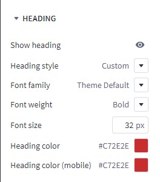

On **TEXT**. In `Heading style` select `Custom`. In `Font weight` select `Medium`. Set `Font size` = `18px`.


On **ADVANCED**. In `Style for theme` select `Kitchenary`.


### Recent Blog Posts


You can add blog posts in Storefront > Blog. Click the **+** button to add a new blog post. Make sure **Blog Visibility** is `on`.

To display the **recent blog** posts on the home page, go to **Page Builder**. In **Theme Styles** > **Home Page**, make sure one of Sections has typed `blog_recent`. Scroll down the Recent Blog section, you can configure **Heading**, **Number of posts** to display.

### Customer Reviews


Drag & drop **Layout** widget to the corresponding position.select Image in the Background section to upload your image, change image fit to fill. Change **Column** = `1`. Select **Column 1**, set **Padding** = `0 0 0 0`.

Drag & drop **Section Heading | PapaThemes Beautify** widget into the **Layout**. Typing your text (example "Customer Reviews"), select `custom` in **Text style** field, set **Font size** = `32px`, **Font size (Mobile)** = `20px`, **Text color** = `#FFFFFF`, **Padding** = `52 0 40 0`, **Padding (Mobile)** = `30 0 6 0`.

Drag & drop **Customer Reviews | PapaThemes Beautify** widget below **Section Heading | PapaThemes Beautify** widget. Make sure to remove all reviews except for the first one.

For each review, provide the following details:

**Title**: Enter the title of the review.

**Content**: Write the content of the review.

**Rating**: Choose the desired number of review stars.

**Author**: Specify the name of the reviewer.

To maintain consistency in the theme, select `Beautify Furniture` in the **Style for theme** option.

If you want to add more reviews, duplicate the first review as many times as needed and update the content for each review.

**Watch the instruction video:**

<iframe width="760" height="515" src="https://www.youtube.com/embed/CKuhCOSMPR4?si=HomGPI60tzLj5bQD" title="YouTube video player" frameborder="0" allow="accelerometer; autoplay; clipboard-write; encrypted-media; gyroscope; picture-in-picture; web-share" allowfullscreen></iframe>


### Newsletter

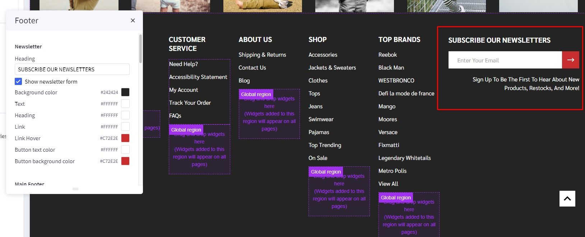

To enable newsletter form, go to **Marketing** > **Email Marketing**, make sure **Allow Newsletter Subscriptions** is checked. Optionally select **Show Newsletter Summary** and enter the summary text as you want.

Go to Page Builder, in **Theme Styles** > **Footer** > **Newsletter** section.

Make sure **Show newsletter form** is selected. You can change the **Heading**, **background color**, **background image**, **button** and **text colors**.

**Watch the instruction video:**

<iframe width="760" height="515" src="https://www.youtube.com/embed/K25Fthor0jE?si=LcO3xJm3V_f8-HAt" title="YouTube video player" frameborder="0" allow="accelerometer; autoplay; clipboard-write; encrypted-media; gyroscope; picture-in-picture; web-share" allowfullscreen></iframe>

### Newsletter Popup


**Newsletter Popup**use the same content and heading with **Newsletter** in footer. Please find instruction to change content in **Newsletter**.

To change delay time and show up again peropd for display **Newsletter Popup**, in **Theme styles** > **General** > **Newsletter Popup** change **Show after page loaded (sec)** for delay time to display the popup, change **Don't show up again (sec)** for the popup re-appear again.

To change image in **Newsletter popup**, simply copy and paste your Image URL to **Newsletter Popup background URL**

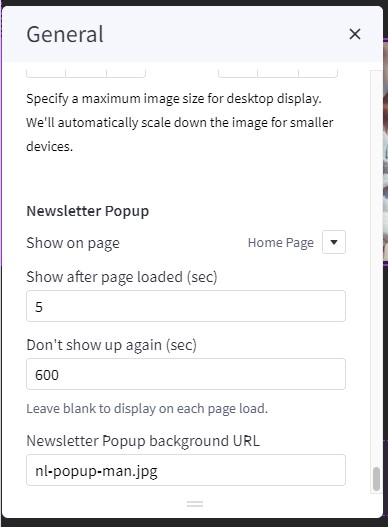


### Footer


In **Page Builder** > **Theme Styles** > **Footer**, you can configure the newsletter form appearance in **Newsletter** section, configure the footer link colors in **Main Footer** section, displaying store logo, contact info, store address,... **Show pages** allows to limit number of web page links to display. **Show categories** allows to limit number of category links to display. Similarly for **Show brands** option.

**Payment Icons** allows to select which payment icons to display.

**Copyright** allows to configure the copyright text.

**Watch the instruction video:**

<iframe width="760" height="515" src="https://www.youtube.com/embed/qIK4uCQxIJ8?si=yqS1NXihsqslwgV3" title="YouTube video player" frameborder="0" allow="accelerometer; autoplay; clipboard-write; encrypted-media; gyroscope; picture-in-picture; web-share" allowfullscreen></iframe>


### Instagram photos

To display your Instagram photos, open <https://instagram.papathemes.com/> Follow the instruction on this page to [Connect your Facebook Page with your Instagram account](https://www.facebook.com/business/help/898752960195806). Then click **Login With Facebook** button and follow the further steps to authorize access permission. Click **Show Embedding Code** button to generate the code embedding to your web store. Choose **Preset** = `Carousel` and select **LazyLoad**.

Copy all the code appear in Step 1 & Step 2. For example:

```html
<script>!function(){var a=document.createElement("script");a.defer=!0,a.src="https://papathemes.s3.amazonaws.com/instagramapp/assets/js/embed-1.0.1.js",a.onload=function(){PapathemesInstagramApp.init({account_id:"****************",element_id:"papainstagram-render",limit:"20",preset:"grid",lazyload:"false"})},document.body.appendChild(a)}();</script>

<div id="papainstagram-render"></div>
```

Go back to your store Page Builder. Drag & drop the HTML widget to the corresponding position. Paste the generated code above to the HTML editor, and click **Save HTML** button. Your Instagram photos should display like our demo store.

Please note that the app only updates your latest uploaded photos every 6 hours.

To create the title, drag & drop the **Section Heading** widget to above the Instagram photos. Set **Padding** = `40 0 40 0` and **Padding (Mobile)** = `20 0 20 0`.

**Watch the instruction video:**

<iframe width="760" height="515" src="https://www.youtube.com/embed/iUCG6iXI0zg?si=MMQGRbdEEY3D6KBP" title="YouTube video player" frameborder="0" allow="accelerometer; autoplay; clipboard-write; encrypted-media; gyroscope; picture-in-picture; web-share" allowfullscreen></iframe>

### Display Custom Footer Links

In **Page builder** > **Custom Widget** find **Footer links | PapaThemes Beautify** widget then drag and drop the widget to corresponding position in **Footer**.

Select the **Column 1** and change **padding** to `0 0 0 0`.

In **design** you can type your link content and click on the **insert/edit link** button as picture below:


In the popup window, copy your web link to `URL`. On the **Open links..** field you can select how your link could be open in **New Window** or **Current Window**
 
 

## Customizing Products Display

### Product Card


Configuring product cards in **Page Builder** > **Theme Styles** > **Products** > **Product cards**.

- **Alignment**: Specifying content alignment `left` or `center`.
- **Product title color**: Specifying the product name's color.
- + **Hover**: Specifying color when hover or focus.
- **Product countdown color**: specify number's color in countdown box.
- - **Background**: Specify background's color of countdown box.
- **Show second image on hover**: Displaying the second image when hover the product card.
- **Show SKU**: toggle displaying the product SKU.
- **Show Brand**: toggle displaying Brand of product.
- **Show Add to Cart button**: toggle on to make Add to Cart button always visible.
- **Show quantity input**: toggle on to display quantity input. If toggle of input field will not visible client cannot adjust the quantity in card.
- + **Border**: Specifying the button border color.
- **Show swatch/rectangle options**: Allows to display with swatch/rectangle type product option on every product card. It's helpful to display different product variants like colors or sizes.
- **Show only option name**: enter the option name to display in card.
- **Swatch sizes**: Specifying the swatch color/image size.
- **Show countdown Flash Sale**: Display countdown timer for Flash Sale products.
- **Show corresponding variant image when filtered**: toggle this option will help display variant image instead of thumbnail image when using Faceted filter. (Example: filter color Ogrance card will display image of variant Ogrance).
- **Show call us for price**: to display call us for price message.
- **Show custom fields**: enter the custom field name and seperate each custom field with `|` to display them in card.
- **Badge position**: also to configure the sale badge position to `Top Left` or `Below image`.

### Displaying product price ranges

By default product price ranges is enabled. To turn off, Go to **Page Builder** > **Theme Styles** > **Products** > uncheck **Price ranges** checkbox.

**Show retail price**: Toggle displaying the product retail prices.


### Hiding prices for non logged in customers

To turn on this feature, go to **Page Builder** > **Theme Styles** > **Products** > tick **Restrict Purchase to Login** checkbox.


### Redirecting to cart page after product added to cart

By default the cart popup is displayed, if you want to take customer to the cart page instead, go to **Page Builder** > **Theme Styles** > **Products** > tick **Redirect to cart page after add to cart** checkbox.

### Showing/Hiding Quick-View button

By default quick-view buttons appear on all product cards. To hide it, go to **Page Builder** > **Theme Styles** > **Products** > un-tick **Show Quickview** checkbox.

### Showing/Hiding the quantity box on PDP

By default the quantity box shows up, to hide it, go to **Page Builder** > **Theme Styles** > **Products** > un-tick **Show quantity selection on product pages** checkbox.

### Customizing the popup displayed after product added to cart

In **Page Builder** > **Theme Styles** > **Products** > **Popup after added to cart**:

- `Cart Preview`: Displaying the whole shopping cart popup on the right side.
- `Hide`: Not show any popup.

Mini added to cart popup:

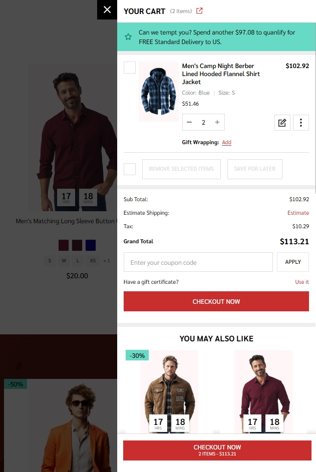

### Displaying Recently Viewed Products

Recently viewed products only display for logged-in customers.

To enable it, go to **Page Builder** > **Theme Styles** > **Products** > **Show recently viewed** select number of products to display.


### Customizing Price Labels

You can customize sale price label, before sale price label, retail price label or regular price label in 
**Page Builder** > **Theme Styles** > **Products** > **Price Labels**


### Displaying product weight, dimensions on PDP

Go to **Page Builder** > **Theme Styles** > **Products** > **Product Page**.

- Tick **Show product weight** checkbox.
- Tick **Show product dimensions** checkbox.

### Display sale badge on PDP

Go to **Page Builder** > **Theme Styles** > **Products** > **Product Page**.

- Tick **Show sale badge** checkbox.

### Sale badge, Condition badge and custom text badges


Displaying the sale badge in **Page Builder** > **Theme Styles** > **Products** > **Product sale badges**, tick **Show sale badges**.

- **Label**: Specifying the badge text.
- **Text color**: Specifying the badge text color.
- **Background color**: Specifying the badge background color

Displaying the condition badge in **Condition badges**, tick **Show condition badges**.

Displaying the condition badge in **Custom badges**, tick **Enable custom badge from '__badge' custom field**. Edit product, add custom field with name `__badge` and value is the badge text.

- **Text color**: Specifying the text color of the custom badge.
- **Background color**: Specifying the background color of the custom badge.

### Displaying Image gallery 

#### Displaying thumbnail as a slider

In **Page Builder** > **Theme Styles** > **Products** > **Product Page**, **Enable thumbnail carousel** section, you can change display thumbnail images to slider or grid.

- `1 row`: Sub-images are displayed in the slider on 1 row.

- `2 rows`: Sub-images are displayed in the slider on 2 row.

- `Hide`: All sub-images are displayed as grid.


#### Displaying product image thumbnails vertically

In **Page Builder** > **Theme Styles** > **Products** > **Product Page**, checked **Show image thumbnails vertically** to display product thumbnails vertically, otherwise it's displayed horizontally.

Checked **Show image thumbnails vertically**:


To specify the number thumbnail display in slider simply enter your desire number in **Number of visible thumbnails**.

### Video image product detail page

In **Page Builder** > **Theme Styles** > **Products** > **Product Page** find **Show videos** select `tab` or `image gallery` to change display video position.

Videos displayed in **tab** options:


Videos displayed in **image gallery** option:


### Setup bulk pricing 

Bulk pricing discounts can be managed under the Pricing section when adding or editing a product. Click Show **Advanced Pricing** to view bulk pricing fields, among other pricing product fields. Bulk pricing of Dino theme auto display under price slider. customer can slide to to increase product quantity to reach each bulk pricing point.

- **% Discount:** takes a percentage off the total product price when the quantity threshold is met ("Order 2 or more, get 10% off").


- **$ Fixed Amount:** specifies a fixed price for each unit when the quantity threshold is met ("Get 2 for $15 each"). This discount type is not available for category-level bulk discounts.


- **$ Off/Unit:** subtracts a fixed amount from the price of each unit when the quantity threshold is met ("Save $7 on each when you buy 2 or more")


### Displaying sticky Add to Cart button on PDP on mobile

In **Page Builder** > **Theme Styles** > **Products** > **Product Page**, tick **
Show sticky Add to Cart on mobile**.


### Displaying product custom fields in a separated tab

In **Page Builder** > **Theme Styles** > **Products** > **Product Page**:

- Tick **Show custom fields in tab** checkbox.
- Enter the tab title in the next **Tab title** box.


### Custom tabs


To add the **custom tabs** in product pages, edit your product description, click on **HTML button** to open HTML Source Editor:


Use the editor at the **[link](https://bc-supermarket-docs.papathemes.com/customization/product-page#custom-tabs)** to generate HTML for your **custom tabs**. Click Export HTML button, copy & paste the generated HTML at the end of HTML Source Editor.

### Displaying product tabs description full width

In **Page Builder** > **Theme Styles** > **Products** > **Product Page**:

- Tick **Tab description full width** checkbox to display tabs description full width in Product page.


### Displaying Delivery & Returns tab

In **Page Builder** > **Theme Styles** > **Products** > **Product Page**:

- Tick **Show Delivery & Returns tab** checkbox.
- Enter the tab title in the next **Tab title** box.

You can add specific content or global content using BC widgets:


### Numbers of products, reviews, thumbnails

In **Page Builder** > **Theme Styles** > **Products** > **Product Page**:

- **Number of Product Reviews**: Specifying number of product reviews displayed.
- **Number of Related Products**: Specifying number of related products displayed.
- **Number of Customers Also Viewed Products**: Specifying number of customer also viewed products displayed.

### Displaying Swatch Options in the dropdown select box

In **Page Builder** > **Theme Styles** > **Products** > **Swatch display type**:

- `Default` (Square): Displaying the regular swatches by default.
- `Dropdown`: Displaying swatches in the dropdown select box.
- `Dropdown + Square`: Displaying swatches in the dropdown select box in addition to regular swatches.


### Displaying Frequently Bought Together Products


Enabling this feature in **Page Builder** > **Theme Styles** > **Products** > **Frequently Bought Together**, Select **Position** to display it.

- **Load products from**: Specifing products to display here.
  - `Custom fields __alsobought`: Specifying the relevant products in product custom fields with name `__alsobought` and value is the relevant product ID. For example:
  
  - `Related products`: Pulling from the related products.
  - `Similar by biews`: Pulling from customer also viewed products.
- **Auto select all items**: Auto select or unselect all frequently bought together products.
- **Thumbnail size**: Specifying the thumbnail image size.
### Configuring swatch dimension

In **Page Builder** > **Theme Styles** > **Products** > **Swatch display type** > Set **Swatch size**.


### Configuring image sizes


In **Page Builder** > **Theme Styles** > **Products** > **Image Sizes**:

- Main product images: Specifying the main product image size displayed on PDP.
- Thumbnail image: Specifying the product thumbnail size.
- Zoomed image: Specifying the zoomed image size.
- Image in gallery view: Specifying product card image size.

### Shipping countdown


To enable shipping countdown, **Theme styles** > **Product page**  find **shipping countdown** field and input your cut off time. Find and copied your timezone from wikipedia `https://en.wikipedia.org/wiki/List_of_tz_database_time_zones` to **timezone** field.

To disable shipping countdown simply leave **shipping countdown** field empty.

Note: The time before cut off the message will show **shipping today** after cut off the message will show **shipping tomorrow**

### Coupon


In **Page Builder**, drag and drop widget **Coupons | PapaThemes Dinosaur** to correct widget region as picture below.

Set **Layout** > **Column** `padding` = `0`.


To edit **Coupon**. To modify the title and details of the coupon ticket, simply click on the title or content of ticket and adjust them. Copy Simply click on the title of the ticket and adjust them according to the **Marketing** > **Coupon codes**. Then copy Coupon code of **Coupon codes** to input `Coupon code` of **Coupon** widget.


Coupons will appear in the sections below.

`Cart popup`:


`Cart Page`:


**Watch the instruction video:**

<iframe width="760" height="515" src="https://www.youtube.com/embed/TFaHUPuuzKg?si=8LjKIj4aHZkS4fFR" title="YouTube video player" frameborder="0" allow="accelerometer; autoplay; clipboard-write; encrypted-media; gyroscope; pictre-in-picture; web-share" allowfullscreen></iframe>

### Flash sales


To create flash sales for each product and product card, in **product** section select the product that you want to add Flash Sales.

Find customer fields, click on add **Add Custom Field**. Enter `__countdown_label` into **Custom Field Name**. In **Custom Field Value**, type your content following format: `<your banner name>|<end in>` (example: FLASH SALES|ENDS IN). 

Create second custom field, enter `__countdown_date` into **Custom Field Name**. In **Custom Field Value**, input your cut off time following the format: `<yyyy>-<mm>-<dd> <hh>:<mm>:<ss><timezone>` (example: 2023-03-15 17:00:00-7).

Note:

- `<yyyy>-<mm>-<dd>` is optional. If the date is not entered, the banner will repeat automatically right after pass cut off time.
  
- `<hh>:<mm>:<ss>` is 24 hour format.
  
- `<timezone>` only input `+ or -` and `number` example: `+7`. if timezone are not entered, the countdown time will be different in different countries.

- Make sure you product also have sale price in orde for Flash Sale display. When you remove the **sale price** **Flash Sale** banner will auto disable.

### Brand logo in product detail


To display **Brand logo** in product detail, in **Page Builder** > **Products** > **Product Page** find and check **Show brand image** option.


### Ask question

In **Page Builder** > **Theme Styles** > **Products** > **Product Page** find **Ask question (contact page URL)** and enter `/contact-us/` to display **Ask Questions?**.


### Instruction & size guide


To create additional information link:

In **Storefront** > **Web Pages**, click on the **Create a Web Page** button to create new webpage.

In **Web Page Details**, enter your page name in **Page Name** field, **Page URL** will be automatically generated. In **Page content** field enter your content.

Uncheck **Navigation Menu** options.

In **Advanced Options** set **Sort Order** = `2`.

To display the additional information link in the product detail page:

In **Products**, select the product you want to display the link. Find **Custom Fields**, created new custom field. Set **Custom Fields Name** = `__guide_popup` and **Custom Fields Value** = `<your page name>|<Page URL>` (example: `Instruction|/instruction/`) then save.

### Below add to cart banner

To create **Below add to cart banner**, in **Page builder** drag and drop **Layout widget** to corresponding position.

Select **Column 1**, set **Padding** = `0 0 0 0`.

Drag and drop **Callout icon | PapaThemes Beautify widget** into column 1, delete all icons except callout icon 1.

In **Styles** select `Left`, set **Padding** for all desktop, mobile and table = `0`.

In **Icon** change to `Choose Image`, in **Icon image** select your desire image.

To input your text into the widget, simply type it into the text field located in the design window.


## Customizing Category Pages

Configuring the category pages in **Page Builder** > **Theme Styles** > **Products** > **Category Page**.

### Category Layout

Theme supports displaying category Page layout in `Full width` mode or `Left sidebar` mode. In **Layout**, select the particular display mode for default display.

- **Layout** = `Full width`


- **Layout** = `Left sidebar`
 


### Products Display Type

Theme supports displaying products in **grid** mode (2, 3, 4 or 5 products per row), in **list mode** or **bulk order** mode. In **Products display type**, select the particular display mode for default display.

- **Display type** on the right allow your customers to change product category display by themselves.


**Grid:**


**List:**


**Bulk order:**


### Display Bulk Order layout

To display this bulk order layout, select **Products display type** = `Bulk order`.


### Displaying Shop by Brand

- **Shop by Brand**: Specifying number of popular brands to display.


### Displaying Price Slider

- **Shop by Price**:
  - `Slider`: Displaying the price slider.
  - `List`: Displaying price list.
  - `Hide`.


### Infinite Products Loading

This feature allows you to choose the method of loading more products in the current catalog.


**Infinite Products Loading**:

  - `On scroll`: Products will automatic loadout when scrolling down.

  - `Load more button`: Click on the **Load more button** to continue loading more products.

  - `Off`: Show **page numbers** and **arrow** button as original. Click on button to see more products.

### Display contextual search

This feature allows searching products within the current category and the current selected filter.


Select **Show quick search in category** = `Show` to enable it.

- **+ Show results in descendent categories**: if selected, it also displays results in the descendent categories.

### Common Settings

- **Number of products per page**: Specifying number of products to display per page.
- **Show category image**: Displaying the category image or not.
- **Show category description on AMP page**: Displaying category description on AMP category page or not. If the category content contains images, the AMP page could be invalid. It's recommended to turn off this option.

## Customizing Brand Page & Search Page

Configuring the brand page in **Page Builder** > **Theme Styles** > **Products** > **Brand Page**.

- **Number of brands per page**: Specifying number of brands to display per page.
- **Number of products per page**: Specifying number of products to display per page.
- **Brand image in gallery view**: Specifying the brand card image size.
- **Brand image in brand page**: Specifying the large image size displayed on the brand page.

Configuring the search results page in **Page Builder** > **Theme Styles** > **Products** > **Search results**.

- **Number of products per page**: Specifying number of products to display on the search results page.

### Displaying brand quick-view introduction


In **Marketing** > **Marketing Banner**, click **Create a Banner** button. 

- Enter the brand introduction content to **Banner Content**.
- Select **Show on Page** = `For a Specific Brand` and select the corresponding brand.
- Select **Location** = `Bottom of Page`.
- Then click **Save** button to finish.

Watch the instruction video:

<iframe width="760" height="515" src="https://www.youtube.com/embed/T_V5ESUEq2M?si=GvRIRsv8OkWSS6gQ" title="YouTube video player" frameborder="0" allow="accelerometer; autoplay; clipboard-write; encrypted-media; gyroscope; pictre-in-picture; web-share" allowfullscreen></iframe>

### Display product in Search page

To change number products display per page in **Product** section find **Search page** then change **Number of products per page**:


## Customizing Cart page

### Display free shipping message in cart page.

Not qualify message


Qualify message

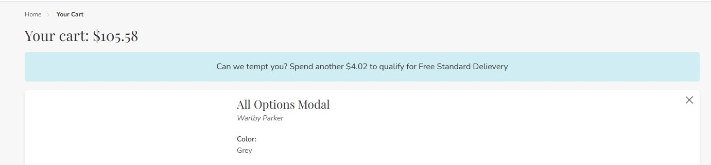

In **Marketing** > **Promotion** click on **create** and select **With legacy editor**

In **Promotion detail** name your promotion 

In **promotion type** select `Orders totaling more than X amount get free shipping to specific shipping zones` at the field **spend at least** type your amount


In **Promotion option** type your message at **Congratulations Banner Message** to display for cart have qualified and type your message for cart have not qualify at **Upsell Banner Message** with format `[your text] %%condition.remaining%% [your text]` then click save

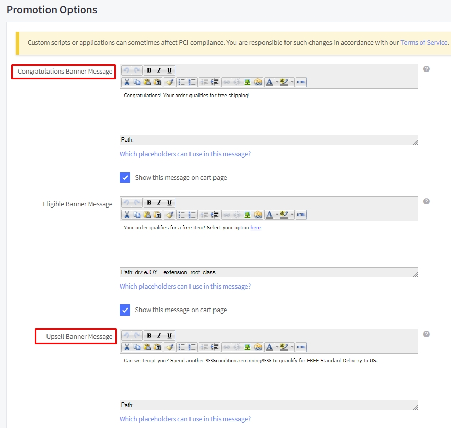


