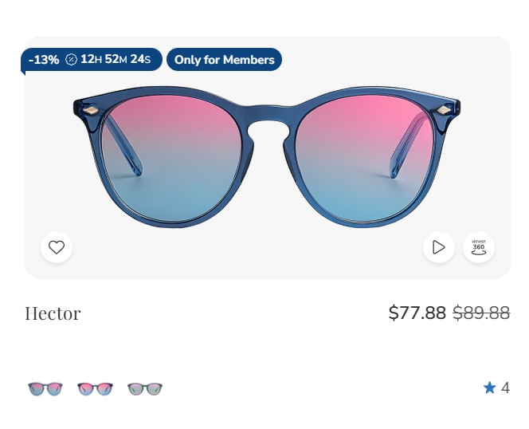
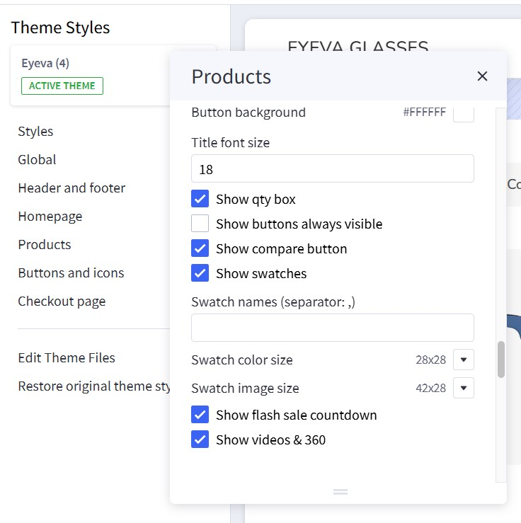
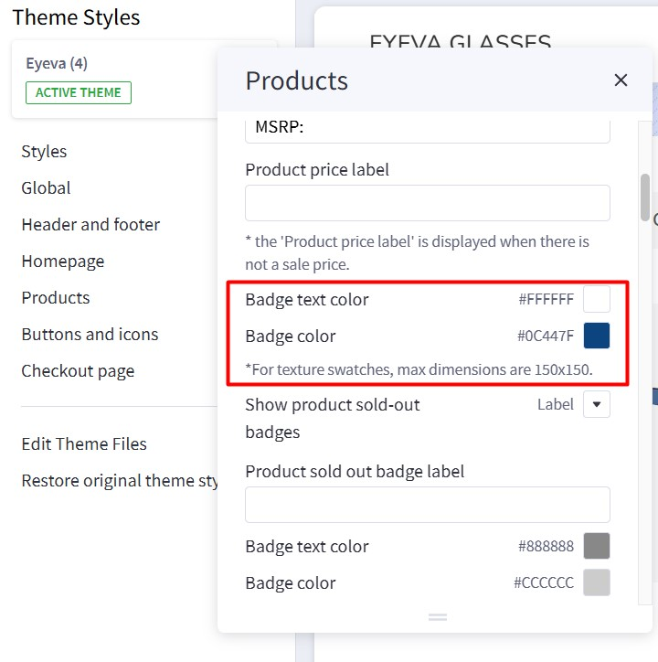
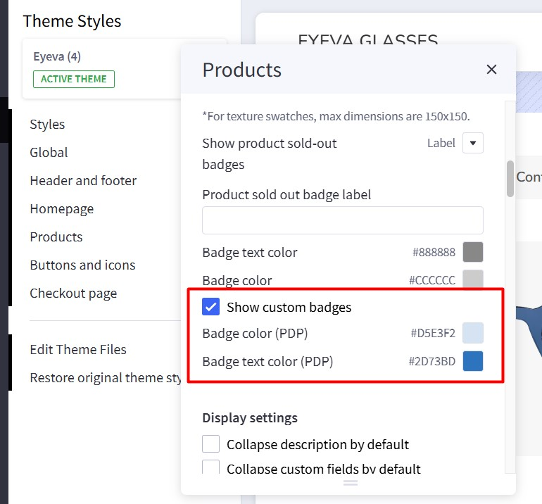
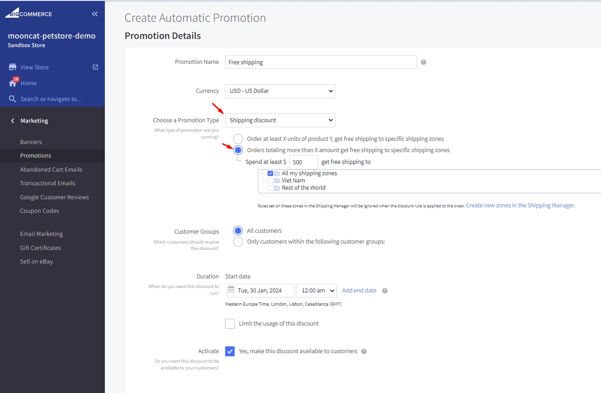

# Usage Guide

## Get Started

Thank you for using our theme!

To set up the theme exactly like our demo stores, you may need to install our free app **[PapaThemes Widgets](https://www.bigcommerce.com/apps/papathemes-widgets/)**. This app provides additional widgets to visually build content in Page Builder without requiring coding skills.

To display your Instagram photos on your website, you can use our free tool **[PapaThemes Instagram](https://instagram.papathemes.com/)**. We will guide you step by step later in this manual.

### Customizing Typography, Fonts, and Colors

Customize typography, fonts, colors, and buttons in **Page Builder** > **Theme Styles** > **General**. There are dozens of options to help you beautifully and uniquely customize your website.

### Customizing the Checkout Page's Typography and Colors

Customize the checkout page's typography and colors in **Page Builder** > **Theme Styles** > **Optimized Checkout**.

### Installing the PapaThemes Widgets App

Find and install the **[PapaThemes Widgets](https://www.bigcommerce.com/apps/papathemes-widgets/)** app from the [BigCommerce Apps Marketplace](https://www.bigcommerce.com/apps/).

After installation, navigate to your admin panel. In the left sidebar, click **Apps** > **My Apps**. Then, click the **Launch** button for the PapaThemes Widgets app to open it:


Next, click the **Install** buttons in sequence to install all the available widgets.


Go to **Storefront** > **My Themes**. Click **Customize** on the Eyeva theme's dropdown menu to open Page Builder. Select any theme style to begin.


Confirm the widgets are installed by verifying they appear in Page Builder.


## Setting Up the Glasses Style Home Page

To start customizing the theme, log in to your admin panel. Navigate to **Storefront** > **My Themes** and click the **Customize** button next to the theme thumbnail.

### Header


To configure the header, navigate to **Theme Styles** > **Header**. Here, you can adjust the header colors, store logo position, and size.

**Utility navigation** allows you to customize the colors of the search, cart, wishlist, and user icons.

**Watch the instruction video:**

<iframe width="760" height="515" src="https://www.youtube.com/embed/AFpgodrjqxg?si=5kDqYIO4jkK4WyX5" title="YouTube video player" frameborder="0" allow="accelerometer; autoplay; clipboard-write; encrypted-media; gyroscope; picture-in-picture; web-share" allowfullscreen></iframe>


#### Main Navigation

**Main Navigation** allows you to customize the navigation bar. You can change the menu type to column, dropdown menu, or mega menu, and also modify the colors of the top menu and submenus.

The "**Hide webpage links**" option allows you to hide static webpage links in the main navigation.


The "**Show top categories on mobile**" option displays top categories on mobile devices.


To configure the Main Navigation, navigate to **Theme Styles** > **Header and Footer**. In the **Main Navigation** section, you can adjust the following:

- **Background**: The background color of the top categories.
- **Text color**: The text color of menu items.
- **Text hover color**: The text color when hovering over menu items.
- **Dropdown menu background**: The background color of the submenu block.
- **Dropdown menu border**: The border color at the bottom of the main navigation.


#### Mega Menu vs. Standard Menu

To configure the style (mega menu, standard menu, etc.) of the main navigation, go to **Theme Styles** > **Header**. In **Main Navigation**, select **Menu Style**. The theme offers two options:

- `Simple`: Displays the submenu in a mega menu style. The **Simple Menu** allows you to insert banners and products.


- `Alternate`: Displays submenu items in a dropdown (standard) style.


#### Displaying Widgets on the Mega Menu

To display banners in the Mega Menu, go to **Header and Footer** and check **TURN ON EDITING MENU WIDGETS** to open the Mega Menu in design mode.


To customize the banner on the right of the submenu on mobile, drag and drop a **Flex Banners | PapaThemes Beautify** widget into the corresponding position:


In **Column 1**, set padding to `0`.

Remove all banners except Banner 1. Select the image you want to upload. Set `Image width` to `250px`, `Image height` to `250px`, and `Border radius` to `16px`.


In **CONTENT**, click **Center** and **Bottom** for **Content Align**.

In **Content Padding**, **Content Padding (Tablet)**, and **Content Padding (Mobile)**, set `Top`, `Right`, `Bottom`, and `Left` to `16`.

Hide the `Heading Text`.

Show the `Action Button`. Set `Style` to `Default` and `Position` to `Bottom`.


In **GENERAL**, edit the **Width**. Choose `px` for **Width**, and set `Value (Desktop)`, `Value (Tablet)`, and `Value (Mobile)` to `250px`.

Edit the **Padding**. For **Desktop**, set `Right` and `Left` to `8`. For **Tablet**, set `Right` and `Left` to `4`. For **Mobile**, set `Right` to `4`, `Bottom` to `0`, and `Left` to `4`.


Duplicate Banner 1 to create another banner.

#### Hide Web Page Links

To hide web page links such as **Contact Us**, **About Us**, and **Shipping & Returns** from the header, navigate to **Theme Styles** > **Header**. Locate the **Hide Web Page Links** option and select it to hide all links except **Categories**.

If you want to hide only specific links, follow these steps:

- **Show web page starting from**: Enter the order number of the first link you want to display.
- **Limit**: Enter the number of webpage links you want to display, starting from the specified order.

For example, to display only **Blog** and **Shipping & Returns**:

- **Show web page starting from**: `1`
- **Limit**: `2`

Note: The order only counts non-category links.


**Watch the instruction video:**

<iframe width="760" height="515" src="https://www.youtube.com/embed/8gJ2qS92AUg?si=zJJ9CwFmVu0Jk1HQ" title="YouTube video player" frameborder="0" allow="accelerometer; autoplay; clipboard-write; encrypted-media; gyroscope; picture-in-picture; web-share" allowfullscreen></iframe>

### Top Banner

Go back to **Storefront** > **My Themes**, and click the **Customize** button beside the theme thumbnail. You can see the top banner above the header. To change the colors of the top banner, go to **Theme Styles** > **General** > **Top Banners**. Here, you can change the text color and background color.

**Watch the instruction video:**

<iframe width="760" height="515" src="https://www.youtube.com/embed/NL1QiC3INpU?si=oMcyYeScMlBQl28f" title="YouTube video player" frameborder="0" allow="accelerometer; autoplay; clipboard-write; encrypted-media; gyroscope; picture-in-picture; web-share" allowfullscreen></iframe>


### Display Top Banner on All Pages


To display a top banner that appears on all pages in the header, drag and drop an **HTML Widget** into the desired position. Paste the code below into the HTML editor, and then click the **Save HTML** button.

```html
<div data-banner-carousel style="text-align: center">
  <div>See Clearly, Look Stylish! ? Shop Top-Quality Eyeglasses at Unbeatable Prices – Limited Time Offers!</div>
  <div><strong>Elevate Your Vision, Elevate Your Style!</strong> ? Discover Our Exclusive Eyeglasses Collection at Amazing Prices &ndash; Shop Now!</div>
  <div><strong>Perfect Your Look with Precision!</strong> ?️ Browse Our Premium Eyewear Range &ndash; Exceptional Deals Await!</div>
</div>
```

This code displays 3 messages in a carousel (specified by the `data-banner-carousel` attribute).

To display a simple message, you can just enter the HTML code like this:

```html
<p>See Clearly, Look Stylish! ? Shop Top-Quality Eyeglasses at Unbeatable Prices – Limited Time Offers!</p>
```

**Watch the instruction video:**

<iframe width="760" height="515" src="https://www.youtube.com/embed/bxD_I4ZbMi0?si=b9dDgPVcNsiazSX5" title="YouTube video player" frameborder="0" allow="accelerometer; autoplay; clipboard-write; encrypted-media; gyroscope; picture-in-picture; web-share" allowfullscreen></iframe>

### Main Carousel


Upload the carousel images in **Storefront** > **Home Page Carousel**.

Return to **Page Builder**. Navigate to **Theme Styles** > **Home Page** and ensure that **Carousel** > **Show carousel** is enabled. You can customize the carousel styles and colors here.


To adjust the image height in mobile view, modify the **Mobile fixed height (px)** to your preferred dimension. For example, enter `500` to display a 500px height on mobile devices.


To display a different image on mobile, upload the image in the Image Manager. Then, copy the image URL and paste it into the corresponding **Slide [Number] for mobile** field (e.g., **Slide 1 for mobile** to **Slide 5 for mobile**).

**Watch the instruction video:**

<iframe width="760" height="515" src="https://www.youtube.com/embed/IvW6T-P3Oxs?si=vGlWYu6UDo4n11HP" title="YouTube video player" frameborder="0" allow="accelerometer; autoplay; clipboard-write; encrypted-media; gyroscope; picture-in-picture; web-share" allowfullscreen></iframe>

### Free Shipping Banner below the Homepage Carousel


In Page Builder, drag and drop the **Section Heading** widget into the corresponding widget region:


Configure the widget options as follows:


-   **Heading tag**: P
-   **Text style**: Custom
-   **Font family**: Inherit
-   **Font weight**: Extra Bold
-   **Font size (Desktop)**: 24px
-   **Font size (Mobile)**: 16px
-   **Line height**: 1.6
-   **Text color**: #0B5F33
-   **Alignment**: Left / Center / Right
-   **Margin (Desktop)**: 0 0 0 0
-   **Margin (Mobile)**: 0 0 0 0
-   **Padding (Desktop)**: 24 16 24 16
-   **Padding (Mobile)**: 24 16 24 16
-   **Background color**: Optional (color picker or hex code)

Edit the text using the inline editor:


### Shop By Category


To display this block, navigate to **Theme Styles** > **Home Page** > **Sections** and enter `categories` into one of the section inputs.


### Bestselling Products


Bestselling products will only appear once your store has received orders.

You can configure the bestselling products section settings in **Page Builder** > **Theme Styles** > **Home Page**. Ensure that one of the **Sections** inputs is set to `bestselling`. In the **Products** section, you can adjust the **Number of most popular products** to display and change the **Most popular products display** to either `Carousel` or `Grid`.


### Featured Products


You can designate products as "featured" in **Products** by clicking the **star** icon on the corresponding row.

Return to **Page Builder** > **Theme Styles** > **Home Page** and ensure that one of the **Sections** inputs is set to `featured_products`. In the **Products** section, you can modify the **Number of featured products** to display and change the **Featured products display** to either `Carousel` or `Grid`.

### New Products


You can configure the new products section settings in **Page Builder** > **Theme Styles** > **Home Page**. Ensure that one of the **Sections** inputs is set to `new`. In the **Products** section, you can change the **Number of new products** to display and change the **New products display** to either `Carousel` or `Grid`.

### Wide banner


In Page Builder, drag & drop the Flex Banner widget into the corresponding widget region:


Configure the widget options as follows:

|  |  |  |
|---|---|---|
|  |  |  |


| **Setting**                                    | **Value**                                   |
|-----------------------------------------------|---------------------------------------------|
| **Image**                                      |                                             |
| Image                                          | (Eyeglasses image)                          |
| Image width                                    | 3000 px                                     |
| Image height                                   | 1000 px                                     |
| Show different image on mobile                 | ON (toggle enabled)                         |
| Image (Mobile)                                 | (Alternate eyeglasses image)               |
| Image width (Mobile)                           | 1000 px                                     |
| Image height (Mobile)                          | 1000 px                                     |
| Image alt text                                 | *(blank)*                                   |
| Image fit                                      | Fill to box                                 |
| Lazy-Load                                      | ON (toggle enabled)                         |
| Border radius                                  | 0 px                                        |
| Link                                           | *(blank)*                                   |
| **Content**                                    |                                             |
| Content align (Horizontal)                     | Left                                        |
| Content align (Vertical)                       | Center                                      |
| Content padding (Desktop)                      | Top: 40 px • Right: 320 px • Bottom: 40 px • Left: 128 px |
| Content padding (Tablet)                       | Top: 40 px • Right: 320 px • Bottom: 40 px • Left: 16 px   |
| Content padding (Mobile)                       | Top: 10 px • Right: 15 px • Bottom: 10 px • Left: 15 px    |
| Content background                             | *(none)*                                    |
| Heading text                                   | Visible (eye icon ON)                       |
| Description text                               | Visible (eye icon ON)                       |
| Action button                                  | Visible (eye icon ON)                       |
| **General**                                    |                                             |
| Width (Desktop)                                | 100%                                        |
| Width (Tablet)                                 | 100%                                        |
| Width (Mobile)                                 | 100%                                        |
| Padding                                        | *(not shown, likely 0)*                    |


### Recently Viewed Products


Recently Viewed Products will be displayed automatically after a product has been viewed.

You can configure the Recently Viewed Products section settings in **Page Builder** > **Theme Styles** > **Home Page**. Ensure that one of the **Sections** inputs is set to `viewed` to enable this block.

### Configure product columns on desktop, tablet, and mobile


To change the number of products displayed per row, go to **Page Builder** > **Global** > **Product**.

- **Columns on Desktop**: Specify the number of product columns to display on Desktop.
- **Columns on Tablet**: Specify the number of product columns to display on Tablet.
- **Columns on Mobile**: Specify the number of product columns to display on Mobile.

### Featured Brands


The **Featured Brands** section will automatically display all brands from your store.

To enable the **Featured Brands** section, in **Theme Styles** > **Home Page** > **Sections**, choose one of the sections and type `brands` to enable this block.

To change the background color of this section, click on **Brands carousel background** and select a color that fits your design.


### Recent Blog Posts


You can add blog posts in **Storefront** > **Blog**. Click the **+** button to add a new blog post. Make sure **Blog Visibility** is `on`.

To display the **recent blog** posts on the home page, go to **Page Builder**. In **Theme Styles** > **Home Page**, make sure one of Sections has typed `blog`. Scroll down the Recent Blog section, you can configure **Heading**, **Number of posts** to display.


### Footer


Configure footer settings in **Theme Styles** > **Header and footer** >  **Footer**.


| **Setting**                         | **Meaning**                                                                                           |
|------------------------------------|-------------------------------------------------------------------------------------------------------|
| **Footer background**              | The background color for the store’s footer area.                                                     |
| **Text color**                     | The primary text color used throughout the footer.                                                    |
| **Hover link color**               | The color applied to footer links when hovered over by the mouse.                                     |
| **Heading color**                  | The color for any heading text within the footer (e.g. “Contact Us,” “Information,” etc.).            |
| **Border color**                   | The color of any borders or dividing lines in the footer.                                             |
| **Phone text**                     | The text snippet (including an HTML link) displayed for phone contact in the footer.                  |
| **Show “Powered by BigCommerce”**  | Toggles the visibility of the “Powered by BigCommerce” credit at the footer’s bottom.                  |
| **Show brands in footer**          | Determines if brand logos/links are displayed in the footer.                                          |
| **Show “&copy;”, current year and store name** | Toggles the display of a copyright notice showing “© [current year] [store name].”         |


**Phone text** allows you to change the text, along with the phone number, in the input field based on the text below.

```html
We're available by phone (<a href='tel:{phone}'>{phone}</a>) and chat today from 8 a.m.-11 p.m.
```

`{phone}` will be replaced by the phone number you set in the store settings.


You can display contact icons (FAQ, Text, Chat, Email) using a widget. Drag and drop the HTML widget into the corresponding widget region, then copy the HTML code below and click the **Save HTML** button.

```html
<ul class="footer-contacts-callouts">
  <li><a href="/faq"><i class="icon" aria-hidden="true"><svg><use href="#icon-comments-question-check"></use></svg></i>FAQ</a></li>
  <li><a href="#text-message"><i class="icon" aria-hidden="true"><svg><use href="#icon-message-dots"></use></svg></i>Text</a></li>
  <li><a href="#chat"><i class="icon" aria-hidden="true"><svg><use href="#icon-messages"></use></svg></i>Chat</a></li>
  <li><a href="mailto:contact@papathemes.com"><i class="icon" aria-hidden="true"><svg><use href="#icon-envelope"></use></svg></i>Email</a></li>
</ul>
```


**Payment Icons** allows you to select which payment icons to display.


**Watch the instruction video:**

<iframe width="760" height="515" src="https://www.youtube.com/embed/qIK4uCQxIJ8?si=yqS1NXihsqslwgV3" title="YouTube video player" frameborder="0" allow="accelerometer; autoplay; clipboard-write; encrypted-media; gyroscope; picture-in-picture; web-share" allowfullscreen></iframe>


## Customizing Products Display

### Product Card


|  |  |  |
|---|---|---|
|  |  |  |

Configure the display of product cards under **Page Builder** > **Theme Styles** > **Products** > **Product Cards**:


| **Setting**                                           | **Value & Meaning**                                                                                                                                                                                           |
|-------------------------------------------------------|--------------------------------------------------------------------------------------------------------------------------------------------------------------------------------------------------------------|
| **Product Cards**                                      |                                                                                                                                                                                                              |
| Background                                            | **#F7F7F7**<br>Defines the background color of the product cards.                                                                                                                                            |
| Product header text color                              | **#333333**<br>The main color used for product headings (e.g., product name/title).                                                                                                                          |
| Product header text hover color                        | **#104EA5**<br>The color applied to product headings when hovered over by the mouse.                                                                                                                         |
| Button text color                                     | **#333333**<br>The color of text on product card buttons (e.g., “Add to Cart,” “View Details”).                                                                                                              |
| Button background                                     | **#FFFFFF**<br>The background color for product card buttons.                                                                                                                                                |
| Title font size                                       | **18** (px)<br>Font size for the product heading/title.                                                                                                                                                      |
| Show qty box                                          | **Checked**<br>Displays a quantity selector on the product cards (so customers can choose a specific quantity before adding to cart).                                                                        |
| Show buttons always visible                           | **Unchecked**<br>When off, product buttons appear on hover. If turned on, the buttons are displayed at all times.                                                                                            |
| Show compare button                                   | **Checked**<br>Displays a “Compare” button, allowing customers to compare products.                                                                                                                          |
| Show swatches                                         | **Checked**<br>Shows color or image swatches on product cards for variants (e.g., different color options).                                                                                                  |
| Swatch names (separator: , )                         | *(blank)*<br>If you enter text here, swatch names will be displayed alongside swatches, separated by the comma character(s).                                                                                |
| Swatch color size                                     | **28x28**<br>Specifies the width and height (in px) for color swatches.                                                                                                                                       |
| Swatch image size                                     | **42x28**<br>Specifies the width and height (in px) for image swatches.                                                                                                                                       |
| Show flash sale countdown                             | **Checked**<br>Shows a countdown timer if a product is on flash sale (limited-time pricing).                                                                                                                  |
| Show videos & 360                                     | **Checked**<br>Enables display of product videos or 360° spin images if available.                                                                                                                           |

**Notes**:
- All color codes are in hexadecimal format.
- Font sizes are typically measured in **px** unless otherwise specified.
- Checked boxes are **enabled**, unchecked boxes are **disabled** by default.


### Hiding Prices for Non-Logged-In Customers

To enable this feature, go to **Settings** > **Display** > **Products Settings** and check the **Hide Product's Price from Guests?** checkbox.


### Showing/Hiding Quick View Button

By default, quick view buttons appear on all product cards. To hide them, go to **Page Builder** > **Theme Styles** > **Products** > **Display Settings** and uncheck the **Show quick view button on product cards** checkbox.


### Displaying Product Weight and Dimensions on PDP

Go to **Page Builder** > **Theme Styles** > **Products** > **Display Settings**.

- Check the **Show product weight** checkbox.
- Check the **Show product dimensions** checkbox.


### Displaying Customer Reviews Tab on PDP


Go to **Page Builder** > **Theme Styles** > **Products** > **Display Settings** and check the **Show product reviews** option.

Specify the number of product reviews to be displayed.


### Display Sale Badges on PDP

Go to **Page Builder** > **Theme Styles** > **Products** > **Product Sale Badges**. In **Show product sale badges**, select the badge type:

-   `Percent`: Displays the badge label with the percentage off.
-   `Label`: Displays only the label.
-   `None`: Hides the badge.

|                                              |                                              |
| :------------------------------------------: | :------------------------------------------: |
|  |  |

-   **Label**: Specifies the badge text.
-   **Badge text color**: Specifies the badge text color.
-   **Badge color**: Specifies the badge background color.


### Sold Out Badge

To display a "**Sold Out**" badge, in **Page Builder**, navigate to **Products** and find **Show product sold-out badges**. Select "Label".


Enter the text to display for the sold-out badge in the **Product sold out badge label** field.

-   **Badge text color**: Specifies the text color.
-   **Badge color**: Specifies the background color.
-

### Custom Text Badge



- **Show custom badges**: Enable to display custom badges.
- **Badge color (PDP)**: Background color of the custom badge.
- **Badge text color (PDP)**: Text color of the custom badge.

To add a custom badge to a product, edit the product and add a custom field with the name `__badge`. The value of this field will be the badge text.


### Customizing Price Labels

You can customize the sale price label, before-sale price label, retail price label, or regular price label in **Page Builder** > **Theme Styles** > **Products** > **Price Labels**.


### Displaying Image gallery

#### limit number thumbnail display

To change number thumbnail display at image gallery go to **Page Builder** > **Theme Styles** > **Products** > **Display setting** enter your number to **Visible thumbnails**.

#### Displaying product image thumbnails vertically

In **Page Builder** > **Theme Styles** > **Products** > **Display setting**, checked **Show vertical thumbnails** to display product thumbnails vertically, otherwise it's displayed horizontally.


To specify the number thumbnail display in slider simply enter your desire number in **Number of visible thumbnails**.

### Configuring image sizes


In **Page Builder** > **Theme Styles** > **Products** > **Image Sizes**:

- Main product images: Specifying the main product image size displayed on PDP.
- Thumbnail image: Specifying the product thumbnail size.
- Zoomed image: Specifying the zoomed image size.
- Image in gallery view: Specifying product card image size.

### Shipping countdown


To enable shipping countdown, **Theme styles** > **Product page**  find **shipping countdown** field and input your cut off time. Find and copied your timezone from wikipedia `https://en.wikipedia.org/wiki/List_of_tz_database_time_zones` to **timezone** field.

To disable shipping countdown simply leave **shipping countdown** field empty.

Note: The time before cut off the message will show **shipping today** after cut off the message will show **shipping tomorrow**
### Close description, custom field, warranty and reviews tab by default

In **Page Builder** > **Theme Styles** > **Products** > **Display setting** and checked option below:

- Collapse description by default
- Collapse custom fields by default
- Collapse warranty by default
- Collapse reviews by default

### Displaying product custom fields in a separated tab

In **Page Builder** > **Theme Styles** > **Products** > **Display setting**:

- Tick **Show custom fields in tab** checkbox.
- Enter the tab title in the next **Product custom fields tab label** box.


### Flash sales


To create flash sales for each product and product card, in **product** section select the product that you want to add Flash Sales.

Find customer fields, click on add **Add Custom Field**. Enter `__countdown_label` into **Custom Field Name**. In **Custom Field Value**, type your content following format: `<your banner name>|<end in>` (example: FLASH SALES|ENDS IN).

Create second custom field, enter `__countdown_date` into **Custom Field Name**. In **Custom Field Value**, input your cut off time following the format: `<yyyy>-<mm>-<dd> <hh>:<mm>:<ss><timezone>` (example: 2023-03-15 17:00:00-7).

Note:

- `<yyyy>-<mm>-<dd>` is optional. If the date is not entered, the banner will repeat automatically right after pass cut off time.

- `<hh>:<mm>:<ss>` is 24 hour format.

- `<timezone>` only input `+ or -` and `number` example: `+7`. if timezone are not entered, the countdown time will be different in different countries.

- Make sure you product also have sale price in orde for Flash Sale display. When you remove the **sale price** **Flash Sale** banner will auto disable.


### Create modal step by step modifier option

#### Enable modal
To enable/disable the modal for selecting options in a product, you need to create the **Modifier Options** for the product first. Then, scroll down to find the **Custom Fields** section. Set the **Custom Field Name** = `__@modifiers_modal` and the **Custom Field Value** = `1` to enable the options modal or `0` to disable it.
Then go to **Page builder** > **Producs** > **Display setting** enable **Show modifiers in modal**


#### Change button name

To change the content of the **"Select Option" button**, go to the **Custom Fields** section. Set the **Custom Field Name** to `__@select_modifiers` and the **Custom Field Value** to the desired content.


#### Grouping modifier option

To group multiple options into a single step in the option modal, set the **Custom Field Name** to `__@group [title]` and the **Custom Field Value** = `Option Names;Option Name` you want to group together, separate each option by `;`.


#### Change title of modal option
To change the **title** of each modifier option in Modal, set the **Custom Field Name** = `__@rename [title to be changed]` where `[title to be changed]` is the name of modifier that you want to modify and the **Custom Field Value** = `new name`.


#### Add tooltip to Modifier Option Modal

To add a description for a modifier option in the modal, set the **Custom Field Name** = `__@tooltip [Option Name]` and the **Custom Field Value** to the desired description of the option.


#### Create assign menu


Step 1: Create menu by create a modifier option have value similar to name modifier option that you want to assign.


Step 2: To make client move to correspond modifier option when click on a value of menu, set the **Custom Field Name** = `__@hide_if [menu name]: [Selected Value]` and the **Custom Field Value** to the values you want to skip in the parent option.

Example:

- **Custom Field Name** = `__@hide_if Prescription type:Progressives`
- **Custom Field Value** = `Single-vision type;Readers strength`


To add a description for each value of an option in the menu, set the **Custom Field Name** = `__@tooltip [Option Name]: [Value]` and the **Custom Field Value** to the desired description of the value.


To set a non-sale price for each value of an option, you need to configure the rules for the Option Modifiers. Then, set the **Custom Field Name** = `"__@nonsale [amount]"` and the **Custom Field Value** = `[Option Name]: [Values]` that should have the discount applied.


### Image Product 360

To create a 360-degree image of a product in the gallery, set the **Custom Field Name** = `__@360` and the Custom Field Value to the link of the image containing all angles of the product. Once saved, a button will appear on the product card and within the product detail page (PDP) to display the 360-degree modal of the product.

PDP:


Product Card:


### Variant Options Stepper

First, create a Variant Option with the type Rectangle List. Then, scroll down to find the Custom Fields section and add:

  - **Custom Field Name** = `__@stepper`.
  - **Custom Field Value** = the Rectangle List options in the Variant Option that need a UI change.


### Custom collapse description


Open the product description in Source Code edit mode in your admin panel.

Copy and paste the complete HTML code below into the product description field:

```html
<!-- Main container for this style/demo -->
<div class="eyeva-style">

    <!-- Collapsible Section: Everything Included -->
    <h2 data-collapsible="everything-included">Everything included</h2>

    <!-- Content block that collapses/expands based on data-collapsible -->
    <div id="everything-included">
    <!-- your content here -->
    </div>
    <!-- /#everything-included -->

    <!-- Horizontal rule separating sections -->
    <hr />

    <!-- Collapsible Section: Materials -->
    <h2 data-collapsible="materials">Materials</h2>
    <div id="materials">
        <!-- your content here -->
    </div>
</div>
```
To create more tab just need to duplicate template below and paste it inside `<div class="eyeva-style"></div>`

```html
<h2 data-collapsible="everything-included">Everything included</h2>

    <!-- Content block that collapses/expands based on data-collapsible -->
    <div id="everything-included">
    <!-- your content here -->
    </div>
    <!-- /#everything-included -->

    <!-- Horizontal rule separating sections -->
    <hr />
```
Make sure the text in `data-collapsible="custom-text"` match to `id="custom-tex"`so the collapse can work correctly.

## Customizing Category Pages

### Hide breadcrumbs and page heading

To hide breadcrumbs and page heading in **page builder** navigate to **Global** > **Page** check on option that you want to hide:

- **Hide breadcrumbs**
- **Hide page heading**
- **Hide category page heading**
- **Hide blog page heading**
- **Hide contact us page heading**

### Numbers of products display

In **Page Builder** > **Theme Styles** > **Products** > **Number of products displayed**:

- **Category page**: Specifying number of products display per page.
- **Brand page**: Specifying number of products displayed per page.

### Category Layout


### Products Display Type

Theme supports displaying products in **grid** and in **list mode** mode. go to **Page builder** > **Global** > **Products** in **Display style**, select the particular display mode for default display.


**Grid:**


**List:**


### Display images/colors on Faceted filter:


Go to **Page Builder** > **Theme Styles** > **Products** > **Display setting** enter the option name that you want to display images on filter to **Faceted filter images** each option name is seperated by comma.


Enter the option name that want to display color swatch into **Faceted filter colors** each option name is seperated by comma.


To change size for image/color on filter click on **+ image size** select **Specify dimension**

## Customizing Cart page

### Display free shipping message in cart page.

Not qualify message


Qualify message


In **Marketing** > **Promotion** click on **create** and select **With legacy editor**

In **Promotion detail** name your promotion

In **promotion type** select `Orders totaling more than X amount get free shipping to specific shipping zones` at the field **spend at least** type your amount



In **Promotion option** type your message at **Congratulations Banner Message** to display for cart have qualified and type your message for cart have not qualify at **Upsell Banner Message** with format `[your text] %%condition.remaining%% [your text]` then click save


