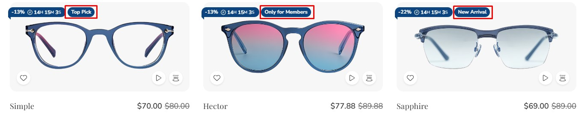
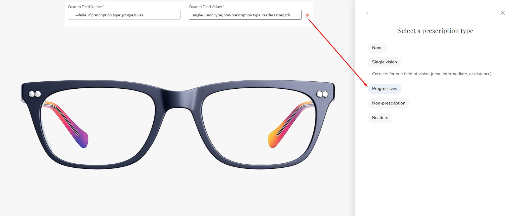
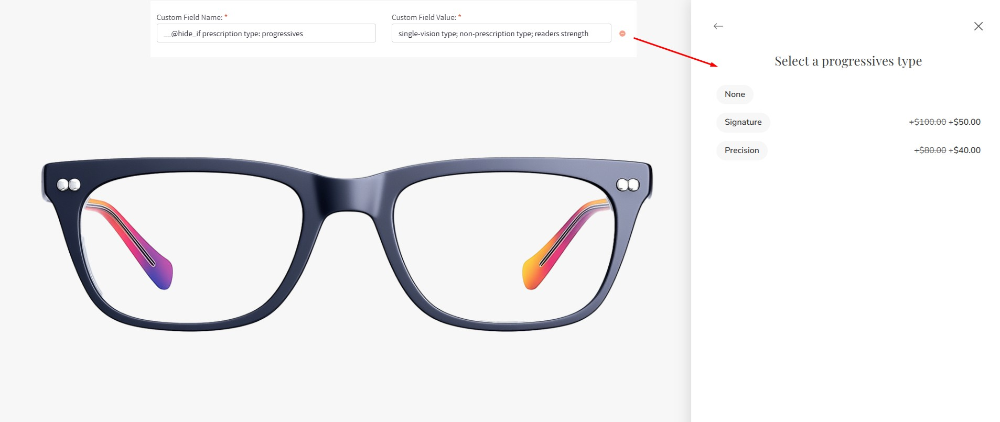
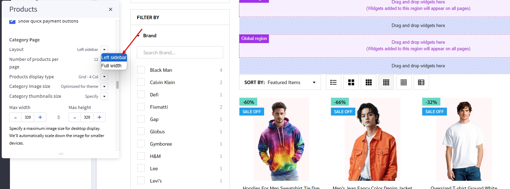
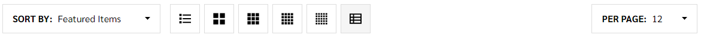
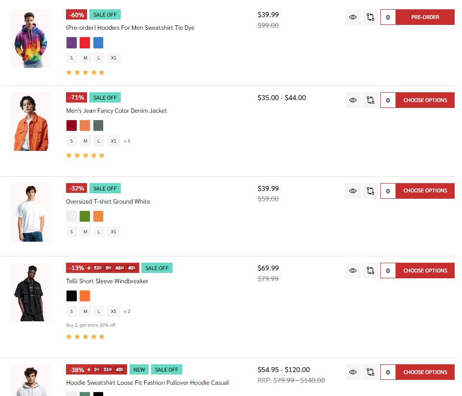
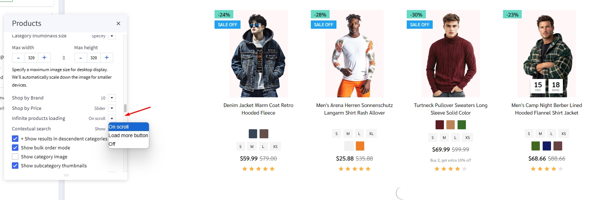
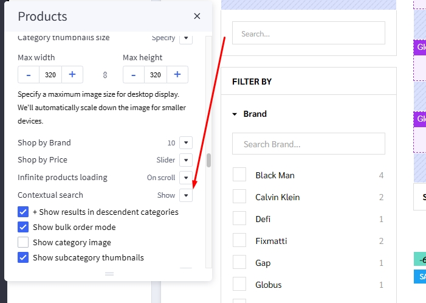

# Usage Guide

## Get Started

Thanks for using our theme!

To set up the theme exactly like our demo stores, you may need to install the our free app **[PapaThemes Widgets](https://www.bigcommerce.com/apps/papathemes-widgets/)**. This app provides additional widgets to build the content in Page Builder visually without coding skill. 

For displaying your Instagram photos on your website, you can use our free tool **[PapaThemes Instagram](https://instagram.papathemes.com/)**. We will guide you step by step later in this manual.

### Customizing Typography, Fonts and Colors

Customizing Typography, Fonts and Colors, Buttons in **Page Builder** > **Theme Styles** > **General**. There are dozens of options to help you customize your website beautifully and uniquely.

### Customizing Checkout Page's Typography and Colors

Customizing the checkout page's typography and colors in **Page Builder** > **Theme Styles** > **Optimized Checkout**

### Installing PapaThemes Widgets App

Find and install **[PapaThemes Widgets](https://www.bigcommerce.com/apps/papathemes-widgets/)** app from [BigCommerce Apps Marketplace](https://www.bigcommerce.com/apps/).

After installed, go to your admin page, on the left sidebar, click **Apps** >** My Apps**, click **Launch** button of PapaThemes Widgets app to open the app:


Then click the Install buttons in turn to install all available widgets:


Go to **Storefront** > **My Themes** > click **Customize** in dropdown menu of Dinosaur theme to open Page Builder. Select any theme style to start:


Verify the widgets installed successfully if they appear in Page Builder:


## Setting Up Glasses Style Home Page

To start customizing the theme, login to your admin panel, go to **Storefront** > **My Themes**, click **Customize** button next to theme thumbnail.

### Header


To configure the header, click on **Theme Styles** > **Header** section, here you can config the header colors, store logo position and size.

**Utility navigation** allows to change colors of the icon search, cart, wishlist, user.

**Watch the instruction video:**

<iframe width="760" height="515" src="https://www.youtube.com/embed/AFpgodrjqxg?si=5kDqYIO4jkK4WyX5" title="YouTube video player" frameborder="0" allow="accelerometer; autoplay; clipboard-write; encrypted-media; gyroscope; picture-in-picture; web-share" allowfullscreen></iframe>


#### Main Navigation

**Main Navigation** allows to customize this navigation bar like changing the menu type to column, dropdown menu or mega menu; changing colors of the top menu as well as the sub-menus. There is an option "**Hide webpage links**" that allows to hide the static web page links on the main navigation. "**Show top categories on mobile**" to show top categories on mobile device.

To configure the Main navigation, click on **Theme Styles** > **Header and footer**. In **Main navigation** section you can change:

- **Text color**: text color of menu item.

- **Text hover color**: text color on hover menu item.

- **Dropdown menu background**: background color of sub menu block.

- **Dropdown menu border**: border-color bottom of main navigation.


To config style of main navigation, click on **Theme Styles** > **Header**. In **Main navigation** select **Menu style**. The theme offer 3 option as below:

- `Simple`: show submenu under Simple menu style. **Simple menu** allow user insert banner and product into it


- `Alternate`: show sub-menu item as dropdown style.


To show top categories on mobile below the header, in **Themes style** > **Header and footer** Find **Show top categories on mobile** option checked to show all the link categories. Section you can change:

- **Background**: background color of top categories.

- **Text color**: text color of menu item.

- **Text hover color**: text color on hover menu item.

.

To create banner on Simple menu, in **Header and footer** find and checked **TURN ON EDITING MENU WIDGETS** to open Simple menu in design mode.


To customize Banner on right of sub menu on mobile. Drag and drop **Flex Banners | PapaThemes Beautify** into corresponding position:


In **Column 1**, set padding = `0`.

Remove all banner except banner 1. Selet your image want to upload. Set `Image width` = `250px`, `Image height` = `250px`. Set `Border radius` = `16px`.


In **CONTENT**. Click center and bottom on **Content align**.

In **Content padding**, **Content padding (Tablet)**, **Content padding (Mobile)** set `Top`, `Right`, `Bottom`, `Left` = `16`.

Hide `Heading Text`.

Show `Action button`. Set `Style` = `Default`, `Position` = `Bottom`.

.

In **GENERAL**

Choose edit **Width**. Choose `px` on **Width**, set `Value (Desktop)`, `Value (Tablet)`, `Value (Mobile)` = `250px`.

Choose edit **Padding**. **Desktop** set `Right`, `Left` = `8`. **Tablet** set `Right`, `Left` = `4`. **Mobile** set `Right` = `4`, `Bottom` = `0`, `Left` = `4`.

.

Duplicate 1 banner to 1 banners.

#### Hide webpage links

To hide Webpage links such as **Contact us**, **About Us**, **Shipping and return** from header, in **Themes style** > **Header** Find **Hide Webpage links** option checked to hide all the links except **Categories** link.

If you only want to hide some specific links not all the link you can do following step:

- `- Show web page started from` field: input the order link you want to show.
- `- Limit` field: input number web link you want to show after begining field.

For example: if you only want show **Blog** and **Shipping & return**: - Begining field: 1; - limit field: 2;

Note: the order will only count non-categories link.

Before:

.

**Watch the instruction video:**

<iframe width="760" height="515" src="https://www.youtube.com/embed/8gJ2qS92AUg?si=zJJ9CwFmVu0Jk1HQ" title="YouTube video player" frameborder="0" allow="accelerometer; autoplay; clipboard-write; encrypted-media; gyroscope; pictre-in-picture; web-share" allowfullscreen></iframe>

### Top Banner

Go back to **Storefront** > **My Themes** > click **Customize** button beside the theme thumbnail. You can see the top banner appears above the header. To change the colors of the top banner, go to **Theme Styles** > **General** > **Top banners** section. Here you can change the text color and the background color.

**Watch the instruction video:**

<iframe width="760" height="515" src="https://www.youtube.com/embed/NL1QiC3INpU?si=oMcyYeScMlBQl28f" title="YouTube video player" frameborder="0" allow="accelerometer; autoplay; clipboard-write; encrypted-media; gyroscope; picture-in-picture; web-share" allowfullscreen></iframe>


You can also create **top banner** by drag and drop **HTML widget** into corresponding position:


Enter your content inside `<p></p>`.

```html
<p>Get a discount with our limited time offer - Use code&nbsp;<strong>SAVE10</strong>&nbsp;for&nbsp;<strong>10%</strong>&nbsp;off your purchase!</p>
<p>Dive into our newest collection of eco-friendly products! Let's make a difference together.</p>
<p>Discover the beauty of handcrafted artisanal items in our latest collection. Every piece tells a story.</p>

```

### Ad Banner Top header

To display the ad banner appearing on all pages on the header, drag and drop the HTML widget to the corresponding position, paste the given code below to the HTML editor, then click Save HTML button.

```html
<p>STAY AHEAD OF THE STYLE CURVE WITH OUR LATEST ARRIVALS -<a href="/shipping-returns/" style="font-weight: 500"> Discover Now</a></p>
```

**Watch the instruction video:**

<iframe width="760" height="515" src="https://www.youtube.com/embed/bxD_I4ZbMi0?si=b9dDgPVcNsiazSX5" title="YouTube video player" frameborder="0" allow="accelerometer; autoplay; clipboard-write; encrypted-media; gyroscope; pictre-in-picture; web-share" allowfullscreen></iframe>

### Main Carousel


Upload the carousel images in **Storefront** > **Home Page Carousel**.

Go back to **Page Builder**, in **Theme Styles** > **Home Page**, make sure **Carousel** > **Show carousel** is selected. You can change the carousel styles and colors here.

To adjust the image height in mobile view, simply modify the **Mobile Image Height** to your preferred dimension.

**Watch the instruction video:**

<iframe width="760" height="515" src="https://www.youtube.com/embed/IvW6T-P3Oxs?si=vGlWYu6UDo4n11HP" title="YouTube video player" frameborder="0" allow="accelerometer; autoplay; clipboard-write; encrypted-media; gyroscope; pictre-in-picture; web-share" allowfullscreen></iframe>

### Shop By Category


Navigate to **Theme Styles** > **Home Page** > **Sections** enter `categories` to one o the section to display this block.


### Bestselling Products


Bestselling products only display when your store has some order.

You can configure bestselling products section settings in **Page Builder** > **Theme Styles** > **Home Page**, make sure one of the **Sections** fill input = `bestselling`. In **Products** section, you can change **Number of most popular products** to display, changing **Most popular products display** to `Carousel` or `Grid`.

### Featured Products


You can set featured products in **Products**, click the **star** icon on the same row to set the product as featured.

Go back to **Page Builder** > **Theme Styles** > **Home Page**, make sure one of the **Sections** fill input = `featured_products`. In **Products** section, you can change **Number of featured products** to display, changing **Featured products display** to `Carousel` or `Grid`.

### New Products


You can configure new products section settings in **Page Builder** > **Theme Styles** > **Home Page**, make sure one of the **Sections** fill input = `new`. In **Products** section, you can change the **Number of new products** to display, changing **New products display** to `Carousel` or `Grid`

### Recently Viewed Products


Recently Viewed Products will be display automatically viewed any product.

You can configure recently viewed products section settings in **Page Builder** > **Theme Styles** > **Home Page**, make sure one of the **Sections** fill input = `viewed` to enable this block.

### Featured Brands


**Featured brand** will automatic load all brands of your store.

To enable **Featured brand**, in **Theme Styles** > **Homepage** > **Section** choose one of sections and type `brands` to enable this block.

To change color background of this section click on **Brands carousel background** and select color fit to design.

### Grid layout banners


To create **grid layout banners** :

In **Page Builder**, drag & drop **Layout** widget to the corresponding position. Change **Column** = `1`, set **Padding** = `0 0 0 0`.

Drag & drop **Flex Banners | PapaThemes Beautify** widget into the **Layout**. Remove all banner except banner 1.

To edit **Banner 1**, change your image, set **Image width** = `1024px`, **Image height** = `500px`. Click **Show different image on mobile**, change your image in mobile, set **Image width** = `550px`, **Image height** = `500px`. Set **Border radius** = `0px`.

In **CONTENT**, hide `Heading text`.

In **GENERAL**. Set **Width (Desktop)** and **Width (Tablet)** = `40%`, **Width (Mobile)** = `100%`. Set **Padding (Desktop)** = `0 15 15 0`, **Padding (Tablet)** = `0 10 10 0`, **Padding (Mobile)** = `0 0 0 0`.

Duplicate banner 1 to 2 banners.

In **Banner 2**, change your image, set **Image width** = `1536px`, **Image height** = `500px`. Click **Show different image on mobile**, change your image in mobile, set **Image width** = `550px`, **Image height** = `450px`. Set **Border radius** = `0px`.

In **GENERAL**. Set **Width (Desktop)** and **Width (Tablet)** = `60%`, **Width (Mobile)** = `100%`. Set **Padding (Desktop)** = `0 0 15 15`, **Padding (Tablet)** = `0 0 10 10`, **Padding (Mobile)** = `0 0 0 0`.

In **Banner 3**, change your image, set **Image width** = `2560px`, **Image height** = `450px`. Click **Show different image on mobile**, change your image in mobile, set **Image width** = `550px`, **Image height** = `400px`. Set **Border radius** = `0px`.

In **GENERAL**. Set **Width (Desktop)**, **Width (Tablet)** , **Width (Mobile)** = `100%`. Set **Padding (Desktop)** = `15 0 0 0`, **Padding (Tablet)** = `10 0 0 0`, **Padding (Mobile)** = `0 0 0 0`.

### Recent Blog Posts


You can add blog posts in Storefront > Blog. Click the **+** button to add a new blog post. Make sure **Blog Visibility** is `on`.

To display the **recent blog** posts on the home page, go to **Page Builder**. In **Theme Styles** > **Home Page**, make sure one of Sections has typed `blog_recent`. Scroll down the Recent Blog section, you can configure **Heading**, **Number of posts** to display.

### Footer


In **Page Builder** > **Theme Styles** > **Footer**, you can configure the footer link colors, contact info ....

You can create title footer info inside the widget. Drag & drop **Section Heading | PapaThemes Beautify** to the corresponding position.

Select the **Column 1** and change **Padding (px)** to `0 0 0 0`.

In **Section Heading | PapaThemes Beautify**, set `Heading tag` = `H3`, select `Text style` = `Custom`. Set `Font family` = `Inherit`, `Font weight` = `Semi Bold`, `Font size` and `Font size (Mobile)` = `14px`. Set `Alignment` = `left`. Set `Padding`, `Padding (Mobile)` = `0 0 0 0`, `Margin` and `Margin (Mobile)` = `0 0 16 0`.


In **Page builder** > **Custom Widget** find **Footer links | PapaThemes Beautify** widget then drag and drop the widget to corresponding position in **Footer**.

Select the **Column 1** and change **padding** to `0 0 0 0`.

In **design** you can type your link content and click on the **insert/edit link** button as picture below:


In the popup window, copy your web link to `URL`. On the **Open links..** field you can select how your link could be open in **New Window** or **Current Window**


**Phone text** allow changing the text along with the phone number in the input field based on the text below.

```html
  We're available by phone (<a href='tel:{phone}'>{phone}</a>) and chat today from 8 a.m.-11 p.m.
```


You can create **Footer contact** inside the widget. Drag & drop the HTML into corresponding position, then copy the HTML below and click the **Save HTML** button.

```html
  <ul class="footer-contacts-callouts">
    <li><a href="/faq"><i class="icon" aria-hidden="true"><svg><use href="#icon-comments-question-check"></use></svg></i>FAQ</a></li>
    <li><a href="#text-message"><i class="icon" aria-hidden="true"><svg><use href="#icon-message-dots"></use></svg></i>Text</a></li>
    <li><a href="#chat"><i class="icon" aria-hidden="true"><svg><use href="#icon-messages"></use></svg></i>Chat</a></li>
    <li><a href="mailto:contact@papathemes.com"><i class="icon" aria-hidden="true"><svg><use href="#icon-envelope"></use></svg></i>Email</a></li>
</ul>
```


**Payment Icons** allows to select which payment icons to display.

**Copyright** allows to configure the copyright text.

**Watch the instruction video:**

<iframe width="760" height="515" src="https://www.youtube.com/embed/qIK4uCQxIJ8?si=yqS1NXihsqslwgV3" title="YouTube video player" frameborder="0" allow="accelerometer; autoplay; clipboard-write; encrypted-media; gyroscope; picture-in-picture; web-share" allowfullscreen></iframe>


### Instagram photos


To display your Instagram photos, open <https://instagram.papathemes.com/> Follow the instruction on this page to [Connect your Facebook Page with your Instagram account](https://www.facebook.com/business/help/898752960195806). Then click **Login With Facebook** button and follow the further steps to authorize access permission. Click **Show Embedding Code** button to generate the code embedding to your web store. Choose **Preset** = `Carousel` and select **LazyLoad**.

Copy all the code appear in Step 1 & Step 2. For example:

```html
<div id="papainstagram-render" class="container">Instagram Feed</div>
<script>!function(){var a=document.createElement("script");a.defer=!0,a.src="https://papathemes.s3.amazonaws.com/instagramapp/assets/js/embed-1.0.1.js",a.onload=function(){PapathemesInstagramApp.init({account_id:"102757428623728",element_id:"papainstagram-render",limit:"20",preset:"grid",lazyload:"false"})},document.body.appendChild(a)}();</script>
```

Go back to your store Page Builder. Drag & drop the HTML widget to the corresponding position. Paste the generated code above to the HTML editor, and click **Save HTML** button. Your Instagram photos should display like our demo store.

Please note that the app only updates your latest uploaded photos every 6 hours.

To create the title, drag & drop the **Section Heading** widget to above the Instagram photos. Set **Padding** = `40 0 40 0` and **Padding (Mobile)** = `20 0 20 0`.

**Watch the instruction video:**

<iframe width="760" height="515" src="https://www.youtube.com/embed/iUCG6iXI0zg?si=MMQGRbdEEY3D6KBP" title="YouTube video player" frameborder="0" allow="accelerometer; autoplay; clipboard-write; encrypted-media; gyroscope; picture-in-picture; web-share" allowfullscreen></iframe>

## Customizing Products Display

### Product Card


Configuring product cards in **Page Builder** > **Theme Styles** > **Products** > **Product cards**.

- **Background**: specifying the color of product card background.
- **Product header text color**: Specifying the product name's color.
- **Product header text hover color**: Specifying color when hover or focus.
- **Button text color**: specify color for text in button.
- **Button background color**: specify color for button background.
- **Title font size**: enter the number to change the title font size.
- **Show quantity input**: toggle on to display quantity input. If toggle of input field will not visible client cannot adjust the quantity in card.
- **show buttons always visible**: toggle on to make button always visible.

- **Show compare button**: toggle on to display compare button.
- **Show swatch**: Allows to display with swatch type product option on every product card. It's helpful to display different product variants like colors or sizes.
- **Swatch names (separator: ,)**: enter the option name to display in card.
- **Swatch color sizes**: Specifying the swatch color size.
- **Swatch images sizes**: Specifying the swatch image size.
- **Show videos & 360**: toggle on to display videos and 360 images.

### Hiding prices for non logged in customers

To turn on this feature, go to **setting** > **display** > **Products setting** > tick **Hide Product's Price from Guests?** checkbox.


### Showing/Hiding Quick-View button

By default quick-view buttons appear on all product cards. To hide it, go to **Page Builder** > **Theme Styles** > **Products** > **Display settings** un-tick **Show quick view button on product cards** checkbox.

### Displaying product weight, dimensions on PDP

Go to **Page Builder** > **Theme Styles** > **Products** > **Product Page**.

- Tick **Show product weight** checkbox.
- Tick **Show product dimensions** checkbox.

### Display sale badge on PDP

Go to **Page Builder** > **Theme Styles** > **Products** > **Product sale badges** in **Show product sale badges** select badge type

- `Percent`: display badges label with percent off.
- `label`: only display label.
- `None`: hide badge. 

- **Label**: Specifying the badge text.
- **Text color**: Specifying the badge text color.
- **Background color**: Specifying the badge background color

### Sold out badge

Displaying **sold out badge**, in **Page Builder** navigate to **Product** find **Show product sold-out badges** select Label.

Enter text to display for sold out badge at **Product sold out badge label** field.

- **Badge text color**: specifying text color.
- **Badge color**: specifying background color.

### Condition badge




Displaying the condition badge in tick **Show custom badges**.

Displaying the condition badge in **Custom badges**, tick **Enable custom badge from '__badge' custom field**. Edit product, add custom field with name `__badge` and value is the badge text.

- **Badge color (PDP)**: Specifying the text color of the custom badge in Product detail page.
- **Badge text color (PDP)**: Specifying the background color of the custom badge in Product detail page.

### Customizing Price Labels

You can customize sale price label, before sale price label, retail price label or regular price label in 
**Page Builder** > **Theme Styles** > **Products** > **Price Labels**


### Numbers of products display

In **Page Builder** > **Theme Styles** > **Products** > **Number of products displayed**:

- **Category page**: Specifying number of products display per page.
- **Brand page**: Specifying number of products displayed per page.
- **Search result page**: Specifying number of products displayed per page.
- **Product page (related products)**: Specifying number of products displayed
- **Product page (customers also viewed products)**: Specifying number of products displayed


### Configuring image sizes


In **Page Builder** > **Theme Styles** > **Products** > **Image Sizes**:

- Main product images: Specifying the main product image size displayed on PDP.
- Thumbnail image: Specifying the product thumbnail size.
- Zoomed image: Specifying the zoomed image size.
- Image in gallery view: Specifying product card image size.

### Shipping countdown


To enable shipping countdown, **Theme styles** > **Product page**  find **shipping countdown** field and input your cut off time. Find and copied your timezone from wikipedia `https://en.wikipedia.org/wiki/List_of_tz_database_time_zones` to **timezone** field.

To disable shipping countdown simply leave **shipping countdown** field empty.

Note: The time before cut off the message will show **shipping today** after cut off the message will show **shipping tomorrow**


### Flash sales


To create flash sales for each product and product card, in **product** section select the product that you want to add Flash Sales.

Find customer fields, click on add **Add Custom Field**. Enter `__countdown_label` into **Custom Field Name**. In **Custom Field Value**, type your content following format: `<your banner name>|<end in>` (example: FLASH SALES|ENDS IN). 

Create second custom field, enter `__countdown_date` into **Custom Field Name**. In **Custom Field Value**, input your cut off time following the format: `<yyyy>-<mm>-<dd> <hh>:<mm>:<ss><timezone>` (example: 2023-03-15 17:00:00-7).

Note:

- `<yyyy>-<mm>-<dd>` is optional. If the date is not entered, the banner will repeat automatically right after pass cut off time.
  
- `<hh>:<mm>:<ss>` is 24 hour format.
  
- `<timezone>` only input `+ or -` and `number` example: `+7`. if timezone are not entered, the countdown time will be different in different countries.

- Make sure you product also have sale price in orde for Flash Sale display. When you remove the **sale price** **Flash Sale** banner will auto disable.


### Modal Option PDP

To enable/disable the modal for selecting options in a product, you need to create the **Modifier Options** for the product first. Then, scroll down to find the **Custom Fields** section. Set the **Custom Field Name** = `__@modifiers_modal` and the **Custom Field Value** = `1` to enable the options modal or `0` to disable it.


To change the content of the "Select Option" button, go to the **Custom Fields** section. Set the **Custom Field Name** to `__@select_modifiers` and the **Custom Field Value** to the desired content.


To group multiple options into a single step in the option modal, set the **Custom Field Name** to `__@group + [title]` and the **Custom Field Value** to the Option Names you want to group together.


To change the title of each modifier option, set the **Custom Field Name** = `__@rename + [title to be changed]` and the **Custom Field Value** to the Option Names you want to modify.


To add a description for a modifier option in the modal, set the **Custom Field Name** = `__@tooltip + [Option Name]` and the **Custom Field Value** to the desired description of the option.


To add a description for each value of an option in the modal, set the **Custom Field Name** = `__@tooltip + [Option Name]: [Value]` and the **Custom Field Value** to the desired description of the value.


To select a value of a parent option inside the modal and switch to that option while skipping the modals of other options, set the **Custom Field Name** = `__@hide_if + [Option]: [Selected Value]` and the **Custom Field Value** to the values you want to skip in the parent option.

Step 1:



Step 2:



To set a non-sale price for each value of an option, you need to configure the rules for the Option Modifiers. Then, set the **Custom Field Name** = `"__@nonsale + [amount]"` and the **Custom Field Value** = `[Option Name]: [Values]` that should have the discount applied.


### Image Product 360

To create a 360-degree image of a product in the gallery, set the **Custom Field Name** = `__@360` and the Custom Field Value to the link of the image containing all angles of the product. Once saved, a button will appear on the product card and within the product detail page (PDP) to display the 360-degree modal of the product.

PDP:


Product Card:


### Variant Options Stepper

First, create a Variant Option with the type Rectangle List. Then, scroll down to find the Custom Fields section and add:

  - **Custom Field Name** = `__@stepper`.
  - **Custom Field Value** = the Rectangle List options in the Variant Option that need a UI change.


## Customizing Category Pages

Configuring the category pages in **Page Builder** > **Theme Styles** > **Products** > **Category Page**.

### Category Layout

Theme supports displaying category Page layout in `Full width` mode or `Left sidebar` mode. In **Layout**, select the particular display mode for default display.

- **Layout** = `Full width`


- **Layout** = `Left sidebar`
 


### Products Display Type

Theme supports displaying products in **grid** mode (2, 3, 4 or 5 products per row), in **list mode** or **bulk order** mode. In **Products display type**, select the particular display mode for default display.

- **Display type** on the right allow your customers to change product category display by themselves.


**Grid:**


**List:**


**Bulk order:**



### Display Bulk Order layout

To display this bulk order layout, select **Products display type** = `Bulk order`.


### Displaying Shop by Brand

- **Shop by Brand**: Specifying number of popular brands to display.


### Displaying Price Slider

- **Shop by Price**:
  - `Slider`: Displaying the price slider.
  - `List`: Displaying price list.
  - `Hide`.


### Infinite Products Loading

This feature allows you to choose the method of loading more products in the current catalog.



**Infinite Products Loading**:

  - `On scroll`: Products will automatic loadout when scrolling down.

  - `Load more button`: Click on the **Load more button** to continue loading more products.

  - `Off`: Show **page numbers** and **arrow** button as original. Click on button to see more products.

### Display contextual search

This feature allows searching products within the current category and the current selected filter.



Select **Show quick search in category** = `Show` to enable it.

- **+ Show results in descendent categories**: if selected, it also displays results in the descendent categories.

### Common Settings

- **Number of products per page**: Specifying number of products to display per page.
- **Show category image**: Displaying the category image or not.
- **Show category description on AMP page**: Displaying category description on AMP category page or not. If the category content contains images, the AMP page could be invalid. It's recommended to turn off this option.

## Customizing Brand Page & Search Page

Configuring the brand page in **Page Builder** > **Theme Styles** > **Products** > **Brand Page**.

- **Number of brands per page**: Specifying number of brands to display per page.
- **Number of products per page**: Specifying number of products to display per page.
- **Brand image in gallery view**: Specifying the brand card image size.
- **Brand image in brand page**: Specifying the large image size displayed on the brand page.

Configuring the search results page in **Page Builder** > **Theme Styles** > **Products** > **Search results**.

- **Number of products per page**: Specifying number of products to display on the search results page.

### Displaying brand quick-view introduction


In **Marketing** > **Marketing Banner**, click **Create a Banner** button. 

- Enter the brand introduction content to **Banner Content**.
- Select **Show on Page** = `For a Specific Brand` and select the corresponding brand.
- Select **Location** = `Bottom of Page`.
- Then click **Save** button to finish.

Watch the instruction video:

<iframe width="760" height="515" src="https://www.youtube.com/embed/T_V5ESUEq2M?si=GvRIRsv8OkWSS6gQ" title="YouTube video player" frameborder="0" allow="accelerometer; autoplay; clipboard-write; encrypted-media; gyroscope; pictre-in-picture; web-share" allowfullscreen></iframe>

### Display product in Search page

To change number products display per page in **Product** section find **Search page** then change **Number of products per page**:


## Customizing Cart page

### Display free shipping message in cart page.

Not qualify message


Qualify message


In **Marketing** > **Promotion** click on **create** and select **With legacy editor**

In **Promotion detail** name your promotion 

In **promotion type** select `Orders totaling more than X amount get free shipping to specific shipping zones` at the field **spend at least** type your amount


In **Promotion option** type your message at **Congratulations Banner Message** to display for cart have qualified and type your message for cart have not qualify at **Upsell Banner Message** with format `[your text] %%condition.remaining%% [your text]` then click save


