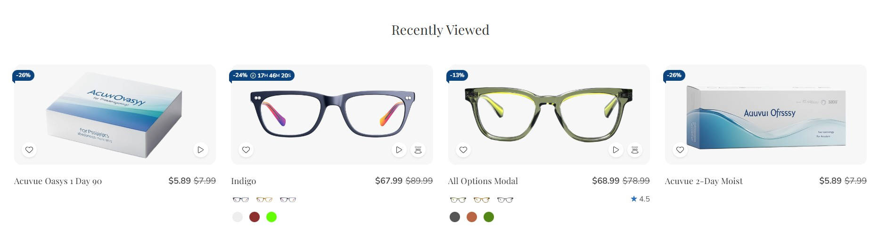
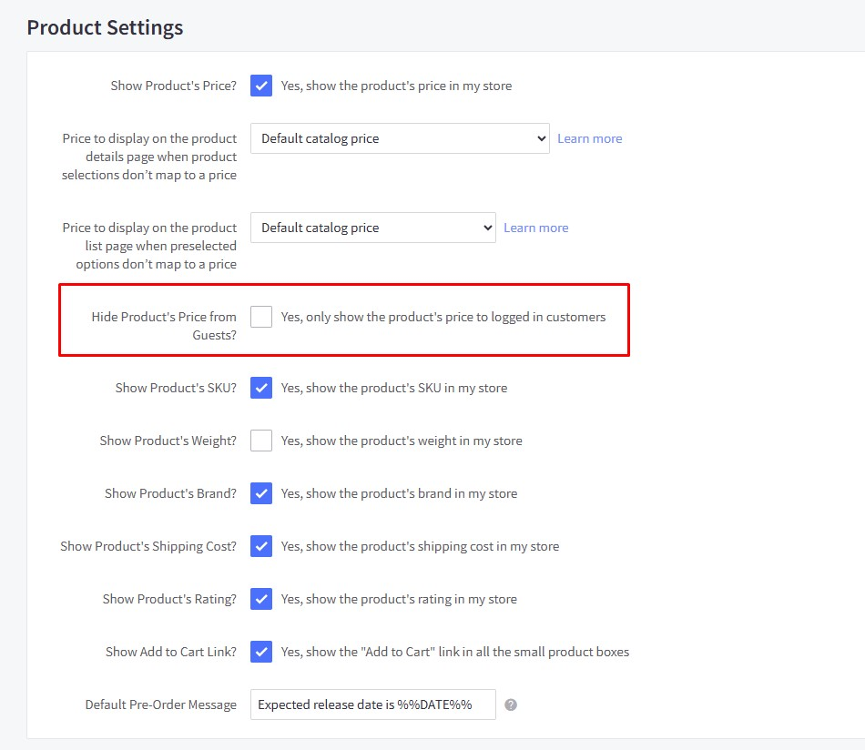
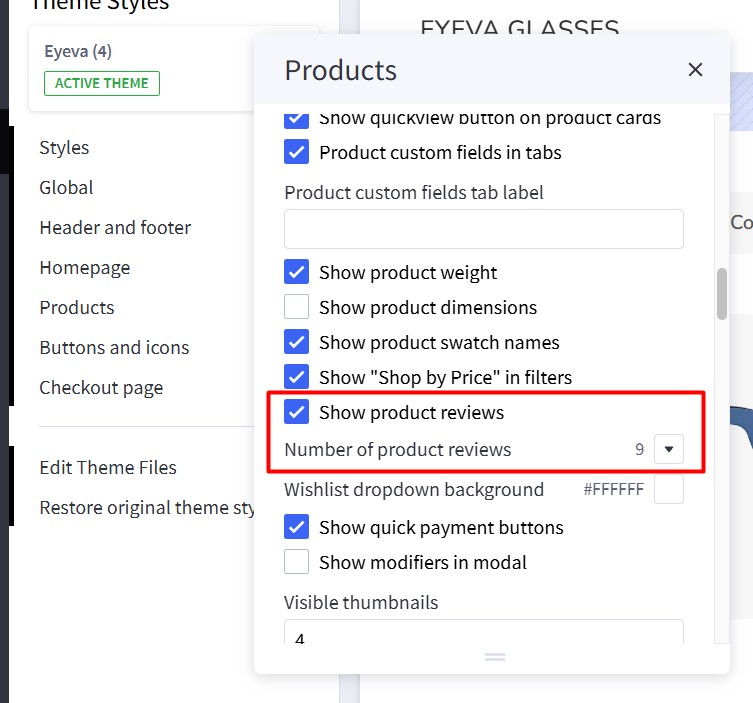
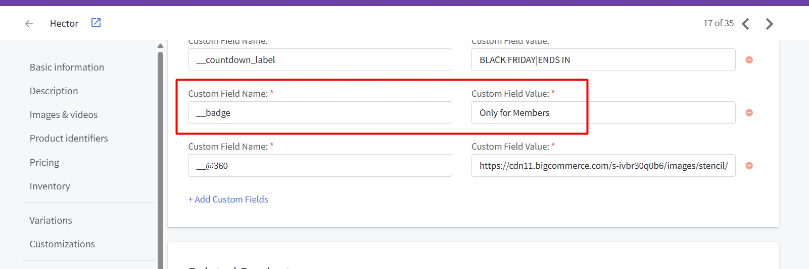
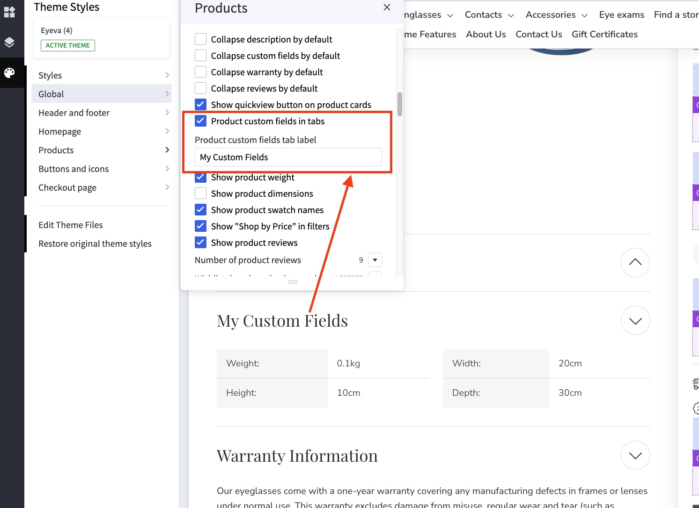
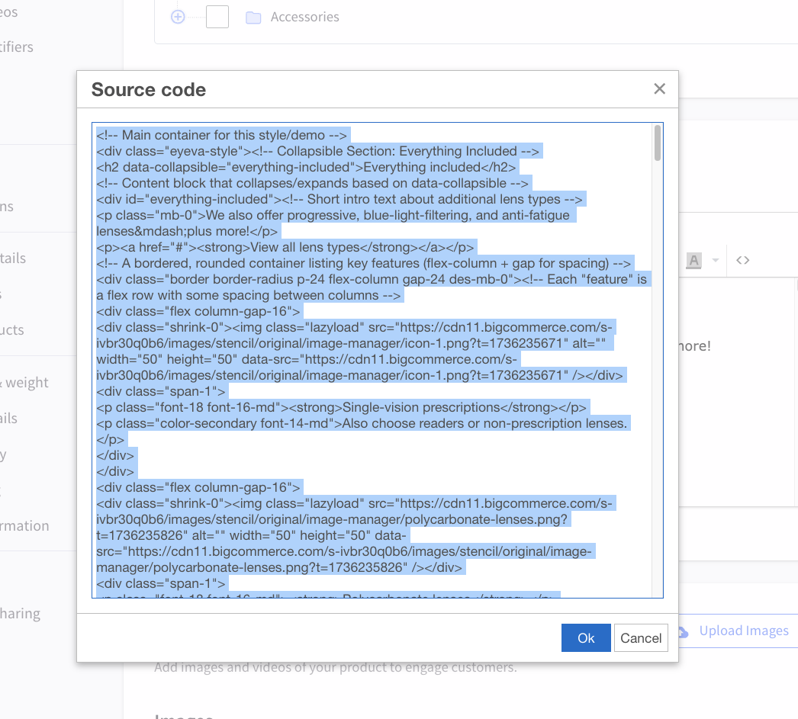
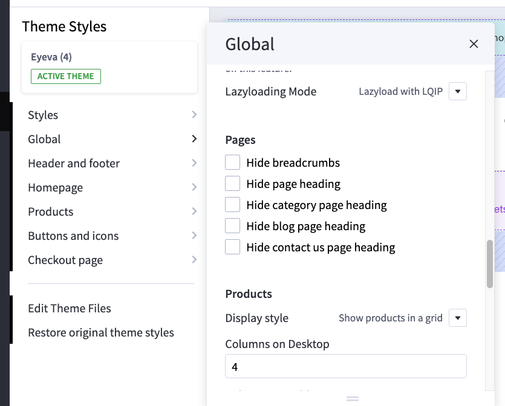
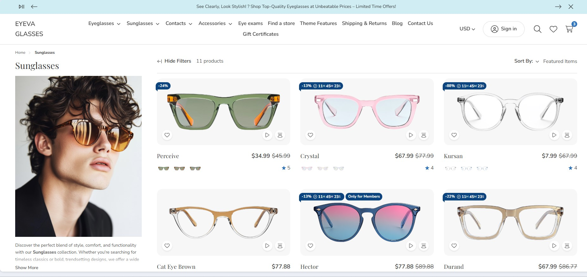

# Usage Guide

## Get Started

Thank you for using our theme!

To set up the theme exactly like our demo stores, you may need to install our free app **[PapaThemes Widgets](https://www.bigcommerce.com/apps/papathemes-widgets/)**. This app provides additional widgets to visually build content in Page Builder without requiring coding skills.

To display your Instagram photos on your website, you can use our free tool **[PapaThemes Instagram](https://instagram.papathemes.com/)**. We will guide you step by step later in this manual.

### Customizing Typography, Fonts, and Colors

Customize typography, fonts, colors, and buttons in **Page Builder** > **Theme Styles** > **General**. There are dozens of options to help you beautifully and uniquely customize your website.

### Customizing the Checkout Page's Typography and Colors

Customize the checkout page's typography and colors in **Page Builder** > **Theme Styles** > **Optimized Checkout**.

### Installing the PapaThemes Widgets App

Find and install the **[PapaThemes Widgets](https://www.bigcommerce.com/apps/papathemes-widgets/)** app from the [BigCommerce Apps Marketplace](https://www.bigcommerce.com/apps/).

After installation, navigate to your admin panel. In the left sidebar, click **Apps** > **My Apps**. Then, click the **Launch** button for the PapaThemes Widgets app to open it:


Next, click the **Install** buttons in sequence to install all the available widgets.


Go to **Storefront** > **My Themes**. Click **Customize** on the Eyeva theme's dropdown menu to open Page Builder. Select any theme style to begin.


Confirm the widgets are installed by verifying they appear in Page Builder.


## Setting Up the Glasses Style Home Page

To start customizing the theme, log in to your admin panel. Navigate to **Storefront** > **My Themes** and click the **Customize** button next to the theme thumbnail.

### Header


To configure the header, navigate to **Theme Styles** > **Header**. Here, you can adjust the header colors, store logo position, and size.

**Utility navigation** allows you to customize the colors of the search, cart, wishlist, and user icons.

**Watch the instruction video:**

<iframe width="760" height="515" src="https://www.youtube.com/embed/AFpgodrjqxg?si=5kDqYIO4jkK4WyX5" title="YouTube video player" frameborder="0" allow="accelerometer; autoplay; clipboard-write; encrypted-media; gyroscope; picture-in-picture; web-share" allowfullscreen></iframe>


#### Main Navigation

**Main Navigation** allows you to customize the navigation bar. You can change the menu type to column, dropdown menu, or mega menu, and also modify the colors of the top menu and submenus.

The "**Hide webpage links**" option allows you to hide static webpage links in the main navigation.


The "**Show top categories on mobile**" option displays top categories on mobile devices.


To configure the Main Navigation, navigate to **Theme Styles** > **Header and Footer**. In the **Main Navigation** section, you can adjust the following:

- **Background**: The background color of the top categories.
- **Text color**: The text color of menu items.
- **Text hover color**: The text color when hovering over menu items.
- **Dropdown menu background**: The background color of the submenu block.
- **Dropdown menu border**: The border color at the bottom of the main navigation.


#### Mega Menu vs. Standard Menu

To configure the style (mega menu, standard menu, etc.) of the main navigation, go to **Theme Styles** > **Header**. In **Main Navigation**, select **Menu Style**. The theme offers two options:

- `Simple`: Displays the submenu in a mega menu style. The **Simple Menu** allows you to insert banners and products.


- `Alternate`: Displays submenu items in a dropdown (standard) style.


#### Displaying Widgets on the Mega Menu

To display banners in the Mega Menu, go to **Header and Footer** and check **TURN ON EDITING MENU WIDGETS** to open the Mega Menu in design mode.


To customize the banner on the right of the submenu on mobile, drag and drop a **Flex Banners | PapaThemes Beautify** widget into the corresponding position:


In **Column 1**, set padding to `0`.

Remove all banners except Banner 1. Select the image you want to upload. Set `Image width` to `250px`, `Image height` to `250px`, and `Border radius` to `16px`.


In **CONTENT**, click **Center** and **Bottom** for **Content Align**.

In **Content Padding**, **Content Padding (Tablet)**, and **Content Padding (Mobile)**, set `Top`, `Right`, `Bottom`, and `Left` to `16`.

Hide the `Heading Text`.

Show the `Action Button`. Set `Style` to `Default` and `Position` to `Bottom`.


In **GENERAL**, edit the **Width**. Choose `px` for **Width**, and set `Value (Desktop)`, `Value (Tablet)`, and `Value (Mobile)` to `250px`.

Edit the **Padding**. For **Desktop**, set `Right` and `Left` to `8`. For **Tablet**, set `Right` and `Left` to `4`. For **Mobile**, set `Right` to `4`, `Bottom` to `0`, and `Left` to `4`.


Duplicate Banner 1 to create another banner.

#### Hide Web Page Links

To hide web page links such as **Contact Us**, **About Us**, and **Shipping & Returns** from the header, navigate to **Theme Styles** > **Header**. Locate the **Hide Web Page Links** option and select it to hide all links except **Categories**.

If you want to hide only specific links, follow these steps:

- **Show web page starting from**: Enter the order number of the first link you want to display.
- **Limit**: Enter the number of webpage links you want to display, starting from the specified order.

For example, to display only **Blog** and **Shipping & Returns**:

- **Show web page starting from**: `1`
- **Limit**: `2`

Note: The order only counts non-category links.


**Watch the instruction video:**

<iframe width="760" height="515" src="https://www.youtube.com/embed/8gJ2qS92AUg?si=zJJ9CwFmVu0Jk1HQ" title="YouTube video player" frameborder="0" allow="accelerometer; autoplay; clipboard-write; encrypted-media; gyroscope; picture-in-picture; web-share" allowfullscreen></iframe>

### Top Banner

Go back to **Storefront** > **My Themes**, and click the **Customize** button beside the theme thumbnail. You can see the top banner above the header. To change the colors of the top banner, go to **Theme Styles** > **General** > **Top Banners**. Here, you can change the text color and background color.

**Watch the instruction video:**

<iframe width="760" height="515" src="https://www.youtube.com/embed/NL1QiC3INpU?si=oMcyYeScMlBQl28f" title="YouTube video player" frameborder="0" allow="accelerometer; autoplay; clipboard-write; encrypted-media; gyroscope; picture-in-picture; web-share" allowfullscreen></iframe>


### Display Top Banner on All Pages


To display a top banner that appears on all pages in the header, drag and drop an **HTML Widget** into the desired position. Paste the code below into the HTML editor, and then click the **Save HTML** button.

```html
<div data-banner-carousel style="text-align: center">
  <div>See Clearly, Look Stylish! ? Shop Top-Quality Eyeglasses at Unbeatable Prices – Limited Time Offers!</div>
  <div><strong>Elevate Your Vision, Elevate Your Style!</strong> ? Discover Our Exclusive Eyeglasses Collection at Amazing Prices &ndash; Shop Now!</div>
  <div><strong>Perfect Your Look with Precision!</strong> ?️ Browse Our Premium Eyewear Range &ndash; Exceptional Deals Await!</div>
</div>
```

This code displays 3 messages in a carousel (specified by the `data-banner-carousel` attribute).

To display a simple message, you can just enter the HTML code like this:

```html
<p>See Clearly, Look Stylish! ? Shop Top-Quality Eyeglasses at Unbeatable Prices – Limited Time Offers!</p>
```

**Watch the instruction video:**

<iframe width="760" height="515" src="https://www.youtube.com/embed/bxD_I4ZbMi0?si=b9dDgPVcNsiazSX5" title="YouTube video player" frameborder="0" allow="accelerometer; autoplay; clipboard-write; encrypted-media; gyroscope; picture-in-picture; web-share" allowfullscreen></iframe>

### Main Carousel


Upload the carousel images in **Storefront** > **Home Page Carousel**.

Return to **Page Builder**. Navigate to **Theme Styles** > **Home Page** and ensure that **Carousel** > **Show carousel** is enabled. You can customize the carousel styles and colors here.


To adjust the image height in mobile view, modify the **Mobile fixed height (px)** to your preferred dimension. For example, enter `500` to display a 500px height on mobile devices.


To display a different image on mobile, upload the image in the Image Manager. Then, copy the image URL and paste it into the corresponding **Slide [Number] for mobile** field (e.g., **Slide 1 for mobile** to **Slide 5 for mobile**).

**Watch the instruction video:**

<iframe width="760" height="515" src="https://www.youtube.com/embed/IvW6T-P3Oxs?si=vGlWYu6UDo4n11HP" title="YouTube video player" frameborder="0" allow="accelerometer; autoplay; clipboard-write; encrypted-media; gyroscope; picture-in-picture; web-share" allowfullscreen></iframe>

### Free Shipping Banner below the Homepage Carousel


In Page Builder, drag and drop the **Section Heading** widget into the corresponding widget region:


Configure the widget options as follows:


-   **Heading tag**: P
-   **Text style**: Custom
-   **Font family**: Inherit
-   **Font weight**: Extra Bold
-   **Font size (Desktop)**: 24px
-   **Font size (Mobile)**: 16px
-   **Line height**: 1.6
-   **Text color**: #0B5F33
-   **Alignment**: Left / Center / Right
-   **Margin (Desktop)**: 0 0 0 0
-   **Margin (Mobile)**: 0 0 0 0
-   **Padding (Desktop)**: 24 16 24 16
-   **Padding (Mobile)**: 24 16 24 16
-   **Background color**: Optional (color picker or hex code)

Edit the text using the inline editor:


### Banner: Pick 5 pairs from our Home Try-On collection


1.  Install the **Leaderboard | Eyeva Glasses** widget from our **PapaThemes Widgets** app:

  

2.  In Page Builder, drag and drop the **Leaderboard | Eyeva Glasses** widget into the corresponding widget region:

  

3.  Configure the widget options as follows:

  


| **Setting**           | **Value**         |
|-----------------------------|---------------------------------------|
| **Display Image**           | **Enabled** (shows a banner image) |
| **Image**                   | _(Preview of the “Try-On” box image)_   |
| **Image Alt**               | `image alt text`                        |
| **Image Width**             | `500 px`                                |
| **Image Height**            | `500 px`                                |
| **Image (mobile) (optional)** |     |
| **Mobile Image Width**      | `1500 px`                               |
| **Mobile Image Height**     | `1500 px`                               |
| **Content Direction**       | **Text – Image**                        |
| **Content Direction (mobile)** | **Image – Text**                     |
| **Background**             | `#F7F7F7`                                |
| **Background on Mobile**    | `#FFFFFF`                                |
| **Heading**                 | *(visible)*        |
| **Text1**                   | *(invisible)*        |
| **Text2**                   | *(visible)*        |
| **Button1**                 | *(visible)*        |
| **Button2**                 | *(visible)*        |
| **Button3**                 | *(invisible)*        |
| **Style**                   | **Inherit theme**                       |


### Shop By Category


To display this block, navigate to **Theme Styles** > **Home Page** > **Sections** and enter `categories` into one of the section inputs.


### 2 Banners: Shop Winter & Shop Emma


Drag and drop the **Flex Banners | PapaThemes Beautify** widget into the corresponding widget region.

Click on **Banner 1** and configure the widget options as follows:


| **Setting**         | **Value**                                        |
|---------------------|--------------------------------------------------|
| **Banner 1 → Image** |                                                  |
| Image               | *(upload your image)*            |
| Image width         | **1824 px**                                      |
| Image height        | **1200 px**                                      |
| Show different image on mobile | *(off - no need)* |
| Image alt text      | `image alt text`                                 |
| Image fit           | **Fit to box**                                   |
| Lazy-Load           | **Checked** (ON)                                 |
| Border radius       | **0 px**                                         |
| Link                | *(put your link)*                                        |
| **Content**         |                                                  |
| Heading text        | “Shop Winter 2025” (WYSIWYG inline editor) |
| **General**         |                                                  |
| Width (Desktop)     | **50%**                                          |
| Width (Tablet)      | **50%**                                          |
| Width (Mobile)      | **100%**                                         |


Settings for Action button:

| **Setting**          | **Value**     |
|----------------------|---------------|
| **Size**             | Unset         |
| **Style**            | Custom        |
| **Font family**      | Theme Default |
| **Radius**           | 25 px         |
| **Color**            | #FFFFFF       |
| **Color hover**      | #2D73BD       |
| **Text color**       | #000000       |
| **Text color hover** | #FFFFFF       |
| **Position**         | Bottom        |


Settings for Width:

| **Setting**       | **Value** |
|-------------------|-----------|
| **Width**         | **%**     |
| **Value (Desktop)** | 50%       |
| **Value (Tablet)**  | 50%       |
| **Value (Mobile)**  | 100%      |


Settings for Padding:

| **Device** | **Top** | **Right** | **Bottom** | **Left** |
|------------|--------|----------|-----------|----------|
| **Desktop** | 0      | 16       | 0         | 0        |
| **Tablet**  | 0      | 8        | 0         | 0        |
| **Mobile**  | 0      | 0        | 8         | 0        |

Repeat the same steps for **Banner 2**, but configure the **Width** option as follows:


Settings for Padding:

| **Device**   | **Top** | **Right** | **Bottom** | **Left** |
|--------------|--------|----------|-----------|----------|
| **Desktop**  | 0      | 0        | 0         | 16       |
| **Tablet**   | 0      | 0        | 0         | 8        |
| **Mobile**   | 8      | 0        | 0         | 0        |


### Banner: Introducing foldable frames


Drag and drop the **Flex Banners | PapaThemes Beautify** widget into the corresponding widget region. Remove any other banners, keeping only one, and configure its options as follows:


Below is a **single table** summarizing the **Banner 1** settings (Flex Banners | PapaThemes Beautify) as shown in the screenshot. This includes the **Image** section, the **Content** section, and any **General** settings visible:

| **Section** | **Setting**                        | **Value**                                                                                  |
|-------------|------------------------------------|--------------------------------------------------------------------------------------------|
| **Image**   | Image                               | *(upload your image for desktop)*                                                                  |
|             | Image width                         | **3000 px**                                                                               |
|             | Image height                        | **1000 px**                                                                               |
|             | Show different image on mobile      | **ON**                                                                                    |
|             | Image (Mobile)                      | *(upload your image for mobile)*                                                        |
|             | Image width (Mobile)                | **1000 px**                                                                               |
|             | Image height (Mobile)               | **1000 px**                                                                               |
|             | Image alt text                      | `image alt text`                                                                          |
|             | Image fit                           | **Fill to box**                                                                           |
|             | Lazy-Load                           | **Checked** (ON)                                                                          |
|             | Border radius                       | **0 px**                                                                                  |
|             | Link                                | *(put your link)*                                                                                 |
| **Content** |                        |               |
|             | Content padding (Desktop)           | **Top:** 40<br>**Right:** 320<br>**Bottom:** 40<br>**Left:** 128                          |
|             | Content background                  | *(transparent)*                                                                         |
|             | Content padding (Tablet)            | **Top:** 40<br>**Right:** 320<br>**Bottom:** 40<br>**Left:** 16                           |
|             | Content padding (Mobile)            | **Top:** 10<br>**Right:** 15<br>**Bottom:** 10<br>**Left:** 15                            |
|             | Heading text                        | “**Introducing foldable frames**” (36px in the WYSIWYG inline editor)                            |
|             | Description text                    | “**Each pair is engineered …**”                                        |
|             | Action button                       | “**Shop now**”                                                                |*                        |


Width settings:

| **Setting**        | **Value** |
|--------------------|-----------|
| **Width**          | **%**     |
| **Value (Desktop)**| **100%**  |
| **Value (Tablet)** | **100%**  |
| **Value (Mobile)** | **100%**  |


Padding settings:

| **Device**   | **Top** | **Right** | **Bottom** | **Left** |
|--------------|--------|----------|-----------|----------|
| **Desktop**  | 0      | 0        | 0         | 0        |
| **Tablet**   | 0      | 0        | 0         | 0        |
| **Mobile**   | 0      | 0        | 0         | 0        |


### Banner: Take 15% off two or more prescription pairs


Set up this banner similarly to the "**Pick 5 pairs**" banner. See the instructions above: [Banner: Pick 5 pairs from our Home Try-On collection](#banner-pick-5-pairs-from-our-home-try-on-collection).


### Banner: From custom-designed acetate to ultra-lightweight titanium


Drag and drop the **Leaderboard | Eyeva Glasses** widget into the corresponding widget region. Configure the widget options as follows:


| **Setting**                     | **Value**                                                                   |
|---------------------------------|-----------------------------------------------------------------------------|
| **Display Image**               | *(OFF)*                                   |
| **Background**                  | `#0F4177`                                                                    |
| **Background on Mobile**        | `#0F4177`                                                                    |
| **Heading**                     | **Visible**                                                    |
| **Text1**                       | **Visible**                                                    |
| **Text2**                       | **Visible**                                                    |
| **Button1**                     | *(OFF)*                                               |
| **Button2**                     | *(OFF)*                                               |
| **Button3**                     | *(OFF)*                                               |
| **Style**                       | **Custom**                                                                   |
| **Base Spacing**                | **1 rem**                                                                    |
| **Heading Font Size (Desktop)** | **36 px**                                                                    |
| **Heading Font Size (Mobile)**  | **28 px**                                                                    |
| **Heading Text Color**          | `#FFFFFF`                                                                    |
| **Text Font Size (Desktop)**    | **16 px**                                                                    |
| **Text Font Size (Mobile)**     | **14 px**                                                                    |
| **Text Color**                  | `#FFFFFF`                                                                    |
| **Link Color**                  | `#2D73BD`                                                                    |


Then, add two spacer widgets (**Spacer | PapaThemes Beautify**) above and below the Leaderboard widget. Configure the spacer options as follows:


| **Device**   | **Spacing** |
|--------------|-------------|
| **Desktop**  | 128 px      |
| **Tablet**   | 64 px       |
| **Mobile**   | 64 px       |


Next, in the **Layers** panel, select the **Layout** containing the Leaderboard widget and the two Spacer widgets. Update the background color to `#0F4177`:


### Banner: Get 20% off your first contacts order


Set up this banner similarly to the "**Pick 5 pairs**" banner. See the instructions above: [Banner: Pick 5 pairs from our Home Try-On collection](#banner-pick-5-pairs-from-our-home-try-on-collection).


### Banner: For every pair purchased


Set up this banner similarly to the "**Pick 5 pairs**" banner. See the instructions above: [Banner: Pick 5 pairs from our Home Try-On collection](#banner-pick-5-pairs-from-our-home-try-on-collection).

Configure the widget options as follows:

| **Setting**                  | **Value**                                                                                          |
|------------------------------|------------------------------------------------------------------------------------------------------|
| **Display Image**            | **ON**                                                                           |
| **Image**                    | *(upload your image)*                                                         |
| **Image Alt**                | `image alt text`                                                                                    |
| **Image Width**              | **700 px**                                                                                           |
| **Image Height**             | **700 px**                                                                                           |
| **Image (mobile) (optional)** | *(Not selected)*                                                                                    |
| **Mobile Image Width**       | **1500 px**                                                                                          |
| **Mobile Image Height**      | **1500 px**                                                                                          |
| **Content Direction**        | **Image - [Text]**                |
| **Content Direction (mobile)** | **Image - [Text]**                   |
| **Background**               | **#E2EDEE**                                                                                          |
| **Background on Mobile**     | **#E2EDEE**                                                                                          |
| **Heading**                  | **ON**                                                                            |
| **Text1**                    | **ON**                                                                            |
| **Text2**                    | **ON**                                                                            |
| **Button1**                  | **OFF**                                                                            |
| **Button2**                  | **OFF**                                                                            |
| **Button3**                  | **OFF**                                                                            |
| **Style**                    | **Inherit theme**                                                                                    |


### Bestselling Products


Bestselling products will only appear once your store has received orders.

You can configure the bestselling products section settings in **Page Builder** > **Theme Styles** > **Home Page**. Ensure that one of the **Sections** inputs is set to `bestselling`. In the **Products** section, you can adjust the **Number of most popular products** to display and change the **Most popular products display** to either `Carousel` or `Grid`.


### Featured Products


You can designate products as "featured" in **Products** by clicking the **star** icon on the corresponding row.

Return to **Page Builder** > **Theme Styles** > **Home Page** and ensure that one of the **Sections** inputs is set to `featured_products`. In the **Products** section, you can modify the **Number of featured products** to display and change the **Featured products display** to either `Carousel` or `Grid`.

### New Products


You can configure the new products section settings in **Page Builder** > **Theme Styles** > **Home Page**. Ensure that one of the **Sections** inputs is set to `new`. In the **Products** section, you can change the **Number of new products** to display and change the **New products display** to either `Carousel` or `Grid`.

### Wide banner


In Page Builder, drag & drop the Flex Banner widget into the corresponding widget region:


Configure the widget options as follows:

|  |  |  |
|---|---|---|
|  |  |  |


| **Setting**                                    | **Value**                                   |
|-----------------------------------------------|---------------------------------------------|
| **Image**                                      |                                             |
| Image                                          | (Eyeglasses image)                          |
| Image width                                    | 3000 px                                     |
| Image height                                   | 1000 px                                     |
| Show different image on mobile                 | ON (toggle enabled)                         |
| Image (Mobile)                                 | (Alternate eyeglasses image)               |
| Image width (Mobile)                           | 1000 px                                     |
| Image height (Mobile)                          | 1000 px                                     |
| Image alt text                                 | *(blank)*                                   |
| Image fit                                      | Fill to box                                 |
| Lazy-Load                                      | ON (toggle enabled)                         |
| Border radius                                  | 0 px                                        |
| Link                                           | *(blank)*                                   |
| **Content**                                    |                                             |
| Content align (Horizontal)                     | Left                                        |
| Content align (Vertical)                       | Center                                      |
| Content padding (Desktop)                      | Top: 40 px • Right: 320 px • Bottom: 40 px • Left: 128 px |
| Content padding (Tablet)                       | Top: 40 px • Right: 320 px • Bottom: 40 px • Left: 16 px   |
| Content padding (Mobile)                       | Top: 10 px • Right: 15 px • Bottom: 10 px • Left: 15 px    |
| Content background                             | *(none)*                                    |
| Heading text                                   | Visible (eye icon ON)                       |
| Description text                               | Visible (eye icon ON)                       |
| Action button                                  | Visible (eye icon ON)                       |
| **General**                                    |                                             |
| Width (Desktop)                                | 100%                                        |
| Width (Tablet)                                 | 100%                                        |
| Width (Mobile)                                 | 100%                                        |
| Padding                                        | *(not shown, likely 0)*                    |


### Recently Viewed Products



Recently Viewed Products will be displayed automatically after a product has been viewed.

You can configure the Recently Viewed Products section settings in **Page Builder** > **Theme Styles** > **Home Page**. Ensure that one of the **Sections** inputs is set to `viewed` to enable this block.

### Configure product columns on desktop, tablet, and mobile


To change the number of products displayed per row, go to **Page Builder** > **Global** > **Product**.

- **Columns on Desktop**: Specify the number of product columns to display on Desktop.
- **Columns on Tablet**: Specify the number of product columns to display on Tablet.
- **Columns on Mobile**: Specify the number of product columns to display on Mobile.

### Featured Brands


The **Featured Brands** section will automatically display all brands from your store.

To enable the **Featured Brands** section, in **Theme Styles** > **Home Page** > **Sections**, choose one of the sections and type `brands` to enable this block.

To change the background color of this section, click on **Brands carousel background** and select a color that fits your design.


### Recent Blog Posts


You can add blog posts in **Storefront** > **Blog**. Click the **+** button to add a new blog post. Make sure **Blog Visibility** is `on`.

To display the **recent blog** posts on the home page, go to **Page Builder**. In **Theme Styles** > **Home Page**, make sure one of Sections has typed `blog`. Scroll down the Recent Blog section, you can configure **Heading**, **Number of posts** to display.


### Footer


Configure footer settings in **Theme Styles** > **Header and footer** >  **Footer**.


| **Setting**                         | **Meaning**                                                                                           |
|------------------------------------|-------------------------------------------------------------------------------------------------------|
| **Footer background**              | The background color for the store’s footer area.                                                     |
| **Text color**                     | The primary text color used throughout the footer.                                                    |
| **Hover link color**               | The color applied to footer links when hovered over by the mouse.                                     |
| **Heading color**                  | The color for any heading text within the footer (e.g. “Contact Us,” “Information,” etc.).            |
| **Border color**                   | The color of any borders or dividing lines in the footer.                                             |
| **Phone text**                     | The text snippet (including an HTML link) displayed for phone contact in the footer.                  |
| **Show “Powered by BigCommerce”**  | Toggles the visibility of the “Powered by BigCommerce” credit at the footer’s bottom.                  |
| **Show brands in footer**          | Determines if brand logos/links are displayed in the footer.                                          |
| **Show “&copy;”, current year and store name** | Toggles the display of a copyright notice showing “© [current year] [store name].”         |


**Phone text** allows you to change the text, along with the phone number, in the input field based on the text below.

```html
We're available by phone (<a href='tel:{phone}'>{phone}</a>) and chat today from 8 a.m.-11 p.m.
```

`{phone}` will be replaced by the phone number you set in the store settings.


You can display contact icons (FAQ, Text, Chat, Email) using a widget. Drag and drop the HTML widget into the corresponding widget region, then copy the HTML code below and click the **Save HTML** button.

```html
<ul class="footer-contacts-callouts">
  <li><a href="/faq"><i class="icon" aria-hidden="true"><svg><use href="#icon-comments-question-check"></use></svg></i>FAQ</a></li>
  <li><a href="#text-message"><i class="icon" aria-hidden="true"><svg><use href="#icon-message-dots"></use></svg></i>Text</a></li>
  <li><a href="#chat"><i class="icon" aria-hidden="true"><svg><use href="#icon-messages"></use></svg></i>Chat</a></li>
  <li><a href="mailto:contact@papathemes.com"><i class="icon" aria-hidden="true"><svg><use href="#icon-envelope"></use></svg></i>Email</a></li>
</ul>
```


**Payment Icons** allows you to select which payment icons to display.


**Watch the instruction video:**

<iframe width="760" height="515" src="https://www.youtube.com/embed/qIK4uCQxIJ8?si=yqS1NXihsqslwgV3" title="YouTube video player" frameborder="0" allow="accelerometer; autoplay; clipboard-write; encrypted-media; gyroscope; picture-in-picture; web-share" allowfullscreen></iframe>


## Customizing Products Display

### Product Card


|  |  |  |
|---|---|---|
|  |  |  |

Configure the display of product cards under **Page Builder** > **Theme Styles** > **Products** > **Product Cards**:


| **Setting**                                           | **Value & Meaning**                                                                                                                                                                                           |
|-------------------------------------------------------|--------------------------------------------------------------------------------------------------------------------------------------------------------------------------------------------------------------|
| **Product Cards**                                      |                                                                                                                                                                                                              |
| Background                                            | **#F7F7F7**<br>Defines the background color of the product cards.                                                                                                                                            |
| Product header text color                              | **#333333**<br>The main color used for product headings (e.g., product name/title).                                                                                                                          |
| Product header text hover color                        | **#104EA5**<br>The color applied to product headings when hovered over by the mouse.                                                                                                                         |
| Button text color                                     | **#333333**<br>The color of text on product card buttons (e.g., “Add to Cart,” “View Details”).                                                                                                              |
| Button background                                     | **#FFFFFF**<br>The background color for product card buttons.                                                                                                                                                |
| Title font size                                       | **18** (px)<br>Font size for the product heading/title.                                                                                                                                                      |
| Show qty box                                          | **Checked**<br>Displays a quantity selector on the product cards (so customers can choose a specific quantity before adding to cart).                                                                        |
| Show buttons always visible                           | **Unchecked**<br>When off, product buttons appear on hover. If turned on, the buttons are displayed at all times.                                                                                            |
| Show compare button                                   | **Checked**<br>Displays a “Compare” button, allowing customers to compare products.                                                                                                                          |
| Show swatches                                         | **Checked**<br>Shows color or image swatches on product cards for variants (e.g., different color options).                                                                                                  |
| Swatch names (separator: , )                         | *(blank)*<br>If you enter text here, swatch names will be displayed alongside swatches, separated by the comma character(s).                                                                                |
| Swatch color size                                     | **28x28**<br>Specifies the width and height (in px) for color swatches.                                                                                                                                       |
| Swatch image size                                     | **42x28**<br>Specifies the width and height (in px) for image swatches.                                                                                                                                       |
| Show flash sale countdown                             | **Checked**<br>Shows a countdown timer if a product is on flash sale (limited-time pricing).                                                                                                                  |
| Show videos & 360                                     | **Checked**<br>Enables display of product videos or 360° spin images if available.                                                                                                                           |

**Notes**:

- All color codes are in hexadecimal format.
- Font sizes are typically measured in **px** unless otherwise specified.
- Checked boxes are **enabled**, unchecked boxes are **disabled** by default.


### Hiding Prices for Non-Logged-In Customers

To enable this feature, go to **Settings** > **Display** > **Products Settings** and check the **Hide Product's Price from Guests?** checkbox.



### Showing/Hiding Quick View Button

By default, quick view buttons appear on all product cards. To hide them, go to **Page Builder** > **Theme Styles** > **Products** > **Display Settings** and uncheck the **Show quick view button on product cards** checkbox.


### Displaying Product Weight and Dimensions on PDP

Go to **Page Builder** > **Theme Styles** > **Products** > **Display Settings**.

- Check the **Show product weight** checkbox.
- Check the **Show product dimensions** checkbox.


### Displaying Customer Reviews Tab on PDP


Go to **Page Builder** > **Theme Styles** > **Products** > **Display Settings** and check the **Show product reviews** option.

Specify the number of product reviews to be displayed.



### Display Sale Badges on PDP

Go to **Page Builder** > **Theme Styles** > **Products** > **Product Sale Badges**. In **Show product sale badges**, select the badge type:

-   `Percent`: Displays the badge label with the percentage off.
-   `Label`: Displays only the label.
-   `None`: Hides the badge.

|                                              |                                              |
| :------------------------------------------: | :------------------------------------------: |
|  |  |

-   **Label**: Specifies the badge text.
-   **Badge text color**: Specifies the badge text color.
-   **Badge color**: Specifies the badge background color.


### Sold Out Badge

To display a "**Sold Out**" badge, in **Page Builder**, navigate to **Products** and find **Show product sold-out badges**. Select "Label".


Enter the text to display for the sold-out badge in the **Product sold out badge label** field.

-   **Badge text color**: Specifies the text color.
-   **Badge color**: Specifies the background color.


### Custom Text Badge


- **Show custom badges**: Enable to display custom badges.
- **Badge color (PDP)**: Background color of the custom badge.
- **Badge text color (PDP)**: Text color of the custom badge.

To add a custom badge to a product, edit the product and add a custom field with the name `__badge`. The value of this field will be the badge text.



### Customizing Price Labels

You can customize the sale price label, before-sale price label, retail price label, or regular price label in **Page Builder** > **Theme Styles** > **Products** > **Price Labels**.


### Displaying Image gallery


Configure the image gallery in **Page Builder** > **Theme Styles** > **Products** > **Display settings**:


| **Setting**              | **Value & Meaning**                                                                                           |
|--------------------------|----------------------------------------------------------------------------------------------------------------|
| Visible thumbnails       | **4**<br>Specifies how many product thumbnails appear alongside the main product image.                        |
| Show vertical thumbnails | **Checked**<br>Displays product thumbnails in a vertical layout instead of a horizontal row under the main image. |


### Configuring Image Sizes

In **Page Builder** > **Theme Styles** > **Products** > **Image Sizes**, you can configure the following image sizes:


-   **Main product images**: Specify the size of the main product image displayed on the Product Detail Page (PDP).
-   **Thumbnail image**: Specify the size of product thumbnails.
-   **Zoomed image**: Specify the size of the zoomed image.
-   **Image in gallery view**: Specify the size of product card images.

### Shipping Countdown


To display a shipping countdown on the Product Detail Page (PDP), navigate to **Theme Styles** > **Product Page**. Locate the **Shipping Countdown** field and enter your cut-off time. Find and copy your timezone from Wikipedia ([https://en.wikipedia.org/wiki/List_of_tz_database_time_zones](https://en.wikipedia.org/wiki/List_of_tz_database_time_zones)) and paste it into the **Timezone** field.

To disable the shipping countdown, simply leave the **Shipping Countdown** field empty.

**Note:**

-   Before the cut-off time, the message will display "**Shipping today**"; after the cut-off time, it will display "**Shipping tomorrow**."
-   Weekends are automatically excluded.


### Default states for collapsible elements

In **Page Builder** > **Theme Styles** > **Products** > **Display setting**:


| **Setting**                           | **Value & Meaning**                                                                                      |
|---------------------------------------|-----------------------------------------------------------------------------------------------------------|
| Collapse description by default       | **Unchecked** <br> The product description is expanded by default (not collapsed).                       |
| Collapse custom fields by default     | **Unchecked** <br> Custom fields are expanded by default (not collapsed).                                |
| Collapse warranty by default          | **Unchecked** <br> The product warranty section is expanded by default (not collapsed).                  |
| Collapse reviews by default           | **Unchecked** <br> The reviews section is expanded by default (not collapsed).                           |


### Displaying product custom fields



In **Page Builder** > **Theme Styles** > **Products** > **Display setting**:

- Tick **Show custom fields in tab** checkbox.
- Enter the tab title in the next **Product custom fields tab label** box.


### Flash Sales

**On the Product Detail Page (PDP):**


**On the Product Card:**


To display flash sales for a product, edit the product and:

1.  Add a product custom field named `__countdown_label` with a value in the format `<your banner name>|<end in>` (e.g., `FLASH SALES|ENDS IN`).
2.  Add a second custom field named `__countdown_date`. The value should be your cut-off time, following this format: `<yyyy>-<mm>-<dd> <hh>:<mm>:<ss><timezone>` (e.g., `2023-03-15 17:00:00-7`).


**Note:**

*   `<yyyy>-<mm>-<dd>` is optional. If the date is omitted, the flash sale message will repeat automatically immediately after the cut-off time passes.
*   `<hh>:<mm>:<ss>` uses a 24-hour format.
*   `<timezone>` should only include `+` or `-` followed by a number (e.g., `+7`). If the timezone is not specified, the countdown time may vary across different countries.
*   The product must have a sale price for the Flash Sale to display. Removing the sale price will automatically disable the Flash Sale banner.


### Display Product Modifiers in a Right-Side Modal


#### Enable Product Modifiers Modal

To enable or disable the modifiers modal for specific products, edit the product and add a custom field with the name `__@modifiers_modal` and set its value to `1`.


To enable the product modifiers modal for all products without adding a custom field to each, navigate to **Page Builder** > **Products** > **Display Settings** and enable **Show modifiers in modal**.


#### Customize the "Select Options" Button Text


To customize the text of the **"Select Options" button**, add a product custom field named `__@select_modifiers`. Set the value of this field to the desired button text.

#### Grouping Modifier Options

By default, each modifier option is displayed step-by-step. To group multiple options into a single step within the option modal, set the **Custom Field Name** to `__@group [title]` and the **Custom Field Value** to a semicolon-separated list of option names you want to group together (e.g., `Option Names;Option Name`).

**Custom field:**


**Result:**


#### Customize the Modal Title of Each Modifier Option

By default, the modal title mirrors the modifier option name. To customize the title of a specific modifier option within the modal, create a custom field named `__@rename [title to be changed]` and assign the desired new title as its value.


#### Add tooltip to Modifier Option Modal

**Display tooltip for option value:**


Add custom field name `__@tooltip [Option Name]: [Value]` and set the custom field value to the desired description of the value:


**Display tooltip heading for option value:**


Add custom field name `__@tooltip_heading [Option Name]: [Value]` and set the custom field value to the desired description of the value:


**Display tooltip for option:**


Add custom field name `__@tooltip [Option Name]` and set the custom field value to the desired description of the option:


### Displaying 360-Degree Images


To showcase a 360-degree image gallery on your Product Detail Page (PDP), begin by uploading the 360-degree image to your Image Manager and copying its link:


Next, edit the product and add a custom field named `__@360`.  Assign the image link as the value for this field. To display multiple 360-degree images, simply add additional custom fields using the same name.


If your image sequence contains, for example, 90 frames, append `#90` to the end of the image link.  For example: `https://cdn11.bigcommerce.com/s-ivbr30q0b6/images/stencil/original/image-manager/eyeglasses-360-1.jpg?t=1736752328#90`

You can download a sample 360-degree image here: [https://cdn11.bigcommerce.com/s-ivbr30q0b6/images/stencil/original/image-manager/eyeglasses-360-1.jpg](https://cdn11.bigcommerce.com/s-ivbr30q0b6/images/stencil/original/image-manager/eyeglasses-360-1.jpg)


### Variant Options Stepper


To create variant options with a Rectangle List type, follow these steps:


Next, add a custom field named `__@stepper`. The value of this field should contain the option names, separated by semicolons (;).


For example:

- Custom Field Name: `__@stepper`
- Custom Field Value: `Left eye (OD); Right eye (OS)`


### Eyeglasses Product Description Template


To use our pre-designed eyeglasses product description template, edit your product description, select the **Source code** button, and paste the code provided below:





```html
<!-- Main container for this style/demo -->
<div class="eyeva-style"><!-- Collapsible Section: Everything Included -->
<h2 data-collapsible="everything-included">Everything included</h2>
<!-- Content block that collapses/expands based on data-collapsible -->
<div id="everything-included"><!-- Short intro text about additional lens types -->
<p class="mb-0">We also offer progressive, blue-light-filtering, and anti-fatigue lenses&mdash;plus more!</p>
<p><a href="#"><strong>View all lens types</strong></a></p>
<!-- A bordered, rounded container listing key features (flex-column + gap for spacing) -->
<div class="border border-radius p-24 flex-column gap-24 des-mb-0"><!-- Each "feature" is a flex row with some spacing between columns -->
<div class="flex column-gap-16">
<div class="shrink-0"></div>
<div class="span-1">
<p class="font-18 font-16-md"><strong>Single-vision prescriptions</strong></p>
<p class="color-secondary font-14-md">Also choose readers or non-prescription lenses.</p>
</div>
</div>
<div class="flex column-gap-16">
<div class="shrink-0"></div>
<div class="span-1">
<p class="font-18 font-16-md"><strong>Polycarbonate lenses</strong></p>
<p class="color-secondary font-14-md">The most impact-resistant lens material for glasses</p>
</div>
</div>
<div class="flex column-gap-16">
<div class="shrink-0"></div>
<div class="span-1">
<p class="font-18 font-16-md"><strong>Anti-reflective and scratch-resistant lens coatings</strong></p>
<p class="color-secondary font-14-md">And our lenses block 100% of UV rays :-)</p>
</div>
</div>
<div class="flex column-gap-16">
<div class="shrink-0"></div>
<div class="span-1">
<p class="font-18 font-16-md"><strong>Free shipping</strong></p>
<p class="color-secondary font-14-md">On every single order at PapaThemes</p>
</div>
</div>
<div class="flex column-gap-16">
<div class="shrink-0"></div>
<div class="span-1">
<p class="font-18 font-16-md"><strong>Free returns or exchanges</strong></p>
<p class="color-secondary font-14-md">Within 30 days of purchase</p>
</div>
</div>
<div class="flex column-gap-16">
<div class="shrink-0"></div>
<div>
<p class="font-18 font-16-md"><strong>Free scratched lens replacement</strong></p>
<p class="color-secondary font-14-md">Guaranteed for prescription lenses within six months of purchase</p>
</div>
</div>
<div class="flex column-gap-16">
<div class="shrink-0"></div>
<div class="span-1">
<p class="font-18 font-16-md"><strong>FSA, HSA, and insurance accepted</strong></p>
<p class="color-secondary font-14-md">Save an average of $100 when you use insurance</p>
</div>
</div>
<!-- Horizontal rule within the "everything included" section --><hr class="m-0" /><!-- Another feature row with an image and description -->
<div class="flex gap-24">
<div class="span-1"></div>
<div class="span-1">
<p class="font-18 font-16-md"><strong>Plus a frame case and lens cloth</strong></p>
<p class="color-secondary font-14-md">A frame this special deserves a comfy home to keep it safe and clean.</p>
</div>
</div>
</div>
</div>
<!-- /#everything-included --> <!-- Horizontal rule separating sections --><hr /><!-- Collapsible Section: Materials -->
<h2 data-collapsible="materials">Materials</h2>
<div id="materials">
<ul>
<li>Made from hand-polished cellulose acetate</li>
</ul>
</div>
<!-- Collapsible Section: Width Guide -->
<h2 data-collapsible="width-guide">Width guide</h2>
<div id="width-guide">
<p class="mb-0">We also offer progressive, blue-light-filtering, and anti-fatigue lenses&mdash;plus more!</p>
<p><a href="#"><strong>View all lens types</strong></a></p>
<!-- Bordered container for the width guide info -->
<div class="border border-radius mb-16 des-mb-0"><!-- Row with image and text, using .flex for layout -->
<div class="flex p-24 gap-24">
<div class="shrink-0"></div>
<div class="span-1">
<p class="font-18 font-16-md"><strong>Frame widths</strong></p>
<p class="color-secondary font-14-md">Our widths are determined by the overall frame width. Choose a width that best corresponds with your own face. (You won&rsquo;t find this number on glasses.)</p>
</div>
</div>
<!-- A filler line and text about the "Medium" size -->
<div class="fill-alt py-12 px-16 border-y">Medium</div>
<div class="py-12 px-16">137mm</div>
</div>
<!-- /.border-radius -->
<p><a href="#" data-collapsible="other-measurements">Other measurements</a></p>
<!-- Another collapsible area for other measurements -->
<div id="other-measurements" class="border border-radius mb-16 des-mb-0">
<div class="flex flex-column-md p-24 gap-24">
<div class="shrink-0 shrink-1-md"></div>
<div class="span-1">
<p class="font-18 font-16-md"><strong>Compare <code>lens width</code> with <code>bridge - temple length</code> with your glasses</strong></p>
<p class="color-secondary font-14-md">For most glasses, these measurements are found on the inside of the temple arm. If you have a pair you like, compare it to these measurements.</p>
<p class="mb-16"><a href="#" data-collapsible="what-do-these-measurements-mean">What do these measurements mean?</a></p>
<!-- Additional info block with some background shading -->
<div class="fill-alt border-radius p-16 flex-column gap-24"><!-- Repeating features, each with an image and a short description -->
<div class="flex gap-24">
<div class="shrink-0"></div>
<div class="span-1">
<p><strong>Lens width</strong></p>
<p class="color-secondary font-14-md">The horizontal diameter of one lens (and the first measurement in the series)</p>
</div>
</div>
<div class="flex gap-24">
<div class="shrink-0"></div>
<div class="span-1">
<p><strong>Bridge</strong></p>
<p class="color-secondary font-14-md">The width of the bridge (and the second measurement in the series)</p>
</div>
</div>
<div class="flex gap-24">
<div class="shrink-0"></div>
<div class="span-1">
<p><strong>Temple length</strong></p>
<p class="color-secondary font-14-md">The length of the entire temple arm, from the front to the tip (and the last measurement)</p>
</div>
</div>
</div>
<!-- /.fill-alt --></div>
<!-- /.span-1 --></div>
<!-- /.flex --> <!-- A row showing column headers for lens width, bridge, temple length -->
<div class="fill-alt flex child-span-1 border-y color-secondary font-14-md">
<div class="py-12 px-16">&nbsp;</div>
<div class="py-12 px-16 border-left">Lens width</div>
<div class="py-12 px-16 border-left">Bridge</div>
<div class="py-12 px-16 border-left">Temple length</div>
</div>
<!-- A row with actual measurements for "Medium" frame sizing -->
<div class="flex child-span-1 font-14-md">
<div class="fill-alt py-12 px-16 color-secondary">Medium</div>
<div class="py-12 px-16 border-left">50mm</div>
<div class="py-12 px-16 border-left">20mm</div>
<div class="py-12 px-16 border-left">140mm</div>
</div>
</div>
<!-- /#other-measurements --> <!-- A horizontal flex container with a bold heading and a button link -->
<div class="flex flex-column-md border border-radius p-24 gap-24 align-items-center align-items-start-md des-mb-0">
<div class="span-1"><strong class="font-18 font-16-md">Don't have a pair of glasses?</strong></div>
<div class="shrink-0"><a class="button button--outline" href="#"> Measure using a credit card </a></div>
</div>
<!-- Section: Prescription and lens types offered -->
<h2 data-collapsible="prescription-and-lens-types-offered">Prescription and lens types offered</h2>
<div id="prescription-and-lens-types-offered">
<p><a class="button button--outline mb-0" href="#">Learn more in our lens guide</a></p>
<!-- "Prescription type" table-like layout -->
<div class="flex flex-column-md border border-radius mb-16">
<div class="span-1 p-24"><strong class="font-18 font-16-md">Prescription type</strong></div>
<div class="span-2 flex-column border-left font-14-md"><!-- Header row with fill-alt background and two columns -->
<div class="flex child-py-12 child-px-16">
<div class="span-1 fill-alt">&nbsp;</div>
<div class="span-1 fill-alt border-left">Starting price</div>
</div>
<!-- Progressive listing row -->
<div class="flex child-py-12 child-px-16 border-top">
<div class="span-1 fill-alt">Single-vision</div>
<div class="span-1 border-left"><s>$95</s> <strong>$80.75</strong></div>
</div>
<div class="flex child-py-12 child-px-16 border-top">
<div class="span-1 fill-alt">Progressive</div>
<div class="span-1 border-left"><s>$295</s> <strong>$250.75</strong></div>
</div>
<div class="flex child-py-12 child-px-16 border-top">
<div class="span-1 fill-alt">Readers</div>
<div class="span-1 border-left"><s>$95</s> <strong>$80.75</strong></div>
</div>
<div class="flex child-py-12 child-px-16 border-top">
<div class="span-1 fill-alt">Non-prescription</div>
<div class="span-1 border-left"><s>$95</s> <strong>$80.75</strong></div>
</div>
</div>
</div>
<!-- /.flex border --> <!-- "Lens type" table-like layout -->
<div class="flex flex-column-md border border-radius mb-16"><!-- Left label column -->
<div class="span-1 p-24"><strong class="font-18 font-16-md">Lens type</strong></div>
<!-- Right column with stacked rows -->
<div class="span-2 flex-column border-left font-14-md"><!-- Header row with two columns, second has border-left -->
<div class="flex child-py-12 child-px-16">
<div class="span-1 fill-alt">&nbsp;</div>
<div class="span-1 fill-alt border-left">Additional cost</div>
</div>
<!-- Each subsequent row has border-top and two columns -->
<div class="flex child-py-12 child-px-16 border-top">
<div class="span-1 fill-alt">Classic</div>
<div class="span-1 border-left">Free</div>
</div>
<div class="flex child-py-12 child-px-16 border-top">
<div class="span-1 fill-alt">Blue-light filtering</div>
<div class="span-1 border-left"><s>$50</s> <strong>$42.50</strong></div>
</div>
<div class="flex child-py-12 child-px-16 border-top">
<div class="span-1 fill-alt">Anti-fatigue</div>
<div class="span-1 border-left"><s>$50</s> <strong>$42.50</strong></div>
</div>
<div class="flex child-py-12 child-px-16 border-top">
<div class="span-1 fill-alt">Light-responsive</div>
<div class="span-1 border-left"><s>$100</s> <strong>$85</strong></div>
</div>
</div>
<!-- /.span-2.flex-column --></div>
<!-- /Lens type block --> <!-- "Lens material" table-like layout -->
<div class="flex flex-column-md border border-radius"><!-- Left column for title -->
<div class="span-1 p-24"><strong class="font-18 font-16-md">Lens material</strong></div>
<!-- Right column with stacked rows -->
<div class="span-2 flex-column border-left font-14-md"><!-- Header row -->
<div class="flex child-py-12 child-px-16">
<div class="span-1 fill-alt">&nbsp;</div>
<div class="span-1 fill-alt border-left">Additional cost</div>
</div>
<!-- Material row: Polycarbonate -->
<div class="flex child-py-12 child-px-16 border-top">
<div class="span-1 fill-alt">Polycarbonate</div>
<div class="span-1 border-left">Free</div>
</div>
<!-- Material row: 1.67 high-index -->
<div class="flex child-py-12 child-px-16 border-top">
<div class="span-1 fill-alt">1.67 high-index</div>
<div class="span-1 border-left"><s>$50</s> <strong>$42.50</strong></div>
</div>
</div>
<!-- /.span-2.flex-column --></div>
<!-- /Lens material block --></div>
<!-- /#prescription-and-lens-types-offered --></div>
<!-- /#width-guide --> <!-- Collapsible Section: Need a Prescription? -->
<h2 data-collapsible="need-a-prescription">Need a prescription?</h2>
<div id="need-a-prescription"><!-- Option #1: In-person eye exam -->
<div class="border border-radius p-24 flex gap-24 mb-16">
<div class="shrink-0"></div>
<div class="span-1">
<p class="font-18 font-16-md mb-0"><strong>Book an in-person eye exam</strong></p>
<p class="color-secondary font-14-md">Meet with an eye doctor at one of our stores for a new prescription and eye health check.</p>
<a class="button button--outline" href="#">Schedule an exam</a></div>
</div>
</div>
<!-- Option #2: Renew at home -->
<div class="border border-radius p-24 flex gap-24 mb-16">
<div class="shrink-0"></div>
<div class="span-1">
<p class="font-18 font-16-md mb-0"><strong>Renew your prescription at home</strong></p>
<p class="color-secondary font-14-md">If your vision hasn't changed, use Virtual Vision Test on an iPhone to renew your prescription from home.</p>
<a class="button button--outline" href="#">Renew your prescription</a></div>
</div>
</div>
<!-- Already have a prescription? -->
<p class="font-18 font-16-md mb-0"><strong>Already have a non-expired prescription?</strong></p>
<p class="color-secondary font-14-md">During checkout, you'll be able to upload it, have us contact your doctor to retrieve it, or send it after you place your order.</p>
<!-- /#need-a-prescription -->
<p>&nbsp;</p>
```

Save your changes. The product description will now display as shown in the image above.
#### HTML Code Details

Here's a breakdown of the classes and attributes used in the HTML code:

| Class / Attribute           | Description / Usage                                                                                                         |
|---------------------------------|--------------------------------------------------------------------------------------------------------------------------------|
| `.eyeva-style` | Main class to apply utility classes. |
| `.flex` | Enables flexbox layout, aligning children in a row or column. |
| `.flex-column-md`           | At tablet screen sizes and smaller, this stacks the flex items vertically.                                        |
| `.gap-24`, `.column-gap-16` | Adds consistent spacing (24px or 16px) between flex items.                                                                         |
| `.shrink-0`, `.shrink-1-md` | Controls how flex items shrink. `.shrink-0` prevents shrinking, while `.shrink-1-md` allows shrinking on tablet screens and below.        |
| `.span-1`, `.span-2`        | Defines the number of columns an element spans within a flex or grid layout.                                         |
| `.child-span-1`            | Applies `.span-1` (or similar) to all direct children of the container.                                                     |
| `.child-py-12`, `.child-px-16` | Adds uniform vertical (12px) or horizontal (16px) padding to all direct children.                                           |
| `.border`, `.border-radius` | Adds a 1px border and rounds the corners of an element.                                                                           |
| `.border-y`, `.border-left`, `.border-top` | Applies a border to specific sides: top/bottom, left, or top.                                                   |
| `.fill-alt`                 | Used for alternate background colors, often a light shade to distinguish rows or blocks.                            |
| `.p-24`, `.py-12`, `.px-16` | Utility classes for padding: `.p-24` adds 24px padding on all sides; `.py-12` adds 12px to top/bottom; `.px-16` adds 16px to left/right.                 |
| `.mb-0`, `.des-mb-0`        | Removes bottom margin (`margin-bottom: 0`). The `des-` prefix might target descendent elements.                        |
| `.font-18`, `.font-16-md`, `.font-14-md` | Utility classes for font sizes at different screen sizes (e.g., 18px on desktop, 16px on tablet and below).                    |
| `.color-secondary`          | Applies a secondary color to text.                                                                                             |
| `.button.button--outline`   | Styles an element as an outlined button.                                                                           |
| `data-collapsible="example"` | A custom attribute that toggles collapsible sections. JavaScript typically targets elements with this attribute and shows/hides the corresponding content. |

**How `data-collapsible` Works:**

- Each heading or link with `data-collapsible="section-id"` is linked to a `<div id="section-id">` block.
- Clicking the heading/link toggles the visibility of the `div` with the matching `id`.

These classes and the `data-collapsible` attribute work together to create a well-structured, responsive, and collapsible layout, minimizing the need for extensive custom CSS or JavaScript.
## Customizing Category Pages

### Hiding Breadcrumbs and Page Headings



To hide breadcrumbs and the page heading, go to **Global** > **Page** in Page Builder and select the options you want to hide:

-   **Hide breadcrumbs**
-   **Hide page heading**
-   **Hide category page heading**
-   **Hide blog page heading**
-   **Hide contact us page heading**

### Number of Products Displayed


In **Page Builder** > **Theme Styles** > **Products** > **Number of products displayed**:

-   **Category page**: Specify the number of products to display per page.
-   **Brand page**: Specify the number of products to display per page.


### Products Display Type

The theme allows you to display products in either a **grid** or a **list** format. To set the default display, navigate to **Page Builder** > **Global** > **Products** and choose your preferred **Display style**.

**Grid:**



**List:**


### Displaying Images and Colors on Faceted Filters


To configure image and color options for faceted filters, navigate to **Page Builder** > **Theme Styles** > **Products** > **Display Settings**.


| Setting                                      | Value & Meaning
|----------------------------------------------|----------------------------------------------------------------------------------------------------------------------------------------------------------------------|
| **Faceted filter images (separated by comma)** | **`shape, material`**<br>Defines which **product filter fields** should display image-based swatches. Each term is separated by a comma (e.g., “Shape,” “Material”). |
| **+ image size**                             | **“Optimized for theme”**<br>Specifies how large each swatch image is rendered, using theme-recommended sizing.                                                      |
| **Faceted filter colors (separated by comma)** | **`color`**<br>Defines which **product filter fields** should display color swatches (e.g., “Color”).                                                               |
| **+ image size**                             | **“Optimized for theme”**<br>Specifies the recommended size for color swatches, ensuring consistency with the overall theme.                                        |


Next, upload the images you want to display on the faceted filters to the Image Manager. Name the images according to the convention `[option-name]-[option-value]` (e.g., `shape-round`, `color-light-brown`). Be sure to replace any spaces or non-alphanumeric characters with hyphens. All images must be in PNG format (with the `.png` file extension).


## Customizing the Cart Page

### Displaying a Free Shipping Message on the Cart Page

**Scenario 1: Cart Does Not Qualify for Free Shipping**


**Scenario 2: Cart Qualifies for Free Shipping**


To configure these messages, follow these steps:

1.  Navigate to **Marketing** > **Promotions** and click **Create**. Select **With legacy editor**.
2.  In the **Promotion detail** section, name your promotion.
3.  In the **Promotion type** section, select `Orders totaling more than X amount get free shipping to specific shipping zones`. In the **spend at least** field, enter the minimum order amount required for free shipping.

  
4.  In the **Promotion options** section, customize your messages:

  *   **Congratulations Banner Message**: Enter the message to display when the cart qualifies for free shipping.
  *   **Upsell Banner Message**: Enter the message to display when the cart does not qualify. Use the format `[your text] %%condition.remaining%% [your text]` to dynamically display the remaining amount needed to qualify.
5.  Click **Save**.

  
