# Customizing Category Pages

## Hiding Breadcrumbs and Page Headings

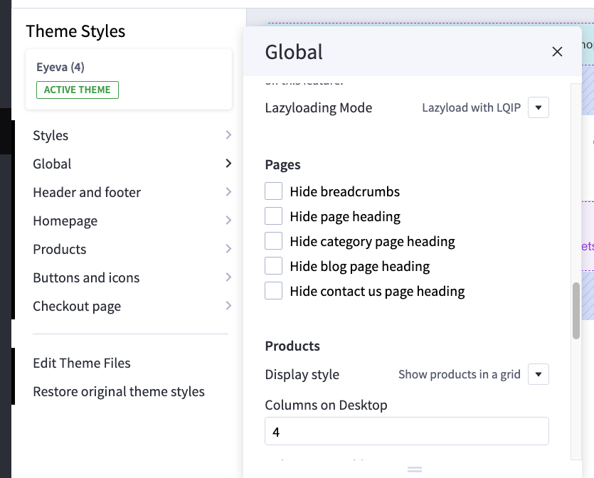{ loading=lazy }

To hide breadcrumbs and the page heading, go to **Global** > **Page** in Page Builder and select the options you want to hide:

-   **Hide breadcrumbs**
-   **Hide page heading**
-   **Hide category page heading**
-   **Hide blog page heading**
-   **Hide contact us page heading**

## Number of Products Displayed

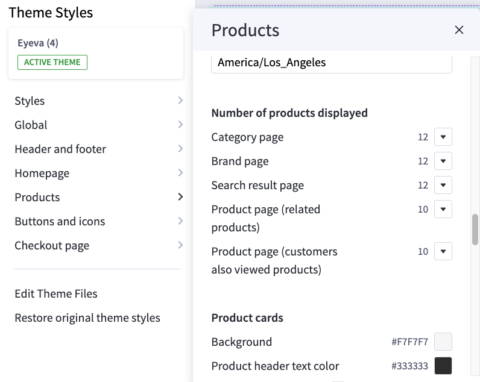{ loading=lazy }

In **Page Builder** > **Theme Styles** > **Products** > **Number of products displayed**:

-   **Category page**: Specify the number of products to display per page.
-   **Brand page**: Specify the number of products to display per page.

## Products Display Type

The theme allows you to display products in either a **grid** or a **list** format. To set the default display, navigate to **Page Builder** > **Global** > **Products** and choose your preferred **Display style**.

**Grid:**

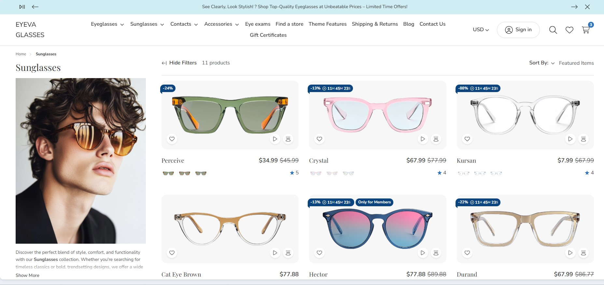{ loading=lazy }

**List:**

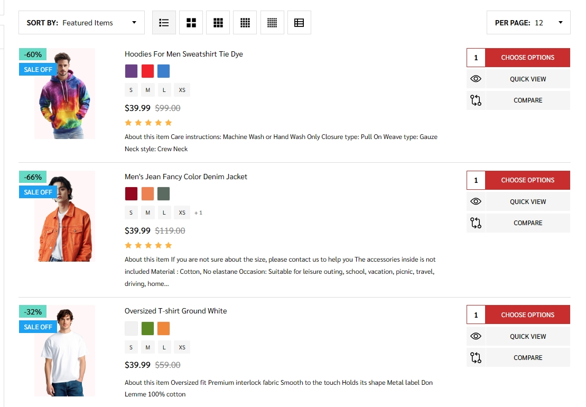{ loading=lazy }

## Displaying Images and Colors on Faceted Filters

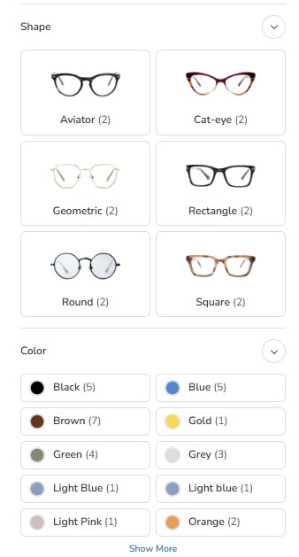{ loading=lazy }

To configure image and color options for faceted filters, navigate to **Page Builder** > **Theme Styles** > **Products** > **Display Settings**.

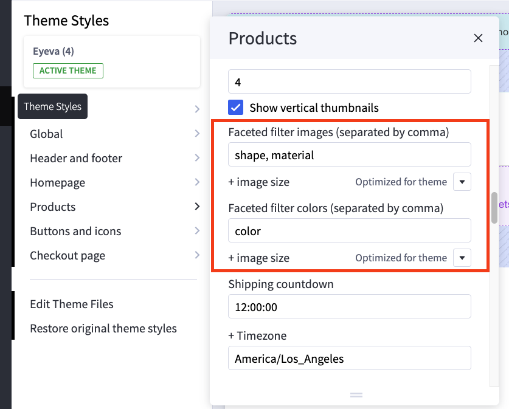{ loading=lazy }

| Setting                                      | Value & Meaning
|----------------------------------------------|----------------------------------------------------------------------------------------------------------------------------------------------------------------------|
| **Faceted filter images (separated by comma)** | **`shape, material`** Defines which **product filter fields** should display image-based swatches. Each term is separated by a comma (e.g., "Shape," "Material"). |
| **+ image size**                             | **"Optimized for theme"** Specifies how large each swatch image is rendered, using theme-recommended sizing.                                                      |
| **Faceted filter colors (separated by comma)** | **`color`** Defines which **product filter fields** should display color swatches (e.g., "Color").                                                               |
| **+ image size**                             | **"Optimized for theme"** Specifies the recommended size for color swatches, ensuring consistency with the overall theme.                                        |

Next, upload the images you want to display on the faceted filters to the Image Manager. Name the images according to the convention `[option-name]-[option-value]` (e.g., `shape-round`, `color-light-brown`). Be sure to replace any spaces or non-alphanumeric characters with hyphens. All images must be in PNG format (with the `.png` file extension).

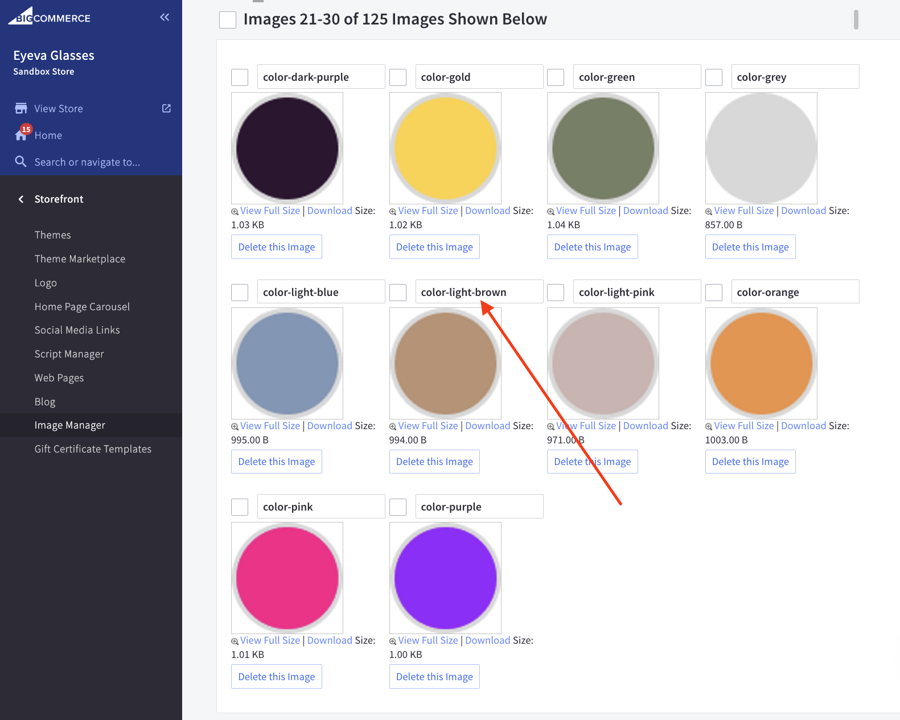{ loading=lazy }

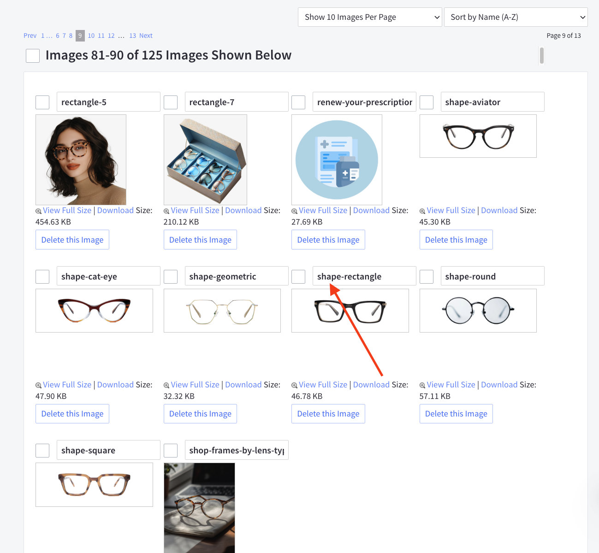{ loading=lazy }

## Display FAQs Accordion

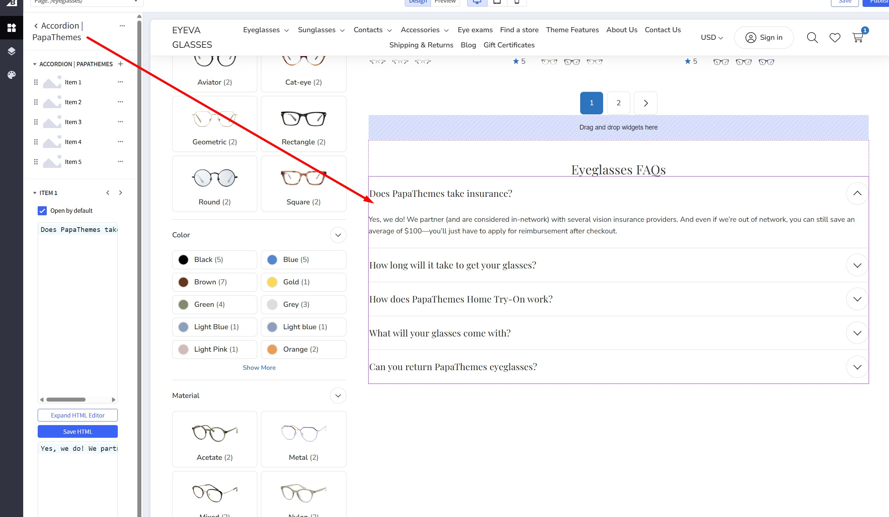{ loading=lazy }

To add the FAQs accordion to your category page, open Page Builder and drag the **Accordion | PapaThemes** widget into the designated widget region. Then, use the inline editor to update the FAQs content as needed.

## PC Builder Feature

PC Builder is a powerful tool that allows customers to build custom PC configurations by selecting compatible components from different categories.

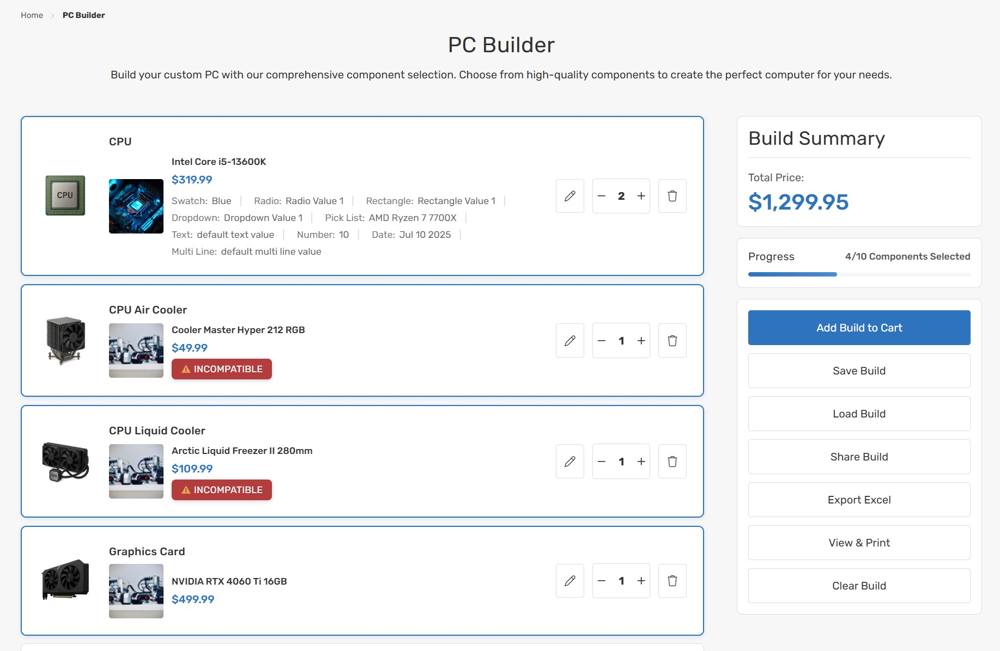{ loading=lazy }

### Key Features

- **Component Selection**: Choose from multiple component categories (CPU, GPU, RAM, etc.)
- **Compatibility Checking**: Automatic validation of component compatibility
- **Real-time Price Calculation**: Price updates instantly as components are selected
- **Configuration Management**: Save, load, and share PC builds
- **Excel Export**: Export configurations to Excel/CSV format
- **Print Support**: Generate printable configuration summaries

### PC Builder Setup

#### 1. Create PC Builder Category Structure

##### 1. **Main Category Setup**:

  - Create a main category called "PC Builder" (or any name you prefer)
  - Set this as the parent category for all component categories

##### 2. **Component Categories**:

  - Create subcategories for each component type:
    - CPU (Processors)
    - GPU (Graphics Cards)
    - RAM (Memory)
    - Motherboard
    - Storage (SSD/HDD)
    - Power Supply
    - Case
    - Cooling

#### 2. Configure PC Builder Template

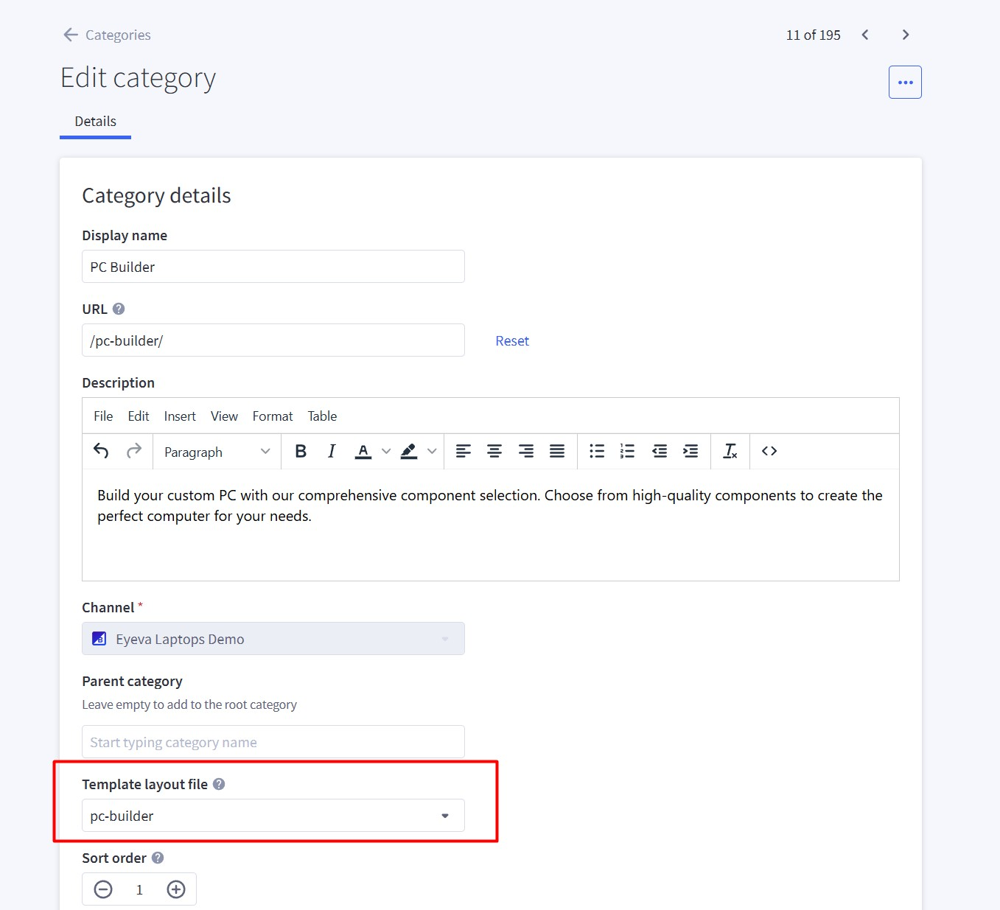{ loading=lazy }

##### 1. **Access Category Settings**:

   - Go to **Products** → **Product Categories** in BigCommerce Admin Panel
   - Select your main PC Builder category

##### 2. **Set Custom Template**:

   - Edit the category and scroll down to the **Custom Template** section
   - Select **PC-Builder** from the dropdown
   - Save the category

#### 3. Configure Compatibility Fields

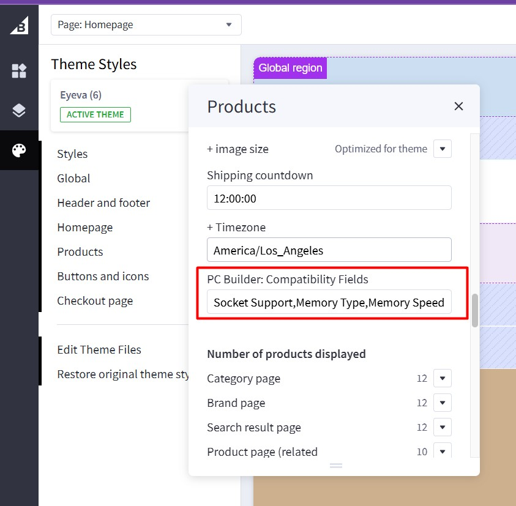{ loading=lazy }

##### 1. **Access Theme Settings**:

   - Go to **Storefront** → **Themes** → **Customize**
   - Navigate to theme settings

##### 2. **Set Compatibility Fields**:

   - Find the **Compatibility Fields** setting
   - Enter comma-separated field names
   - Example: `Socket Support,Memory Type,Memory Speed,TDP,Power Rating,Form Factor,Interface,PCIe Slot,Dimensions,Efficiency`

### Product Configuration

#### Create Custom Fields for Products

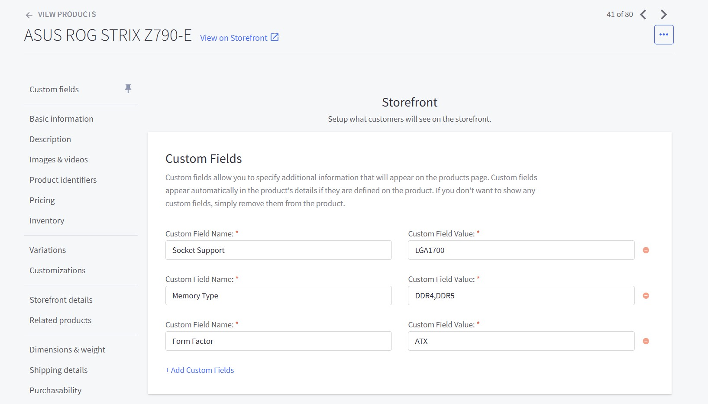{ loading=lazy }

For each product that will be used in PC Builder, you need to create custom fields that correspond to the compatibility fields.

##### **Add Custom Field to Product**:

   - Go to **Products** → **View Products** in BigCommerce Admin Panel
   - Edit the product you want to add custom fields to
   - Scroll down to the **Custom Fields** section
   - Click **Add Custom Field**
   - Enter the **Custom Field Name** (must match compatibility field names exactly)
   - Fill in the **Value** in the text box
   - Save the product

#### Product Configuration Examples

**CPU Product (Intel Core i7-12700K)**:

- Socket Support: `LGA1700`
- TDP: `125`
- Memory Type: `DDR4,DDR5`
- Memory Speed: `3200,4800`

**Motherboard Product (ASUS Z690-A)**:

- Socket Support: `LGA1700`
- Memory Type: `DDR4,DDR5`
- Memory Speed: `3200,4800,5600`
- Form Factor: `ATX`
- PCIe Slot: `PCIe 5.0`

**RAM Product (Corsair Vengeance 32GB DDR5)**:

- Memory Type: `DDR5`
- Memory Speed: `5600`
- Form Factor: `DIMM`

### Using PC Builder

{ loading=lazy }

#### Customer Interface

##### 1. **Accessing PC Builder**:

   - Customers navigate to the PC Builder category
   - The custom template loads the PC Builder interface

##### 2. **Component Selection**:

   - Each component category is displayed as a row
   - Click "Select" button to choose components
   - A modal opens showing filtered compatible products

##### 3. **Product Selection Modal**:

   - Products are filtered based on compatibility with already selected components
   - Advanced filtering and search options available
   - Product details, pricing, and options displayed

#### Build Management

1. **Save Configuration**: Click "Save Build" to download configuration as JSON file
2. **Load Configuration**: Click "Load Build" to upload a previously saved JSON file
3. **Share Build**: Click "Share Build" to generate a shareable URL
4. **Export to Excel**: Click "Export Excel" to download CSV file
5. **Print View**: Click "View & Print" to open printable summary
6. **Add to Cart**: Click "Add to Cart" to add all selected components to shopping cart

### Compatibility System

#### How Compatibility Works

##### 1. **Field Matching**:

   - Components are compatible when their custom field values match
   - Only compares custom fields with the same name
   - Supports exact matching and partial matching for multi-value fields

##### 2. **Multi-Value Support**:

   - Fields can contain multiple values separated by commas
   - Example: `DDR4,DDR5` matches products with `DDR4` or `DDR5`

##### 3. **Compatibility Chain**:

   - Each new component selection filters remaining options
   - Builds a compatibility chain ensuring all components work together

### Common Troubleshooting

##### 1. **PC Builder Not Loading**:

   - Verify custom template is set correctly
   - Check category structure and subcategories
   - Ensure JavaScript files are loading properly

##### 2. **Compatibility Not Working**:

   - Verify custom fields are created correctly
   - Check field names match theme configuration
   - Ensure products have custom field values set

##### 3. **Products Not Showing**:

   - Verify products are assigned to correct categories
   - Check product availability and inventory
   - Ensure products have required custom fields
