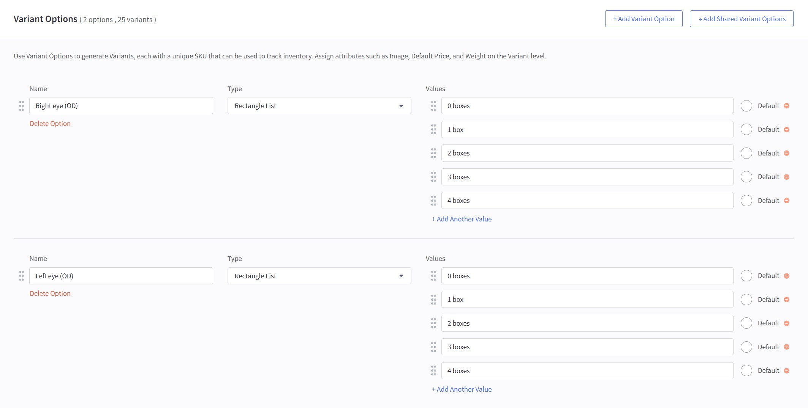
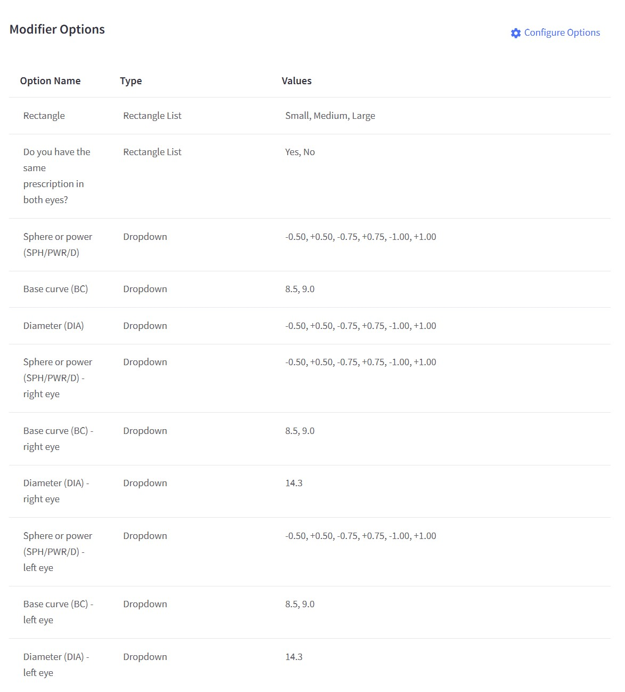
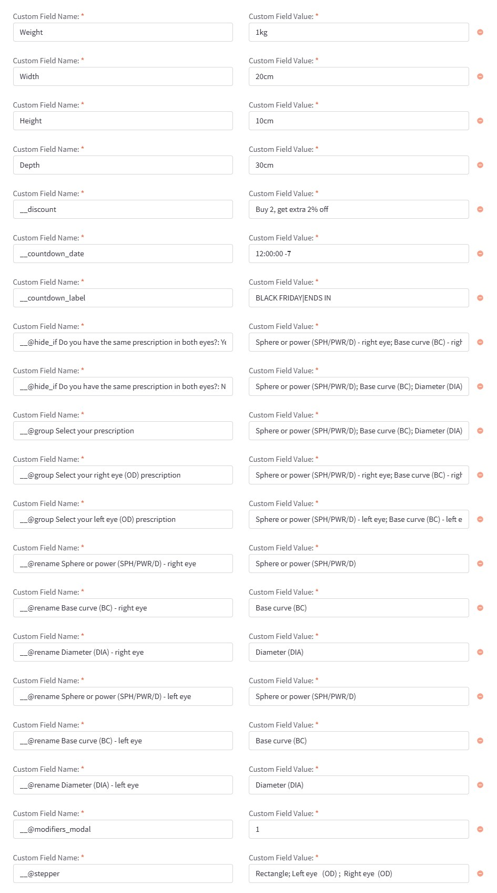

# Guide: Setting Up an Contacts Product Like the Demo

This section provides a step-by-step guide for setting up a contacts product that replicates the theme demo. For a live example, please visit the [Contacts Demo Product](https://eyeva-glasses-demo.mybigcommerce.com/contacts-demo/).

## Product Variant Options

Configure product variants for contacts by adding options for attributes such as Right eye (OD) and Left eye (OS) as shown below:

{ loading=lazy }

| **Option Name**   | **Type**        | **Values**                         | **Default** |
|-------------------|-----------------|------------------------------------|------------|
| Right eye (OD)    | Rectangle List  | 1 boxes, 2 boxes, 3 boxes, 4 boxes, 5 boxes | 1 boxes    |
| Left eye (OS)     | Rectangle List  | 1 boxes, 2 boxes, 3 boxes, 4 boxes, 5 boxes | 1 boxes    |

## Product Modifiers

Configure product modifiers for the contacts product as outlined below:

{ loading=lazy }

| **Option Name**                                       | **Type**         | **Values**                                              |
|-------------------------------------------------------|-----------------|---------------------------------------------------------|
| Rectangle                                             | Rectangle List  | Small, Medium, Large                                    |
| Do you have the same prescription in both eyes?       | Rectangle List  | Yes, No                                                |
| Sphere or power (SPH/PWR/D) – right eye               | Dropdown        | 8.5, 9.0, +0.50, +0.75, +1.00, -1.00                    |
| Base curve (BC) – right eye                           | Dropdown        | 8.5, 9.0                                              |
| Diameter (DIA) – right eye                            | Dropdown        | 14.3                                                   |
| Sphere or power (SPH/PWR/D) – left eye                | Dropdown        | 8.5, 9.0, +0.50, +0.75, +1.00, -1.00                    |
| Base curve (BC) – left eye                            | Dropdown        | 8.5, 9.0                                              |
| Diameter (DIA) – left eye                             | Dropdown        | 14.3                                                   |

## Product Custom Fields

Configure custom fields for the contacts product as outlined below:

{ loading=lazy }

| **Custom Field Name**                                       | **Custom Field Value**                                                                                                              | **Explanation**                                                                                                                                             |
|-------------------------------------------------------------|-------------------------------------------------------------------------------------------------------------------------------------|-------------------------------------------------------------------------------------------------------------------------------------------------------------|
| **Weight**                                                  | 1kg                                                                                                                                 | Displays the product’s weight in the custom fields tab (e.g., physical package weight).                                                                     |
| **Width**                                                   | 20cm                                                                                                                                | Displays the product’s width in the custom fields tab (physical dimension).                                                                                 |
| **Height**                                                  | 10cm                                                                                                                                | Displays the product’s height in the custom fields tab (physical dimension).                                                                                |
| **Depth**                                                   | 30cm                                                                                                                                | Displays the product’s depth in the custom fields tab (physical dimension).                                                                                 |
| `__discount`                                                | Buy 2, get extra 2% off                                                                                                             | Promotional text shown on the product card (e.g., “Buy 2, get extra 2% off”).                                                                                    |
| `__countdown_date`                                          | 12:00:00 -7                                                                                                                         | A countdown timer setting (time and/or timezone offset) for a flash sale.                                                                                   |
| `__countdown_label`                                         | BLACK FRIDAY\|ENDS IN                                                                                                               | The text label shown next to the countdown timer (“BLACK FRIDAY” + “ENDS IN”).                                                                               |
| `__hide_if Do you have the same prescription in both eyes?: Yes` | Sphere or power (SPH/PWR/D) - right eye; Base curve (BC) - right eye; Diameter (DIA) - right eye; Sphere or power (SPH/PWR/D) - left eye; Base curve (BC) - left eye; Diameter (DIA) - left eye                                                                   | Hides these fields if the customer selects “Yes, same prescription in both eyes?” (Yes).                                                                     |
| `__hide_if Do you have the same prescription in both eyes?: No`  | Sphere or power (SPH/PWR/D); Base curve (BC); Diameter (DIA)                                                                       | Hides these fields if the customer selects “No, different prescriptions” (No).                                                                               |
| `__@group Select your prescription`                          | Sphere or power (SPH/PWR/D); Base curve (BC); Diameter (DIA)                                                                        | Groups modifier fields for the prescription selection flow.                                                                                                 |
| `__@group Select your right eye (OD) prescription`           | Sphere or power (SPH/PWR/D) - right eye; Base curve (BC) - right eye; Diameter (DIA) - right eye                                                                    | Groups modifier fields for the right eye prescription.                                                                                                       |
| `__@group Select your left eye (OD) prescription`            | Sphere or power (SPH/PWR/D) - left eye; Base curve (BC) - left eye; Diameter (DIA) - left eye                                                                    | Groups modifier fields for the left eye prescription (marked OD in text, though OD typically means right eye).                                               |
| `__@rename Sphere or power (SPH/PWR/D) - right eye`          | Sphere or power (SPH/PWR/D)                                                                                                         | Renames the “Sphere or power” field specifically for the right eye.                                                                                         |
| `__@rename Base curve (BC) - right eye`                      | Base curve (BC)                                                                                                                     | Renames the “Base curve” field specifically for the right eye.                                                                                              |
| `__@rename Diameter (DIA) - right eye`                       | Diameter (DIA)                                                                                                                      | Renames the “Diameter” field specifically for the right eye.                                                                                                |
| `__@rename Sphere or power (SPH/PWR/D) - left eye`           | Sphere or power (SPH/PWR/D)                                                                                                         | Renames the “Sphere or power” field specifically for the left eye.                                                                                          |
| `__@rename Base curve (BC) - left eye`                       | Base curve (BC)                                                                                                                     | Renames the “Base curve” field specifically for the left eye.                                                                                               |
| `__@rename Diameter (DIA) - left eye`                        | Diameter (DIA)                                                                                                                      | Renames the “Diameter” field specifically for the left eye.                                                                                                 |
| `__@modifiers_modal`                                        | 1                                                                                                                                   | Indicates whether the product uses a modal for modifiers (1 = enabled).                                                                                      |
| `__@stepper`                                                | Rectangle; Left eye (OD) ; Right eye (OD)                                                                                           | Defines a stepper or interactive selector for each eye (labeled OD in both cases).                                                                 |
| `__@card_video`                                             | https://storage.themeforshop.com/eyeva-demo/laptop-360-1-h265.mp4                                                                   | Video URL to play when hovering over product card images (MP4 format). Requires theme setting to be enabled.                                      |
