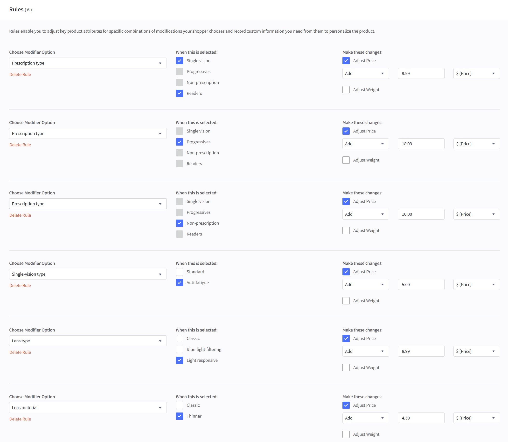

# Guide: Setting Up an Eyeglasses Product Like the Demo

This section provides a step-by-step guide for setting up an eyeglasses product that replicates the theme demo. For a live example, please visit the [Eyeglass Modifiers Modal Demo Product](https://eyeva-glasses-demo.mybigcommerce.com/eyeglass-modifiers-modal-demo/).

## Product Description

To replicate the demo's product description, edit a product, click the **Source code** button:

{ loading=lazy }

and paste the following HTML code:

{ loading=lazy }

```html
<!-- Main container for this style/demo -->
<div class="eyeva-style">

    <!-- Collapsible Section: Everything Included -->
    <h2 data-collapsible="everything-included">Everything included</h2>

    <!-- Content block that collapses/expands based on data-collapsible -->
    <div id="everything-included">

        <!-- Short intro text about additional lens types -->
        <p class="mb-0">We also offer progressive, blue-light-filtering, and anti-fatigue lenses&mdash;plus more!</p>
        <p><a href="#"><strong>View all lens types</strong></a></p>

        <!-- A bordered, rounded container listing key features (flex-column + gap for spacing) -->
        <div class="border border-radius p-24 flex-column gap-24 des-mb-0">

            <!-- Each "feature" is a flex row with some spacing between columns -->
            <div class="flex column-gap-16">
                <div class="shrink-0"></div>
                <div class="span-1">
                    <p class="font-18 font-16-md"><strong>Single-vision prescriptions</strong></p>
                    <p class="color-secondary font-14-md">Also choose readers or non-prescription lenses.</p>
                </div>
            </div>
            <div class="flex column-gap-16">
                <div class="shrink-0"></div>
                <div class="span-1">
                    <p class="font-18 font-16-md"><strong>Polycarbonate lenses</strong></p>
                    <p class="color-secondary font-14-md">The most impact-resistant lens material for glasses</p>
                </div>
            </div>
            <div class="flex column-gap-16">
                <div class="shrink-0"></div>
                <div class="span-1">
                    <p class="font-18 font-16-md"><strong>Anti-reflective and scratch-resistant lens coatings</strong></p>
                    <p class="color-secondary font-14-md">And our lenses block 100% of UV rays :-)</p>
                </div>
            </div>
            <div class="flex column-gap-16">
                <div class="shrink-0"></div>
                <div class="span-1">
                    <p class="font-18 font-16-md"><strong>Free shipping</strong></p>
                    <p class="color-secondary font-14-md">On every single order at PapaThemes</p>
                </div>
            </div>
            <div class="flex column-gap-16">
                <div class="shrink-0"></div>
                <div class="span-1">
                    <p class="font-18 font-16-md"><strong>Free returns or exchanges</strong></p>
                    <p class="color-secondary font-14-md">Within 30 days of purchase</p>
                </div>
            </div>
            <div class="flex column-gap-16">
                <div class="shrink-0"></div>
                <div class="span-1">
                    <p class="font-18 font-16-md"><strong>Free scratched lens replacement</strong></p>
                    <p class="color-secondary font-14-md">Guaranteed for prescription lenses within six months of purchase</p>
                </div>
            </div>
            <div class="flex column-gap-16">
                <div class="shrink-0"></div>
                <div class="span-1">
                    <p class="font-18 font-16-md"><strong>FSA, HSA, and insurance accepted</strong></p>
                    <p class="color-secondary font-14-md">Save an average of $100 when you use insurance</p>
                </div>
            </div>
            <!-- Horizontal rule within the "everything included" section -->
             <hr class="m-0" />

             <!-- Another feature row with an image and description -->
            <div class="flex gap-24">
                <div class="span-1"></div>
                <div class="span-1">
                    <p class="font-18 font-16-md"><strong>Plus a frame case and lens cloth</strong></p>
                    <p class="color-secondary font-14-md">A frame this special deserves a comfy home to keep it safe and clean.</p>
                </div>
            </div>
        </div>
    </div>
    <!-- /#everything-included -->

    <!-- Horizontal rule separating sections -->
    <hr />

    <!-- Collapsible Section: Materials -->
    <h2 data-collapsible="materials">Materials</h2>
    <div id="materials">
        <ul>
            <li>Made from hand-polished cellulose acetate</li>
        </ul>
    </div>

    <!-- Collapsible Section: Width Guide -->
    <h2 data-collapsible="width-guide">Width guide</h2>
    <div id="width-guide">
        <p class="mb-0">We also offer progressive, blue-light-filtering, and anti-fatigue lenses&mdash;plus more!</p>
        <p><a href="#"><strong>View all lens types</strong></a></p>

        <!-- Bordered container for the width guide info -->
        <div class="border border-radius mb-16 des-mb-0"><!-- Row with image and text, using .flex for layout -->
            <div class="flex p-24 gap-24">
                <div class="shrink-0"></div>
                <div class="span-1">
                    <p class="font-18 font-16-md"><strong>Frame widths</strong></p>
                    <p class="color-secondary font-14-md">Our widths are determined by the overall frame width. Choose a width that best corresponds with your own face. (You won&rsquo;t find this number on glasses.)</p>
                </div>
            </div>

            <!-- A filler line and text about the "Medium" size -->
            <div class="fill-alt py-12 px-16 border-y">Medium</div>
            <div class="py-12 px-16">137mm</div>
        </div>
        <!-- /.border-radius -->

        <p><a href="#" data-collapsible="other-measurements">Other measurements</a></p>

        <!-- Another collapsible area for other measurements -->
        <div id="other-measurements" class="border border-radius mb-16 des-mb-0">
            <div class="flex flex-column-md p-24 gap-24">
                <div class="shrink-0 shrink-1-md"></div>
                <div class="span-1">
                    <p class="font-18 font-16-md"><strong>Compare <code>lens width</code> with <code>bridge - temple length</code> with your glasses</strong></p>
                    <p class="color-secondary font-14-md">For most glasses, these measurements are found on the inside of the temple arm. If you have a pair you like, compare it to these measurements.</p>
                    <p class="mb-16"><a href="#" data-collapsible="what-do-these-measurements-mean">What do these measurements mean?</a></p>

                    <!-- Additional info block with some background shading -->
                    <div class="fill-alt border-radius p-16 flex-column gap-24"><!-- Repeating features, each with an image and a short description -->
                        <div class="flex gap-24">
                            <div class="shrink-0"></div>
                            <div class="span-1">
                                <p><strong>Lens width</strong></p>
                                <p class="color-secondary font-14-md">The horizontal diameter of one lens (and the first measurement in the series)</p>
                            </div>
                        </div>
                        <div class="flex gap-24">
                            <div class="shrink-0"></div>
                            <div class="span-1">
                                <p><strong>Bridge</strong></p>
                                <p class="color-secondary font-14-md">The width of the bridge (and the second measurement in the series)</p>
                            </div>
                        </div>
                        <div class="flex gap-24">
                            <div class="shrink-0"></div>
                            <div class="span-1">
                                <p><strong>Temple length</strong></p>
                                <p class="color-secondary font-14-md">The length of the entire temple arm, from the front to the tip (and the last measurement)</p>
                            </div>
                        </div>
                    </div>
                    <!-- /.fill-alt -->
                </div>
                <!-- /.span-1 -->
            </div>
            <!-- /.flex -->

            <!-- A row showing column headers for lens width, bridge, temple length -->
            <div class="fill-alt flex child-span-1 border-y color-secondary font-14-md">
                <div class="py-12 px-16">&nbsp;</div>
                <div class="py-12 px-16 border-left">Lens width</div>
                <div class="py-12 px-16 border-left">Bridge</div>
                <div class="py-12 px-16 border-left">Temple length</div>
            </div>

            <!-- A row with actual measurements for "Medium" frame sizing -->
            <div class="flex child-span-1 font-14-md">
                <div class="fill-alt py-12 px-16 color-secondary">Medium</div>
                <div class="py-12 px-16 border-left">50mm</div>
                <div class="py-12 px-16 border-left">20mm</div>
                <div class="py-12 px-16 border-left">140mm</div>
            </div>
        </div>
        <!-- /#other-measurements -->

        <!-- A horizontal flex container with a bold heading and a button link -->
        <div class="flex flex-column-md border border-radius p-24 gap-24 align-items-center align-items-start-md des-mb-0">
            <div class="span-1"><strong class="font-18 font-16-md">Don't have a pair of glasses?</strong></div>
            <div class="shrink-0"><a class="button button--outline" href="#"> Measure using a credit card </a></div>
        </div>

        <!-- Section: Prescription and lens types offered -->
        <h2 data-collapsible="prescription-and-lens-types-offered">Prescription and lens types offered</h2>
        <div id="prescription-and-lens-types-offered">
            <p><a class="button button--outline mb-0" href="#">Learn more in our lens guide</a></p>

            <!-- "Prescription type" table-like layout -->
            <div class="flex flex-column-md border border-radius mb-16">
                <div class="span-1 p-24"><strong class="font-18 font-16-md">Prescription type</strong></div>
                <div class="span-2 flex-column border-left font-14-md"><!-- Header row with fill-alt background and two columns -->
                    <div class="flex child-py-12 child-px-16">
                        <div class="span-1 fill-alt">&nbsp;</div>
                        <div class="span-1 fill-alt border-left">Starting price</div>
                    </div>

                    <!-- Progressive listing row -->
                    <div class="flex child-py-12 child-px-16 border-top">
                        <div class="span-1 fill-alt">Single-vision</div>
                        <div class="span-1 border-left"><s>$95</s> <strong>$80.75</strong></div>
                    </div>
                    <div class="flex child-py-12 child-px-16 border-top">
                        <div class="span-1 fill-alt">Progressive</div>
                        <div class="span-1 border-left"><s>$295</s> <strong>$250.75</strong></div>
                    </div>
                    <div class="flex child-py-12 child-px-16 border-top">
                        <div class="span-1 fill-alt">Readers</div>
                        <div class="span-1 border-left"><s>$95</s> <strong>$80.75</strong></div>
                    </div>
                    <div class="flex child-py-12 child-px-16 border-top">
                        <div class="span-1 fill-alt">Non-prescription</div>
                        <div class="span-1 border-left"><s>$95</s> <strong>$80.75</strong></div>
                    </div>
                </div>
            </div>
            <!-- /.flex border -->

            <!-- "Lens type" table-like layout -->
            <div class="flex flex-column-md border border-radius mb-16">

                <!-- Left label column -->
                <div class="span-1 p-24"><strong class="font-18 font-16-md">Lens type</strong></div>

                <!-- Right column with stacked rows -->
                <div class="span-2 flex-column border-left font-14-md"><!-- Header row with two columns, second has border-left -->
                    <div class="flex child-py-12 child-px-16">
                        <div class="span-1 fill-alt">&nbsp;</div>
                        <div class="span-1 fill-alt border-left">Additional cost</div>
                    </div>

                    <!-- Each subsequent row has border-top and two columns -->
                    <div class="flex child-py-12 child-px-16 border-top">
                        <div class="span-1 fill-alt">Classic</div>
                        <div class="span-1 border-left">Free</div>
                    </div>
                    <div class="flex child-py-12 child-px-16 border-top">
                        <div class="span-1 fill-alt">Blue-light filtering</div>
                        <div class="span-1 border-left"><s>$50</s> <strong>$42.50</strong></div>
                    </div>
                    <div class="flex child-py-12 child-px-16 border-top">
                        <div class="span-1 fill-alt">Anti-fatigue</div>
                        <div class="span-1 border-left"><s>$50</s> <strong>$42.50</strong></div>
                    </div>
                    <div class="flex child-py-12 child-px-16 border-top">
                        <div class="span-1 fill-alt">Light-responsive</div>
                        <div class="span-1 border-left"><s>$100</s> <strong>$85</strong></div>
                    </div>
                </div>
                <!-- /.span-2.flex-column -->
            </div>
            <!-- /Lens type block -->

            <!-- "Lens material" table-like layout -->
            <div class="flex flex-column-md border border-radius"><!-- Left column for title -->
                <div class="span-1 p-24"><strong class="font-18 font-16-md">Lens material</strong></div>

                <!-- Right column with stacked rows -->
                <div class="span-2 flex-column border-left font-14-md"><!-- Header row -->
                    <div class="flex child-py-12 child-px-16">
                        <div class="span-1 fill-alt">&nbsp;</div>
                        <div class="span-1 fill-alt border-left">Additional cost</div>
                    </div>

                    <!-- Material row: Polycarbonate -->
                    <div class="flex child-py-12 child-px-16 border-top">
                        <div class="span-1 fill-alt">Polycarbonate</div>
                        <div class="span-1 border-left">Free</div>
                    </div>

                    <!-- Material row: 1.67 high-index -->
                    <div class="flex child-py-12 child-px-16 border-top">
                        <div class="span-1 fill-alt">1.67 high-index</div>
                        <div class="span-1 border-left"><s>$50</s> <strong>$42.50</strong></div>
                    </div>
                </div>
                <!-- /.span-2.flex-column -->
            </div>
            <!-- /Lens material block -->
        </div>
        <!-- /#prescription-and-lens-types-offered -->
    </div>
    <!-- /#width-guide -->

    <!-- Collapsible Section: Need a Prescription? -->
    <h2 data-collapsible="need-a-prescription">Need a prescription?</h2>
    <div id="need-a-prescription">

        <!-- Option #1: In-person eye exam -->
        <div class="border border-radius p-24 flex gap-24 mb-16">
            <div class="shrink-0"></div>
            <div class="span-1">
                <p class="font-18 font-16-md mb-0"><strong>Book an in-person eye exam</strong></p>
                <p class="color-secondary font-14-md">Meet with an eye doctor at one of our stores for a new prescription and eye health check.</p>
                <a class="button button--outline" href="#">Schedule an exam</a>
            </div>
        </div>

        <!-- Option #2: Renew at home -->
        <div class="border border-radius p-24 flex gap-24 mb-16">
            <div class="shrink-0"></div>
            <div class="span-1">
                <p class="font-18 font-16-md mb-0"><strong>Renew your prescription at home</strong></p>
                <p class="color-secondary font-14-md">If your vision hasn't changed, use Virtual Vision Test on an iPhone to renew your prescription from home.</p>
                <a class="button button--outline" href="#">Renew your prescription</a>
            </div>
        </div>

        <!-- Already have a prescription? -->
        <p class="font-18 font-16-md mb-0"><strong>Already have a non-expired prescription?</strong></p>
        <p class="color-secondary font-14-md">During checkout, you'll be able to upload it, have us contact your doctor to retrieve it, or send it after you place your order.</p>
    </div>
    <!-- /#need-a-prescription -->
</div>
```


## Product Variant Options

Configure product variants for eyeglasses by adding options for attributes such as color and size as shown below:

{ loading=lazy }

| **Option** | **Type**         | **Values**            |
|------------|------------------|-----------------------|
| **Color**  | Swatch           | Black, Brown, Purple  |
| **Size**   | Rectangle List   | Small, Medium, Large  |

## Product Modifiers

Configure product modifiers by adding relevant modifier options for the eyeglasses product. Follow the procedure illustrated below:

{ loading=lazy }

| **Option Name**       | **Type**           | **Values**                                                    |
|-----------------------|--------------------|--------------------------------------------------------------|
| **Prescription type** | Radio Buttons     | Single vision, Progressives, Non-prescription, Readers       |
| **Single-vision type** | Radio Buttons     | Standard, Anti-fatigue                                       |
| **Progressives type** | Radio Buttons     | Signature, Precision                                         |
| **Readers strength**  | Rectangle List    | 0.25, 0.5, 0.75, 1                                           |
| **Lens type**         | Radio Buttons     | Classic, Blue-light-filtering, Light responsive              |
| **Lens color**        | Swatch            | Grey, Brown, Green                                           |
| **Lens material**     | Radio Buttons     | Classic, Thinner                                             |
| **Lens cleaning kit** | Pick List         | Fog Lens Spray Simple, Contacts Case Green Simple            |


## Product Rules

Apply product rules to the eyeglasses product using the settings described below:

{ loading=lazy }


| **Rule** | **Modifier Option**  | **When This Is Selected**               | **Price Adjustment** | **Weight Adjustment** |
|----------|----------------------|-----------------------------------------|----------------------|-----------------------|
| **1**    | Prescription type   | Single vision, Readers                  | + \$9.99             | Off (not used)        |
| **2**    | Prescription type   | Single vision, Progressives             | + \$18.99            | Off (not used)        |
| **3**    | Prescription type   | Single vision, Non-prescription         | + \$10.00            | Off (not used)        |
| **4**    | Single-vision type | Anti-fatigue                             | + \$5.00             | Off (not used)        |
| **5**    | Lens type           | Light responsive                         | + \$8.99             | Off (not used)        |
| **6**    | Lens material       | Thinner                                  | + \$4.50             | Off (not used)        |


## Product Custom Fields

Configure custom fields for the eyeglasses product as outlined below:

{ loading=lazy }

{ loading=lazy }

{ loading=lazy }


| **Custom Field Name**                                        | **Custom Field Value**                                                                                                                                                                                                                                                           | **Explanation**                                                                                                                                                                                                                              |
|--------------------------------------------------------------|---------------------------------------------------------------------------------------------------------------------------------------------------------------------------------------------------------------------------------------------------------------------------------|----------------------------------------------------------------------------------------------------------------------------------------------------------------------------------------------------------------------------------------------|
| **Weight**                                                   | 1kg                                                                                                                                                                                                                                                                             | Displays the product’s weight in the custom fields tab.                                                                                                                                                                                     |
| **Width**                                                    | 20cm                                                                                                                                                                                                                                                                            | Displays the product’s width in the custom fields tab.                                                                                                                                                                                      |
| **Height**                                                   | 10cm                                                                                                                                                                                                                                                                            | Displays the product’s height in the custom fields tab.                                                                                                                                                                                     |
| **Depth**                                                    | 30cm                                                                                                                                                                                                                                                                            | Displays the product’s depth in the custom fields tab.                                                                                                                                                                                      |
| `__discount`                                                 | Buy 2, get extra 2% off                                                                                                                                                                                                                                                         | Displays promotional text on the product card.                                                                                                                                                                                              |
| `__countdown_date`                                           | 12:00:00 -7                                                                                                                                                                                                                                                                     | A countdown timer setting (time and/or timezone offset) for a flash sale.                                                                                                                                                                    |
| `__countdown_label`                                          | BLACK FRIDAY\|ENDS IN                                                                                                                                                                                                                                                            | The text label shown next to the countdown timer (“BLACK FRIDAY” followed by “ENDS IN”).                                                                                                                                                     |
| `__hide_if prescription type: single vision`                 | progressives type; readers strength                                                                                                                                                                                                                                             | Hides the listed modifier options if the user selects “single vision.”                                                                                                                                                                       |
| `__hide_if prescription type: progressives`                  | single-vision type; readers strength                                                                                                                                                                                                                                            | Hides the listed modifier options if the user selects “progressives.”                                                                                                                                                                        |
| `__hide_if prescription type: non-prescription`              | single-vision type; progressives type; readers strength; lens material: thinner                                                                                                                                                                                                  | Hides these options if “non-prescription” is chosen.                                                                                                                                                                                         |
| `__hide_if prescription type: readers`                       | single-vision type; progressives type; lens material: thinner                                                                                                                                                                                                                   | Hides the listed modifiers if the user selects “readers.”                                                                                                                                                                                    |
| `__hide_if lens type: classic`                               | lens color                                                                                                                                                                                                                                                                      | Hides the lens color option if the lens type is set to “classic.”                                                                                                                                                                            |
| `__hide_if lens type: blue-light-filtering`                  | lens color                                                                                                                                                                                                                                                                      | Hides the lens color option if the lens type is “blue-light-filtering.”                                                                                                                                                                      |
| `__@nonsale 90`                                              | prescription type: single vision                                                                                                                                                                                                                                                | Non-sale pricing for “single vision” prescription type.                                                                                                                                                                                      |
| `__@nonsale 95`                                              | prescription type: readers                                                                                                                                                                                                                                                      | Non-sale pricing for “readers” prescription type.                                                                                                                                                                                            |
| `__@nonsale 100`                                             | single-vision type: anti-fatigue                                                                                                                                                                                                                                                | Non-sale pricing for “anti-fatigue” lens type under single-vision.                                                                                                                                                                           |
| `__@nonsale 50`                                              | lens type: blue-light-filtering                                                                                                                                                                                                                                                 | Non-sale pricing for the “blue-light-filtering” lens type.                                                                                                                                                                                   |
| `__@nonsale 100`                                             | lens type: light responsive                                                                                                                                                                                                                                                     | Non-sale pricing for the “light responsive” lens type.                                                                                                                                                                                       |
| `__@nonsale 50`                                              | lens material: thinner                                                                                                                                                                                                                                                          | Non-sale pricing for the “thinner” lens material.                                                                                                                                                                                            |
| `__@tooltip prescription type: single vision`                | Corrects for one field of vision (near, intermediate, or distance)                                                                                                                                                                                                              | Tooltip text explaining single-vision prescription.                                                                                                                                                                                          |
| `__@tooltip prescription type: progressives`                 | Corrects near, intermediate, and distance fields of vision in one lens so you don't have to switch between multiple pairs                                                                                                                                                       | Tooltip text for progressives, describing multi-distance correction in a single lens.                                                                                                                                                       |
| `__@tooltip prescription type: non-prescription`             | Offers style and protection with no vision correction                                                                                                                                                                                                                           | Tooltip text for non-prescription lenses (fashion or protective use).                                                                                                                                                                        |
| `__@tooltip prescription type: readers`                      | Offer simple magnification for, well, reading (no prescription necessary)                                                                                                                                                                                                        | Tooltip text for “readers,” which provide light magnification.                                                                                                                                                                               |
| `__@tooltip single-vision type: standard`                    | Corrects one field of vision (near, intermediate, or distance)                                                                                                                                                                                                                  | Tooltip for “standard” single-vision type.                                                                                                                                                                                                   |
| `__@tooltip_heading single-vision type: anti-fatigue`        | Ideal for screens                                                                                                                                                                                                                                                               | A special heading tooltip emphasizing that “anti-fatigue” lenses reduce screen strain.                                                                                                                                                      |
| `__@tooltip progressives type: signature`                    | Digital free-form progressive lenses that offer a comfortable, balanced view. They also include anti-reflective and scratch-resistant lens coatings—plus block 100% of UV rays.                                                                                                 | Tooltip text for “signature” progressive lenses, highlighting technology and benefits.                                                                                                                                                       |
| `__@tooltip progressives type: precision`                    | Premium progressive lenses that offer more customization, resulting in optimized vision, reduced peripheral distortion, and a wider field of view (plus everything above)                                                                                                        | Tooltip text for “precision” progressive lenses, focusing on advanced performance.                                                                                                                                                           |
| `__@tooltip lens type: classic`                              | UV-blocking lenses with scratch-resistant, anti-reflective coatings                                                                                                                                                                                                             | Tooltip text describing “classic” lens type benefits.                                                                                                                                                                                        |
| `__@tooltip lens type: blue-light-filtering`                 | UV-blocking lenses with scratch-resistant, anti-reflective coatings—plus a special treatment that helps block potentially pesky blue light that occurs naturally and digitally.                                                                                                  | Tooltip text highlighting blue-light-filtering’s extra benefit (blocking more blue light).                                                                                                                                                  |
| `__@tooltip lens type: light responsive`                     | UV-blocking lenses with scratch-resistant, anti-reflective coatings—these also transition from clear to a darker tint outdoors, plus filter more blue light than our classic lenses. (Choose from grey, brown, or green.)                                                                                               | Tooltip text explaining photochromic “light responsive” lenses and available colors.                                                                                                                                                        |
| `__@tooltip lens material: classic`                          | Our impact-resistant polycarbonate lenses are ideal for most prescription strengths. We recommend them for prescriptions that range between -4.00 and +4.00.                                                                                                                    | Tooltip text describing the “classic” (polycarbonate) lens material’s benefits and recommended Rx range.                                                                                                                                    |
| `__@tooltip lens material: thinner`                          | Our 1.67 high-index lenses are thinner and more lightweight when accommodating stronger prescriptions. We recommend them for prescriptions that are higher than +/- 4.00.                                                                                                        | Tooltip text describing “thinner” (1.67 high-index) lens material for high prescriptions.                                                                                                                                                   |
| `__@tooltip lens cleaning kit`                               | It includes anti-fog lens spray, a microfiber cloth, and a microfiber lens pouch—convenient!                                                                                                                                                                                    | Tooltip text about the included items in the lens cleaning kit.                                                                                                                                                                             |
| `__@group Select a prescription type`                        | prescription type                                                                                                                                                                                                                                                                | Groups the fields related to prescription selection.                                                                                                                                                                                         |
| `__@modifiers_modal`                                         | 1                                                                                                                                                                                                                                                                               | Indicates whether the product uses a modal for modifiers (1 = enabled).                                                                                                                                                                       |
| `__@select_modifiers`                                        | Select lens and buy                                                                                                                                                                                                                                                             | Specifies the text for the “Select Options” button.                                                                                                                                                                                          |
| `__@360`                                                     | https://cdn11.bigcommerce.com/s-ivbr30q0b6/images/stencil/original/image-manager/eyeglasses-360-1.jpg?t=1736752328#90                                                                                                                                                           | URL for a 360° product image (with a frame reference #90).                                                                                                                                                                                   |


## Product Images & Videos

Add images and videos to the eyeglasses product as shown below:

{ loading=lazy }

## 360-Degree Product View

For a detailed guide on enabling a 360-degree view for your product, please refer to the [Displaying 360-Degree Images](product.md#displaying-360-degree-images) section above.
