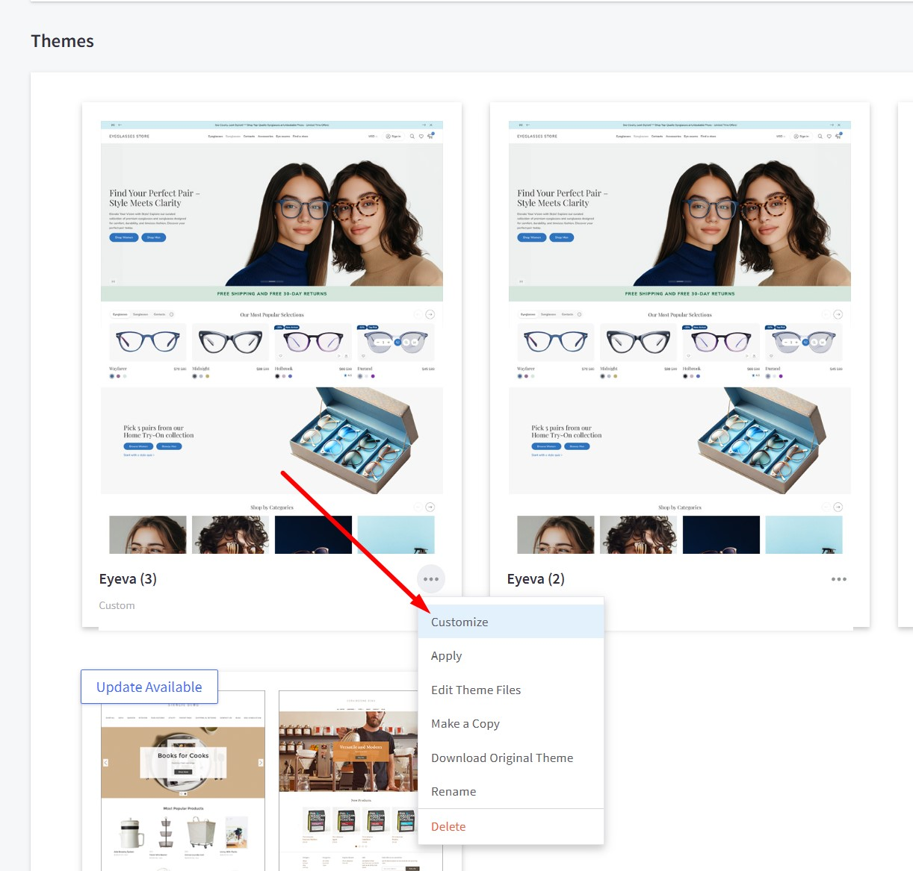
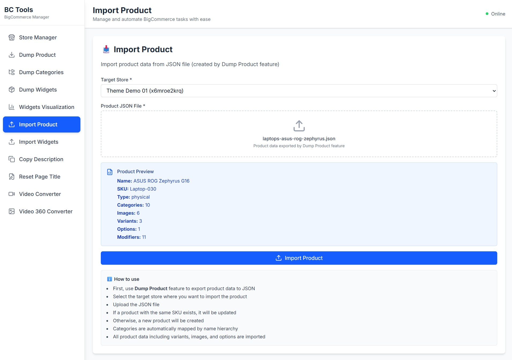
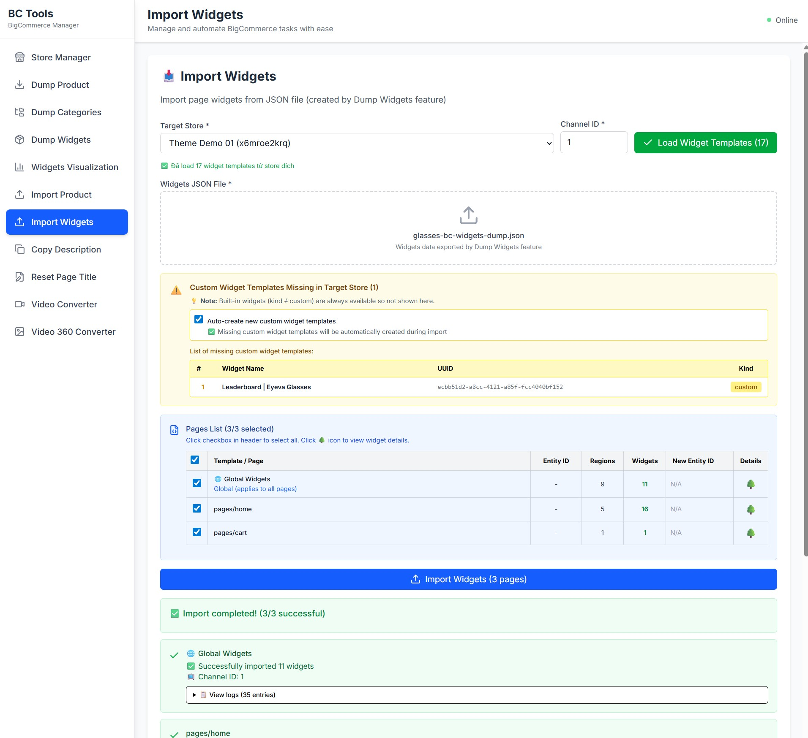

# Get Started

Thank you for using our theme!

To set up the theme exactly like our demo stores, you may need to install our free app **[PapaThemes Widgets](https://www.bigcommerce.com/apps/papathemes-widgets/)**. This app provides additional widgets to visually build content in Page Builder without requiring coding skills.

To display your Instagram photos on your website, you can use our free tool **[PapaThemes Instagram](https://instagram.papathemes.com/)**. We will guide you step by step later in this manual.

## Customizing Typography, Fonts, and Colors

Customize typography, fonts, colors, and buttons in **Page Builder** > **Theme Styles** > **General**. There are dozens of options to help you beautifully and uniquely customize your website.

## Customizing the Checkout Page's Typography and Colors

Customize the checkout page's typography and colors in **Page Builder** > **Theme Styles** > **Optimized Checkout**.

## Installing the PapaThemes Widgets App

Find and install the **[PapaThemes Widgets](https://www.bigcommerce.com/apps/papathemes-widgets/)** app from the [BigCommerce Apps Marketplace](https://www.bigcommerce.com/apps/).

After installation, navigate to your admin panel. In the left sidebar, click **Apps** > **My Apps**. Then, click the **Launch** button for the PapaThemes Widgets app to open it:

{ loading=lazy }

Next, click the **Install** buttons in sequence to install all the available widgets.

{ loading=lazy }

Go to **Storefront** > **My Themes**. Click **Customize** on the Eyeva theme's dropdown menu to open Page Builder. Select any theme style to begin.

{ loading=lazy }

Confirm the widgets are installed by verifying they appear in Page Builder.

{ loading=lazy }

## Importing Sample Products

To set up your store to work exactly like our demo stores, you can import sample products using the following steps:

**Available Sample Products:**

- **Contacts Demo Product**
    - Product link: [https://eyeva-glasses-demo.mybigcommerce.com/contacts-demo/](https://eyeva-glasses-demo.mybigcommerce.com/contacts-demo/)
    - Download: [samples/glasses-product-contacts-demo.json](../samples/glasses-product-contacts-demo.json)

- **Eyeglass Modifiers Modal Demo Product**
    - Product link: [https://eyeva-glasses-demo.mybigcommerce.com/eyeglass-modifiers-modal-demo/](https://eyeva-glasses-demo.mybigcommerce.com/eyeglass-modifiers-modal-demo/)
    - Download: [samples/glasses-product-modifiers-modal-demo.json](../samples/glasses-product-modifiers-modal-demo.json)

- **Brown Leather L-Shaped Sofa**
    - Product link: [https://eyeva-sofas-demo.mybigcommerce.com/brown-leather-l-shaped/](https://eyeva-sofas-demo.mybigcommerce.com/brown-leather-l-shaped/)
    - Download: [samples/sofas-product-brown-leather.json](../samples/sofas-product-brown-leather.json)

- **ASUS ROG Zephyrus G16 Laptop**
    - Product link: [https://eyeva-laptops-demo.mybigcommerce.com/asus-rog-zephyrus-g16/](https://eyeva-laptops-demo.mybigcommerce.com/asus-rog-zephyrus-g16/)
    - Download: [samples/laptops-asus-rog-zephyrus.json](../samples/laptops-asus-rog-zephyrus.json)

**Import Steps:**

1. Go to **[BC Tools](https://bc-tools.papathemes.com/)**
2. Click the **Store Manager** menu item and enter your store API key
3. Click the **Import Product** menu item
4. Select your store as the target store
5. Select **Quick Import from Samples** or Under **Product JSON File**, upload the downloaded JSON file from above
6. Click the **Import Product** button to import the product into your store

{ loading=lazy }

## Importing Widgets to Pages

To import widgets to pages (Home, Product, Cart, global regions) in your store to work exactly like our demo stores:

**Available Widget Dumps:**

- **For Glasses Demo Store**
    - Download: [samples/glasses-bc-widgets-dump.json](../samples/glasses-bc-widgets-dump.json)

- **For Sofas Demo Store**
    - Download: [samples/sofas-bc-widgets-dump.json](../samples/sofas-bc-widgets-dump.json)

- **For Laptops Demo Store**
    - Download: [samples/laptops-bc-widgets-dump.json](../samples/laptops-bc-widgets-dump.json)

**Import Steps:**

1. Go to **[BC Tools](https://bc-tools.papathemes.com/)**
2. Click the **Store Manager** menu item and enter your store API key (skip if already entered)
3. Click the **Import Widgets** menu item
4. Select your store as the target store
5. Enter your **Channel ID** (default is `1` if you only have one storefront)
6. Click the **Load Widget Templates** button to load existing widget templates in your store
7. Select **Quick Import from Samples** or Under **Widgets JSON File**, upload the downloaded JSON file from above. After selecting the file or sample, a list of widgets and pages to be imported will appear
8. Check **"Auto-create new custom widget templates"** if you want to automatically create widget templates that are not yet available in your store but are required for our theme
9. In the **Page List**, select the pages you want to import widgets into
10. Click the **Import Widgets** button to import the widgets into your store
11. Preview your storefront with pages like Home, Product, Cart, which will look like our demo stores

{ loading=lazy }