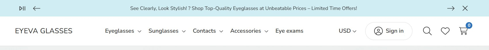
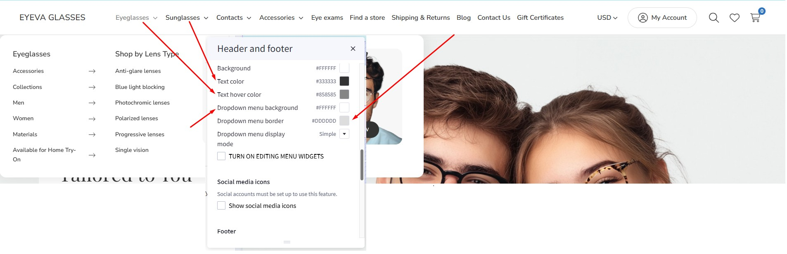
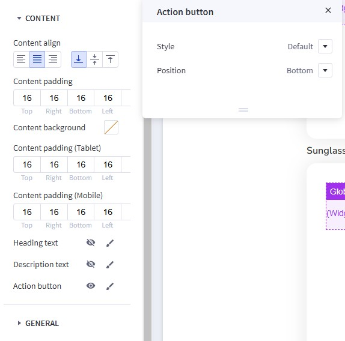
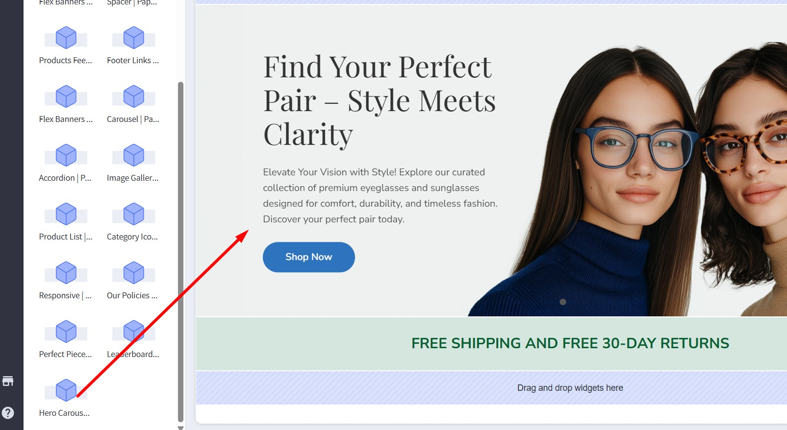
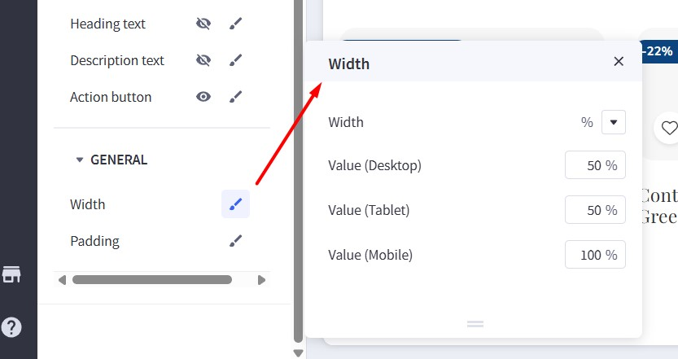
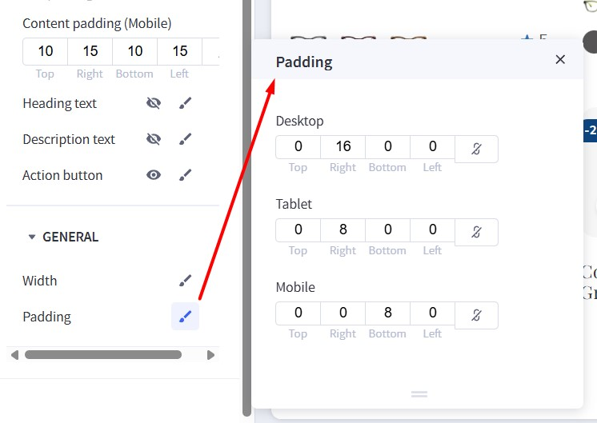
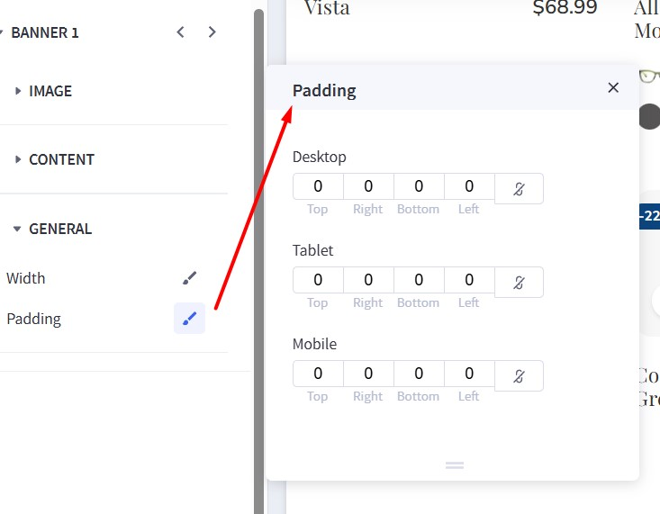
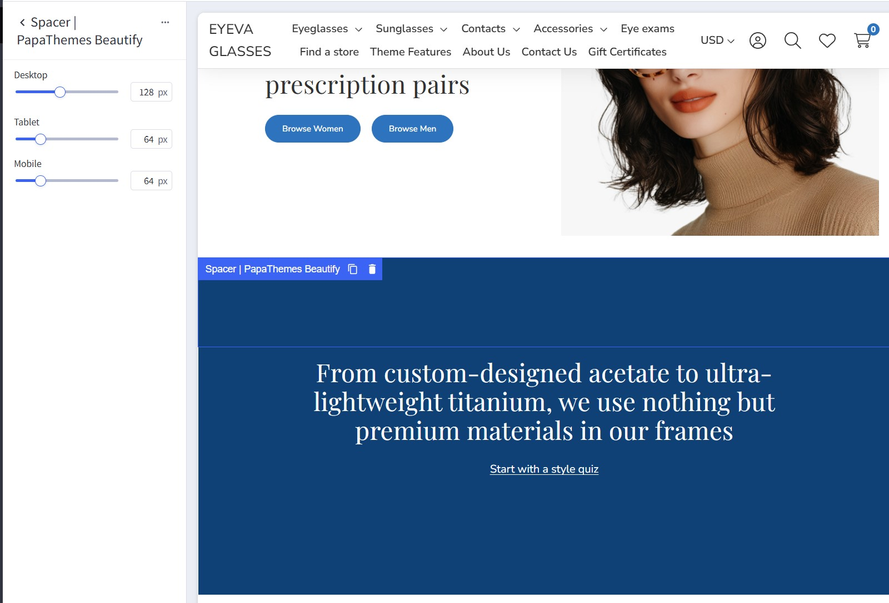

# Setting Up the Glasses Style Home Page

To start customizing the theme, log in to your admin panel. Navigate to **Storefront** > **My Themes** and click the **Customize** button next to the theme thumbnail.

## Header

{ loading=lazy }

To configure the header, navigate to **Theme Styles** > **Header**. Here, you can adjust the header colors, store logo position, and size.

**Utility navigation** allows you to customize the colors of the search, cart, wishlist, and user icons.

**Watch the instruction video:**

<iframe width="760" height="515" src="https://www.youtube.com/embed/AFpgodrjqxg?si=5kDqYIO4jkK4WyX5" title="YouTube video player" frameborder="0" allow="accelerometer; autoplay; clipboard-write; encrypted-media; gyroscope; picture-in-picture; web-share" allowfullscreen></iframe>


### Main Navigation

**Main Navigation** allows you to customize the navigation bar. You can change the menu type to column, dropdown menu, or mega menu, and also modify the colors of the top menu and submenus.

The "**Hide webpage links**" option allows you to hide static webpage links in the main navigation.

{ loading=lazy }

The "**Show top categories on mobile**" option displays top categories on mobile devices.

{ loading=lazy }

To configure the Main Navigation, navigate to **Theme Styles** > **Header and Footer**. In the **Main Navigation** section, you can adjust the following:

- **Background**: The background color of the top categories.
- **Text color**: The text color of menu items.
- **Text hover color**: The text color when hovering over menu items.
- **Dropdown menu background**: The background color of the submenu block.
- **Dropdown menu border**: The border color at the bottom of the main navigation.

{ loading=lazy }


### Mega Menu vs. Standard Menu

To configure the style (mega menu, standard menu, etc.) of the main navigation, go to **Theme Styles** > **Header**. In **Main Navigation**, select **Menu Style**. The theme offers two options:

- `Simple`: Displays the submenu in a mega menu style. The **Simple Menu** allows you to insert banners and products.

{ loading=lazy }

- `Alternate`: Displays submenu items in a dropdown (standard) style.

{ loading=lazy }

### Displaying Widgets on the Mega Menu

To display banners in the Mega Menu, go to **Header and Footer** and check **TURN ON EDITING MENU WIDGETS** to open the Mega Menu in design mode.

{ loading=lazy }

To customize the banner on the right of the submenu on mobile, drag and drop a **Flex Banners | PapaThemes Beautify** widget into the corresponding position:

{ loading=lazy }

In **Column 1**, set padding to `0`.

Remove all banners except Banner 1. Select the image you want to upload. Set `Image width` to `250px`, `Image height` to `250px`, and `Border radius` to `16px`.

{ loading=lazy }

In **CONTENT**, click **Center** and **Bottom** for **Content Align**.

In **Content Padding**, **Content Padding (Tablet)**, and **Content Padding (Mobile)**, set `Top`, `Right`, `Bottom`, and `Left` to `16`.

Hide the `Heading Text`.

Show the `Action Button`. Set `Style` to `Default` and `Position` to `Bottom`.

{ loading=lazy }

In **GENERAL**, edit the **Width**. Choose `px` for **Width**, and set `Value (Desktop)`, `Value (Tablet)`, and `Value (Mobile)` to `250px`.

Edit the **Padding**. For **Desktop**, set `Right` and `Left` to `8`. For **Tablet**, set `Right` and `Left` to `4`. For **Mobile**, set `Right` to `4`, `Bottom` to `0`, and `Left` to `4`.

{ loading=lazy }

Duplicate Banner 1 to create another banner.

### Hide Web Page Links

To hide web page links such as **Contact Us**, **About Us**, and **Shipping & Returns** from the header, navigate to **Theme Styles** > **Header**. Locate the **Hide Web Page Links** option and select it to hide all links except **Categories**.

If you want to hide only specific links, follow these steps:

- **Show web page starting from**: Enter the order number of the first link you want to display.
- **Limit**: Enter the number of webpage links you want to display, starting from the specified order.

For example, to display only **Blog** and **Shipping & Returns**:

- **Show web page starting from**: `1`
- **Limit**: `2`

Note: The order only counts non-category links.

{ loading=lazy }

**Watch the instruction video:**

<iframe width="760" height="515" src="https://www.youtube.com/embed/8gJ2qS92AUg?si=zJJ9CwFmVu0Jk1HQ" title="YouTube video player" frameborder="0" allow="accelerometer; autoplay; clipboard-write; encrypted-media; gyroscope; picture-in-picture; web-share" allowfullscreen></iframe>

## Top Banner

Go back to **Storefront** > **My Themes**, and click the **Customize** button beside the theme thumbnail. You can see the top banner above the header. To change the colors of the top banner, go to **Theme Styles** > **General** > **Top Banners**. Here, you can change the text color and background color.

**Watch the instruction video:**

<iframe width="760" height="515" src="https://www.youtube.com/embed/NL1QiC3INpU?si=oMcyYeScMlBQl28f" title="YouTube video player" frameborder="0" allow="accelerometer; autoplay; clipboard-write; encrypted-media; gyroscope; picture-in-picture; web-share" allowfullscreen></iframe>


## Display Top Banner on All Pages

{ loading=lazy }

To display a top banner that appears on all pages in the header, drag and drop an **HTML Widget** into the desired position. Paste the code below into the HTML editor, and then click the **Save HTML** button.

```html
<div data-banner-carousel style="text-align: center">
  <div>See Clearly, Look Stylish! ? Shop Top-Quality Eyeglasses at Unbeatable Prices – Limited Time Offers!</div>
  <div><strong>Elevate Your Vision, Elevate Your Style!</strong> ? Discover Our Exclusive Eyeglasses Collection at Amazing Prices &ndash; Shop Now!</div>
  <div><strong>Perfect Your Look with Precision!</strong> ?️ Browse Our Premium Eyewear Range &ndash; Exceptional Deals Await!</div>
</div>
```

This code displays 3 messages in a carousel (specified by the `data-banner-carousel` attribute).

To display a simple message, you can just enter the HTML code like this:

```html
<p>See Clearly, Look Stylish! ? Shop Top-Quality Eyeglasses at Unbeatable Prices – Limited Time Offers!</p>
```

**Watch the instruction video:**

<iframe width="760" height="515" src="https://www.youtube.com/embed/bxD_I4ZbMi0?si=b9dDgPVcNsiazSX5" title="YouTube video player" frameborder="0" allow="accelerometer; autoplay; clipboard-write; encrypted-media; gyroscope; picture-in-picture; web-share" allowfullscreen></iframe>

## Main Carousel

{ loading=lazy }

Upload the carousel images in **Storefront** > **Home Page Carousel**.

Return to **Page Builder**. Navigate to **Theme Styles** > **Home Page** and ensure that **Carousel** > **Show carousel** is enabled. You can customize the carousel styles and colors here.

{ loading=lazy }

To adjust the image height in mobile view, modify the **Mobile fixed height (px)** to your preferred dimension. For example, enter `500` to display a 500px height on mobile devices.

{ loading=lazy }

To display a different image on mobile, upload the image in the Image Manager. Then, copy the image URL and paste it into the corresponding **Slide [Number] for mobile** field (e.g., **Slide 1 for mobile** to **Slide 5 for mobile**).

**Watch the instruction video:**

<iframe width="760" height="515" src="https://www.youtube.com/embed/IvW6T-P3Oxs?si=vGlWYu6UDo4n11HP" title="YouTube video player" frameborder="0" allow="accelerometer; autoplay; clipboard-write; encrypted-media; gyroscope; picture-in-picture; web-share" allowfullscreen></iframe>


### Using the Hero Carousel for Multi-Storefronts

The BigCommerce homepage carousel is exclusive to the main channel and does not support multi-storefront deployments. As an alternative, we provide the "**Hero Carousel | Eyeva**" widget, which enables you to showcase an image carousel on any page or storefront.

To implement this:

1. Install the widget from the **PapaThemes Widgets** app.
2. In Page Builder, drag and drop the "**Hero Carousel | Eyeva**" widget into the appropriate widget area.
3. Click on each slide to customize the content using the inline editor.

{ loading=lazy }

{ loading=lazy }

| **Setting**                  | **Value**                          |
|------------------------------|------------------------------------|
| **Slide 1 → Image**          |                                    |
| Image                        | (Upload your image)                |
| Width                        | 1920 px                            |
| Height                       | 800 px                             |
| Image on Mobile (optional)   | *(Upload a mobile-specific image)* |
| Alt Text                     | `alt text`                         |
| Image Link                   | *(Enter URL)*                      |
| **Content**                  |                                    |
| Heading                      | **Visible**                        |
| Description                  | **Visible**                        |
| Button 1                     | **Visible**                        |
| Button 2                     | **Visible**                        |
| Button 3                     | **Visible**                        |

To adjust the widget settings, click the three-dot icon and select **Settings**:

{ loading=lazy }

{ loading=lazy }
|-------------|-----------------------------|---------------------|
| **General** | Background Color           | `#FFFFFF`           |
|             | Text Color                 | `#333333`           |
|             | Primary Color              | `#FFFFFF`           |
|             | Border Color               | `#DDDDDD`           |
|             | Dot Color                  | `#AAAAAA`           |
|             | Dot Active Color           | `#555555`           |
|             | Dot Background Color       | `#555555`           |
|             | Height on Mobile           | `0 px`              |
|             | Base Spacing               | `1 rem` |
| **Slider**  | Enable Autoplay            | **Yes**    |
|             | Autoplay Interval          | `5000 ms`           |
|             | Autoplay on Interaction    | **Yes** |
| **Content** | Content align              | **Left** |
|             | Title Color                | `#333333`           |
|             | Title Font Size (Desktop)  | `48 px`             |
|             | Title Font Size (Mobile)   | `24 px`             |
|             | Title Font Weight          | `400`               |
|             | Description Color          | `#555555`           |
|             | Description Font Size      | `16 px`             |
|             | Button Height              | `50 px`       |


## Free Shipping Banner below the Homepage Carousel

{ loading=lazy }

In Page Builder, drag and drop the **Section Heading** widget into the corresponding widget region:

{ loading=lazy }

Configure the widget options as follows:

{ loading=lazy }

-   **Heading tag**: P
-   **Text style**: Custom
-   **Font family**: Inherit
-   **Font weight**: Extra Bold
-   **Font size (Desktop)**: 24px
-   **Font size (Mobile)**: 16px
-   **Line height**: 1.6
-   **Text color**: #0B5F33
-   **Alignment**: Left / Center / Right
-   **Margin (Desktop)**: 0 0 0 0
-   **Margin (Mobile)**: 0 0 0 0
-   **Padding (Desktop)**: 24 16 24 16
-   **Padding (Mobile)**: 24 16 24 16
-   **Background color**: Optional (color picker or hex code)

Edit the text using the inline editor:

{ loading=lazy }


## Banner: Pick 5 pairs from our Home Try-On collection

{ loading=lazy }

1.  Install the **Leaderboard | Eyeva Glasses** widget from our **PapaThemes Widgets** app:

  { loading=lazy }

2.  In Page Builder, drag and drop the **Leaderboard | Eyeva Glasses** widget into the corresponding widget region:

  { loading=lazy }

3.  Configure the widget options as follows:

  { loading=lazy }


| **Setting**           | **Value**         |
|-----------------------------|---------------------------------------|
| **Display Image**           | **Enabled** (shows a banner image) |
| **Image**                   | _(Preview of the “Try-On” box image)_   |
| **Image Alt**               | `image alt text`                        |
| **Image Width**             | `500 px`                                |
| **Image Height**            | `500 px`                                |
| **Image (mobile) (optional)** |     |
| **Mobile Image Width**      | `1500 px`                               |
| **Mobile Image Height**     | `1500 px`                               |
| **Content Direction**       | **Text – Image**                        |
| **Content Direction (mobile)** | **Image – Text**                     |
| **Background**             | `#F7F7F7`                                |
| **Background on Mobile**    | `#FFFFFF`                                |
| **Heading**                 | *(visible)*        |
| **Text1**                   | *(invisible)*        |
| **Text2**                   | *(visible)*        |
| **Button1**                 | *(visible)*        |
| **Button2**                 | *(visible)*        |
| **Button3**                 | *(invisible)*        |
| **Style**                   | **Inherit theme**                       |


## Shop By Category

{ loading=lazy }

To display this block, navigate to **Theme Styles** > **Home Page** > **Sections** and enter `categories` into one of the section inputs.

{ loading=lazy }


## 2 Banners: Shop Winter & Shop Emma

{ loading=lazy }

Drag and drop the **Flex Banners | PapaThemes Beautify** widget into the corresponding widget region.

Click on **Banner 1** and configure the widget options as follows:

{ loading=lazy }


| **Setting**         | **Value**                                        |
|---------------------|--------------------------------------------------|
| **Banner 1 → Image** |                                                  |
| Image               | *(upload your image)*            |
| Image width         | **1824 px**                                      |
| Image height        | **1200 px**                                      |
| Show different image on mobile | *(off - no need)* |
| Image alt text      | `image alt text`                                 |
| Image fit           | **Fit to box**                                   |
| Lazy-Load           | **Checked** (ON)                                 |
| Border radius       | **0 px**                                         |
| Link                | *(put your link)*                                        |
| **Content**         |                                                  |
| Heading text        | “Shop Winter 2025” (WYSIWYG inline editor) |
| **General**         |                                                  |
| Width (Desktop)     | **50%**                                          |
| Width (Tablet)      | **50%**                                          |
| Width (Mobile)      | **100%**                                         |


{ loading=lazy }

Settings for Action button:

| **Setting**          | **Value**     |
|----------------------|---------------|
| **Size**             | Unset         |
| **Style**            | Custom        |
| **Font family**      | Theme Default |
| **Radius**           | 25 px         |
| **Color**            | #FFFFFF       |
| **Color hover**      | #2D73BD       |
| **Text color**       | #000000       |
| **Text color hover** | #FFFFFF       |
| **Position**         | Bottom        |


{ loading=lazy }

Settings for Width:

| **Setting**       | **Value** |
|-------------------|-----------|
| **Width**         | **%**     |
| **Value (Desktop)** | 50%       |
| **Value (Tablet)**  | 50%       |
| **Value (Mobile)**  | 100%      |


{ loading=lazy }

Settings for Padding:

| **Device** | **Top** | **Right** | **Bottom** | **Left** |
|------------|--------|----------|-----------|----------|
| **Desktop** | 0      | 16       | 0         | 0        |
| **Tablet**  | 0      | 8        | 0         | 0        |
| **Mobile**  | 0      | 0        | 8         | 0        |

Repeat the same steps for **Banner 2**, but configure the **Width** option as follows:

{ loading=lazy }

Settings for Padding:

| **Device**   | **Top** | **Right** | **Bottom** | **Left** |
|--------------|--------|----------|-----------|----------|
| **Desktop**  | 0      | 0        | 0         | 16       |
| **Tablet**   | 0      | 0        | 0         | 8        |
| **Mobile**   | 8      | 0        | 0         | 0        |


## Banner: Introducing foldable frames

{ loading=lazy }

Drag and drop the **Flex Banners | PapaThemes Beautify** widget into the corresponding widget region. Remove any other banners, keeping only one, and configure its options as follows:

{ loading=lazy }

Below is a **single table** summarizing the **Banner 1** settings (Flex Banners | PapaThemes Beautify) as shown in the screenshot. This includes the **Image** section, the **Content** section, and any **General** settings visible:

| **Section** | **Setting**                        | **Value**                                                                                  |
|-------------|------------------------------------|--------------------------------------------------------------------------------------------|
| **Image**   | Image                               | *(upload your image for desktop)*                                                                  |
|             | Image width                         | **3000 px**                                                                               |
|             | Image height                        | **1000 px**                                                                               |
|             | Show different image on mobile      | **ON**                                                                                    |
|             | Image (Mobile)                      | *(upload your image for mobile)*                                                        |
|             | Image width (Mobile)                | **1000 px**                                                                               |
|             | Image height (Mobile)               | **1000 px**                                                                               |
|             | Image alt text                      | `image alt text`                                                                          |
|             | Image fit                           | **Fill to box**                                                                           |
|             | Lazy-Load                           | **Checked** (ON)                                                                          |
|             | Border radius                       | **0 px**                                                                                  |
|             | Link                                | *(put your link)*                                                                                 |
| **Content** |                        |               |
|             | Content padding (Desktop)           | **Top:** 40<br>**Right:** 320<br>**Bottom:** 40<br>**Left:** 128                          |
|             | Content background                  | *(transparent)*                                                                         |
|             | Content padding (Tablet)            | **Top:** 40<br>**Right:** 320<br>**Bottom:** 40<br>**Left:** 16                           |
|             | Content padding (Mobile)            | **Top:** 10<br>**Right:** 15<br>**Bottom:** 10<br>**Left:** 15                            |
|             | Heading text                        | “**Introducing foldable frames**” (36px in the WYSIWYG inline editor)                            |
|             | Description text                    | “**Each pair is engineered …**”                                        |
|             | Action button                       | “**Shop now**”                                                                |*                        |


{ loading=lazy }

Width settings:

| **Setting**        | **Value** |
|--------------------|-----------|
| **Width**          | **%**     |
| **Value (Desktop)**| **100%**  |
| **Value (Tablet)** | **100%**  |
| **Value (Mobile)** | **100%**  |


{ loading=lazy }

Padding settings:

| **Device**   | **Top** | **Right** | **Bottom** | **Left** |
|--------------|--------|----------|-----------|----------|
| **Desktop**  | 0      | 0        | 0         | 0        |
| **Tablet**   | 0      | 0        | 0         | 0        |
| **Mobile**   | 0      | 0        | 0         | 0        |


## Banner: Take 15% off two or more prescription pairs

{ loading=lazy }

Set up this banner similarly to the "**Pick 5 pairs**" banner. See the instructions above: [Banner: Pick 5 pairs from our Home Try-On collection](#banner-pick-5-pairs-from-our-home-try-on-collection).


## Banner: From custom-designed acetate to ultra-lightweight titanium

{ loading=lazy }

Drag and drop the **Leaderboard | Eyeva Glasses** widget into the corresponding widget region. Configure the widget options as follows:

{ loading=lazy }

| **Setting**                     | **Value**                                                                   |
|---------------------------------|-----------------------------------------------------------------------------|
| **Display Image**               | *(OFF)*                                   |
| **Background**                  | `#0F4177`                                                                    |
| **Background on Mobile**        | `#0F4177`                                                                    |
| **Heading**                     | **Visible**                                                    |
| **Text1**                       | **Visible**                                                    |
| **Text2**                       | **Visible**                                                    |
| **Button1**                     | *(OFF)*                                               |
| **Button2**                     | *(OFF)*                                               |
| **Button3**                     | *(OFF)*                                               |
| **Style**                       | **Custom**                                                                   |
| **Base Spacing**                | **1 rem**                                                                    |
| **Heading Font Size (Desktop)** | **36 px**                                                                    |
| **Heading Font Size (Mobile)**  | **28 px**                                                                    |
| **Heading Text Color**          | `#FFFFFF`                                                                    |
| **Text Font Size (Desktop)**    | **16 px**                                                                    |
| **Text Font Size (Mobile)**     | **14 px**                                                                    |
| **Text Color**                  | `#FFFFFF`                                                                    |
| **Link Color**                  | `#2D73BD`                                                                    |


Then, add two spacer widgets (**Spacer | PapaThemes Beautify**) above and below the Leaderboard widget. Configure the spacer options as follows:

{ loading=lazy }

| **Device**   | **Spacing** |
|--------------|-------------|
| **Desktop**  | 128 px      |
| **Tablet**   | 64 px       |
| **Mobile**   | 64 px       |


Next, in the **Layers** panel, select the **Layout** containing the Leaderboard widget and the two Spacer widgets. Update the background color to `#0F4177`:

{ loading=lazy }


## Banner: Get 20% off your first contacts order

{ loading=lazy }

Set up this banner similarly to the "**Pick 5 pairs**" banner. See the instructions above: [Banner: Pick 5 pairs from our Home Try-On collection](#banner-pick-5-pairs-from-our-home-try-on-collection).


## Banner: For every pair purchased

{ loading=lazy }


Set up this banner similarly to the "**Pick 5 pairs**" banner. See the instructions above: [Banner: Pick 5 pairs from our Home Try-On collection](#banner-pick-5-pairs-from-our-home-try-on-collection).

Configure the widget options as follows:

| **Setting**                  | **Value**                                                                                          |
|------------------------------|------------------------------------------------------------------------------------------------------|
| **Display Image**            | **ON**                                                                           |
| **Image**                    | *(upload your image)*                                                         |
| **Image Alt**                | `image alt text`                                                                                    |
| **Image Width**              | **700 px**                                                                                           |
| **Image Height**             | **700 px**                                                                                           |
| **Image (mobile) (optional)** | *(Not selected)*                                                                                    |
| **Mobile Image Width**       | **1500 px**                                                                                          |
| **Mobile Image Height**      | **1500 px**                                                                                          |
| **Content Direction**        | **Image - [Text]**                |
| **Content Direction (mobile)** | **Image - [Text]**                   |
| **Background**               | **#E2EDEE**                                                                                          |
| **Background on Mobile**     | **#E2EDEE**                                                                                          |
| **Heading**                  | **ON**                                                                            |
| **Text1**                    | **ON**                                                                            |
| **Text2**                    | **ON**                                                                            |
| **Button1**                  | **OFF**                                                                            |
| **Button2**                  | **OFF**                                                                            |
| **Button3**                  | **OFF**                                                                            |
| **Style**                    | **Inherit theme**                                                                                    |


## Bestselling Products

{ loading=lazy }

Bestselling products will only appear once your store has received orders.

You can configure the bestselling products section settings in **Page Builder** > **Theme Styles** > **Home Page**. Ensure that one of the **Sections** inputs is set to `bestselling`. In the **Products** section, you can adjust the **Number of most popular products** to display and change the **Most popular products display** to either `Carousel` or `Grid`.

{ loading=lazy }

## Featured Products

{ loading=lazy }

You can designate products as "featured" in **Products** by clicking the **star** icon on the corresponding row.

Return to **Page Builder** > **Theme Styles** > **Home Page** and ensure that one of the **Sections** inputs is set to `featured_products`. In the **Products** section, you can modify the **Number of featured products** to display and change the **Featured products display** to either `Carousel` or `Grid`.

## New Products

{ loading=lazy }

You can configure the new products section settings in **Page Builder** > **Theme Styles** > **Home Page**. Ensure that one of the **Sections** inputs is set to `new`. In the **Products** section, you can change the **Number of new products** to display and change the **New products display** to either `Carousel` or `Grid`.

## Wide banner

{ loading=lazy }

In Page Builder, drag & drop the Flex Banner widget into the corresponding widget region:

{ loading=lazy }

Configure the widget options as follows:

|  |  |  |
|---|---|---|
| { loading=lazy } | { loading=lazy } | { loading=lazy } |


| **Setting**                                    | **Value**                                   |
|-----------------------------------------------|---------------------------------------------|
| **Image**                                      |                                             |
| Image                                          | (Eyeglasses image)                          |
| Image width                                    | 3000 px                                     |
| Image height                                   | 1000 px                                     |
| Show different image on mobile                 | ON (toggle enabled)                         |
| Image (Mobile)                                 | (Alternate eyeglasses image)               |
| Image width (Mobile)                           | 1000 px                                     |
| Image height (Mobile)                          | 1000 px                                     |
| Image alt text                                 | *(blank)*                                   |
| Image fit                                      | Fill to box                                 |
| Lazy-Load                                      | ON (toggle enabled)                         |
| Border radius                                  | 0 px                                        |
| Link                                           | *(blank)*                                   |
| **Content**                                    |                                             |
| Content align (Horizontal)                     | Left                                        |
| Content align (Vertical)                       | Center                                      |
| Content padding (Desktop)                      | Top: 40 px • Right: 320 px • Bottom: 40 px • Left: 128 px |
| Content padding (Tablet)                       | Top: 40 px • Right: 320 px • Bottom: 40 px • Left: 16 px   |
| Content padding (Mobile)                       | Top: 10 px • Right: 15 px • Bottom: 10 px • Left: 15 px    |
| Content background                             | *(none)*                                    |
| Heading text                                   | Visible (eye icon ON)                       |
| Description text                               | Visible (eye icon ON)                       |
| Action button                                  | Visible (eye icon ON)                       |
| **General**                                    |                                             |
| Width (Desktop)                                | 100%                                        |
| Width (Tablet)                                 | 100%                                        |
| Width (Mobile)                                 | 100%                                        |
| Padding                                        | *(not shown, likely 0)*                    |


## Recently Viewed Products

{ loading=lazy }

Recently Viewed Products will be displayed automatically after a product has been viewed.

You can configure the Recently Viewed Products section settings in **Page Builder** > **Theme Styles** > **Home Page**. Ensure that one of the **Sections** inputs is set to `viewed` to enable this block.

## Configure product columns on desktop, tablet, and mobile

{ loading=lazy }

To change the number of products displayed per row, go to **Page Builder** > **Global** > **Product**.

- **Columns on Desktop**: Specify the number of product columns to display on Desktop.
- **Columns on Tablet**: Specify the number of product columns to display on Tablet.
- **Columns on Mobile**: Specify the number of product columns to display on Mobile.

## Featured Brands

{ loading=lazy }

The **Featured Brands** section will automatically display all brands from your store.

To enable the **Featured Brands** section, in **Theme Styles** > **Home Page** > **Sections**, choose one of the sections and type `brands` to enable this block.

To change the background color of this section, click on **Brands carousel background** and select a color that fits your design.

{ loading=lazy }

## Recent Blog Posts

{ loading=lazy }

You can add blog posts in **Storefront** > **Blog**. Click the **+** button to add a new blog post. Make sure **Blog Visibility** is `on`.

To display the **recent blog** posts on the home page, go to **Page Builder**. In **Theme Styles** > **Home Page**, make sure one of Sections has typed `blog`. Scroll down the Recent Blog section, you can configure **Heading**, **Number of posts** to display.

{ loading=lazy }

## Footer

{ loading=lazy }

Configure footer settings in **Theme Styles** > **Header and footer** >  **Footer**.

{ loading=lazy }


| **Setting**                         | **Meaning**                                                                                           |
|------------------------------------|-------------------------------------------------------------------------------------------------------|
| **Footer background**              | The background color for the store’s footer area.                                                     |
| **Text color**                     | The primary text color used throughout the footer.                                                    |
| **Hover link color**               | The color applied to footer links when hovered over by the mouse.                                     |
| **Heading color**                  | The color for any heading text within the footer (e.g. “Contact Us,” “Information,” etc.).            |
| **Border color**                   | The color of any borders or dividing lines in the footer.                                             |
| **Phone text**                     | The text snippet (including an HTML link) displayed for phone contact in the footer.                  |
| **Show “Powered by BigCommerce”**  | Toggles the visibility of the “Powered by BigCommerce” credit at the footer’s bottom.                  |
| **Show brands in footer**          | Determines if brand logos/links are displayed in the footer.                                          |
| **Show “&copy;”, current year and store name** | Toggles the display of a copyright notice showing “© [current year] [store name].”         |


**Phone text** allows you to change the text, along with the phone number, in the input field based on the text below.

```html
We're available by phone (<a href='tel:{phone}'>{phone}</a>) and chat today from 8 a.m.-11 p.m.
```

`{phone}` will be replaced by the phone number you set in the store settings.

{ loading=lazy }

You can display contact icons (FAQ, Text, Chat, Email) using a widget. Drag and drop the HTML widget into the corresponding widget region, then copy the HTML code below and click the **Save HTML** button.

```html
<ul class="footer-contacts-callouts">
  <li><a href="/faq"><i class="icon" aria-hidden="true"><svg><use href="#icon-comments-question-check"></use></svg></i>FAQ</a></li>
  <li><a href="#text-message"><i class="icon" aria-hidden="true"><svg><use href="#icon-message-dots"></use></svg></i>Text</a></li>
  <li><a href="#chat"><i class="icon" aria-hidden="true"><svg><use href="#icon-messages"></use></svg></i>Chat</a></li>
  <li><a href="mailto:contact@papathemes.com"><i class="icon" aria-hidden="true"><svg><use href="#icon-envelope"></use></svg></i>Email</a></li>
</ul>
```

{ loading=lazy }

**Payment Icons** allows you to select which payment icons to display.


### Custom Footer Links

Add custom links to the footer by using the HTML widget. Simply drag and drop it into the appropriate widget region:

{ loading=lazy }


Paste the following code into the HTML editor, and then click the **Save HTML** button:

```html
<article class="footer-info-col">
    <h3 class="footer-info-heading">Ways to Save</h3>
    <ul class="footer-info-list">
        <li><a href="/insurance/">Insurance</a></li>
        <li><a href="/flexible-spending/">Flexible spending</a></li>
        <li><a href="/20-off-contacts/">20% off contacts</a></li>
        <li><a href="/add-a-pair-and-save/">Add a pair and save</a></li>
    </ul>
</article>

<article class="footer-info-col">
    <h3 class="footer-info-heading">Education</h3>
    <ul class="footer-info-list">
        <li><a href="/eyeglasses-lens-guide/">Eyeglasses lens guide</a></li>
        <li><a href="/sunglasses-lens-guide/">Sunglasses lens guide</a></li>
        <li><a href="/eyewear-a-to-z/">Eyewear A to Z</a></li>
        <li><a href="/how-our-glasses-are-made/">How our glasses are made</a></li>
    </ul>
</article>
```