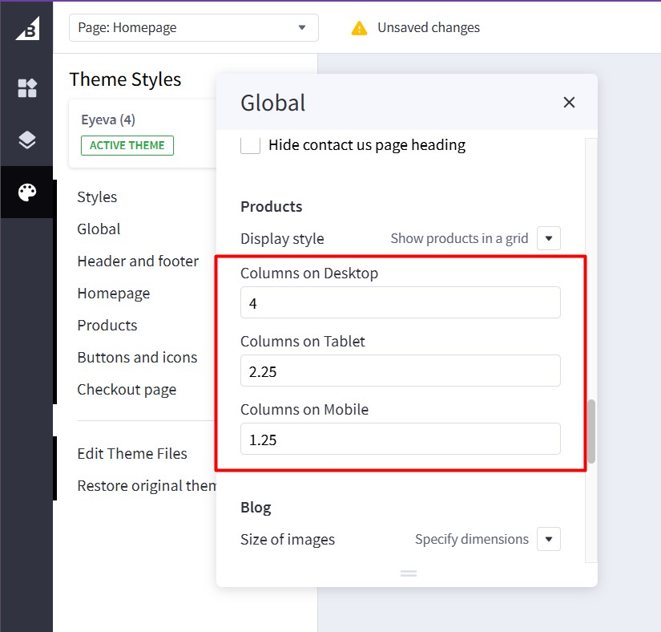

# Setting Up the Laptops Style Home Page

To start customizing the theme, log in to your admin panel. Navigate to **Storefront** > **My Themes** and click the **Customize** button next to the theme thumbnail.

{ loading=lazy }

To configure the home page sections, navigate to **Theme Styles** > **Home Page** > **Sections**. Enter the following sections in the appropriate fields:

- `laptop-banners` - Displays laptop-specific banner carousel
- `categories` - Shows shop by category section
- `bestselling` - Displays bestselling laptop products
- `featured` - Shows featured laptop products
- `new` - Displays new laptop arrivals
- `brands` - Shows featured laptop brands
- `blog` - Displays recent blog posts
- `viewed` - Shows recently viewed products

## Main Carousel

{ loading=lazy }

To set up the main carousel for laptops, you need to use the **Hero Carousel | Eyeva** widget instead of the default BigCommerce carousel. This widget provides better customization options and supports multi-storefront deployments.

1. Install the **Hero Carousel | Eyeva** widget from the **PapaThemes Widgets** app.
2. In Page Builder, drag and drop the **Hero Carousel | Eyeva** widget into the main carousel position on your homepage.
3. Configure the widget settings and upload your laptop carousel images directly within the widget.

### Hero Carousel Widget Configuration

{ loading=lazy }

After installing and adding the **Hero Carousel | Eyeva** widget to your homepage, configure it as follows:

1. Click on each slide to customize the content using the inline editor.
2. Upload your laptop carousel images directly in the widget settings.
3. Configure the slide content, buttons, and styling options.

Configure the widget settings as follows:

| **Setting**                  | **Value**                          |
|------------------------------|------------------------------------|
| **Slide 1 → Image**          |                                    |
| Image                        | (Upload your laptop gaming image)  |
| Width                        | 1792 px                            |
| Height                       | 1264 px                            |
| Image on Mobile (optional)   | *(Upload a mobile-specific image)* |
| Alt Text                     | `gaming laptop carousel`           |
| Image Link                   | *(Enter URL)*                      |
| **Content**                  |                                    |
| Heading                      | "Dominate Anywhere - Game Anytime, Power in Your Hands." |
| Description                  | "Play, connect, and win with a compact gaming arsenal." |
| Button Text                  | "Shop Now"                         |
| Button Link                  | *(Enter product/category URL)*     |

**Note:** The Hero Carousel widget supports multiple slides. You can see Slide 1, Slide 2, and Slide 3 in the widget panel. Configure each slide by clicking on it and uploading different laptop images and content for each slide.

**For additional slides (Slide 2, Slide 3):**

- Follow the same configuration pattern as Slide 1
- Upload different laptop/gaming images for variety
- Create unique headlines and descriptions for each slide
- Use consistent button styling across all slides

To adjust the widget settings, click the **three-dot menu icon** next to the widget name and select **Settings**:

{ loading=lazy }

This will open the Hero Carousel Settings panel where you can configure the overall widget behavior:

{ loading=lazy }

Configure the widget settings as follows:

| **Section** | **Setting**                  | **Value**                          |
|-------------|------------------------------|------------------------------------|
| **GENERAL** | Style                        | `Inherit theme`                    |
| **SLIDER**  | Enable Autoplay              | **✓ Checked** (ON)                 |
|             | Autoplay Interval            | `5000 ms`                          |
|             | Stop Autoplay on Interaction | **✓ Checked** (ON)                 |
|             | Height on Mobile             | `0 px`                             |
|             | Stretched (recommended for video display) | **☐ Unchecked** (OFF)    |
|             | Content align                | **Left** (first option selected)  |

**Settings Explanation:**

- **Style**: `Inherit theme` uses your theme's default styling
- **Enable Autoplay**: Automatically advances slides every 5 seconds
- **Stop Autoplay on Interaction**: Pauses autoplay when user interacts with carousel
- **Height on Mobile**: `0 px` means responsive height based on image dimensions
- **Stretched**: Leave unchecked for normal image display (only check for video content)
- **Content align**: Choose Left, Center, or Right alignment for slide content

## Flex Banners Section (Next to Carousel)

These banners appear alongside the main carousel and showcase different laptop categories or promotions.

Drag and drop the **Flex Banners | PapaThemes Beautify** widget into the corresponding widget region next to the carousel.

### Banner 1 Configuration - Desktop Gaming Setup

{ loading=lazy }

Configure Banner 1 with the following settings:

| **Setting**                    | **Value**                                        |
|--------------------------------|--------------------------------------------------|
| **Banner 1 → Image**           |                                                  |
| Image                          | *(upload desktop gaming setup image)*           |
| Image width                    | **864 px**                                       |
| Image height                   | **600 px**                                       |
| Show different image on mobile | **☐ Unchecked** (OFF)                           |
| Image alt text                 | `desktop gaming setup`                           |
| Image fit                      | **Fill to box**                                  |
| Lazy-Load                      | **✓ Checked** (ON)                               |
| Video URL (.mp4)               | *(optional - for video background)*             |
| Show video                     | **In** (if using video)                         |
| Hide video when paused         | **✓ Checked** (ON)                               |
| Border radius                  | **0 px**                                         |
| **Content**                    |                                                  |
| Heading text                   | "Power & Productivity in One Package"           |
| Description                    | "Your Ultimate PC Setup"                        |
| Button text                    | "Bundles & Save"                                 |
| Link                           | *(put your bundle products link)*                |

### Banner 2 Configuration - AI-Powered Laptops

{ loading=lazy }

Configure Banner 2 with the following settings:

| **Setting**                    | **Value**                                        |
|--------------------------------|--------------------------------------------------|
| **Banner 2 → Image**           |                                                  |
| Image                          | *(upload AI laptop image)*                      |
| Image width                    | **864 px**                                       |
| Image height                   | **1264 px**                                      |
| Show different image on mobile | **☐ Unchecked** (OFF)                           |
| Image alt text                 | `AI-powered laptop`                              |
| Image fit                      | **Fill to box**                                  |
| Lazy-Load                      | **✓ Checked** (ON)                               |
| Border radius                  | **0 px**                                         |
| **Content**                    |                                                  |
| Heading text                   | "Smarter, Faster, AI-Powered"                   |
| Description                    | "Experience the Future!"                         |
| Button text                    | "Shop AI Laptops"                               |
| Link                           | *(put your AI laptops category link)*           |


## Section 4 Column Banners

{ loading=lazy }

Drag and drop the **Flex Banners | PapaThemes Beautify** widget into the corresponding widget region.

Configure four banners with the following settings:

### Banner Configuration (Apply to all 4 banners)

| **Setting**         | **Value**                                        |
|---------------------|--------------------------------------------------|
| **Image**           |                                                  |
| Image               | *(upload your 4-column banner image)*           |
| Image width         | **864 px**                                       |
| Image height        | **1100 px**                                      |
| Image alt text      | `4-column banner image`                          |
| Image fit           | **Fit to box**                                   |
| Lazy-Load           | **Checked** (ON)                                 |
| Border radius       | **8 px**                                         |
| Link                | *(put your link)*                                |

### Content Settings

| **Setting**                    | **Value**                                        |
|--------------------------------|--------------------------------------------------|
| **Content align**              | Left, Center, Bottom (horizontal & vertical)    |
| **Content padding (Desktop)**  | Top: **40** Right: **36** Bottom: **40** Left: **36** |
| **Content padding (Tablet)**   | Top: **40** Right: **36** Bottom: **40** Left: **36** |
| **Content padding (Mobile)**   | Top: **10** Right: **15** Bottom: **10** Left: **15** |
| **Content background**         | *(transparent)*                                  |
| **Heading text**               | *(Enter banner title)*                           |
| **Description text**           | *(Enter banner description)*                     |
| **Action button**              | *(Enter button text)*                            |

### Widget Settings Configuration

To configure the overall widget settings, click the **three-dot menu icon** next to the widget name and select **Settings**:

{ loading=lazy }

This opens the **Flex Banners | PapaThemes Beautify Settings** panel. Configure the **GENERAL** section as follows:

| **Setting**                           | **Value**                                        |
|---------------------------------------|--------------------------------------------------|
| **Style for theme**                   | `Other`                                          |
| **Your theme name**                   | *(leave blank)*                                  |
| **Display banners in container div**  | **☐ Unchecked** (OFF)                           |
| **Display content overlaying banner on mobile** | **✓ Checked** (ON)              |

### Widget Padding Settings

Click on the **Padding** option to configure spacing for the entire widget:

| **Device** | **Top** | **Right** | **Bottom** | **Left** |
|------------|---------|-----------|------------|----------|
| **Desktop** | **0**   | **32**    | **0**      | **32**   |
| **Tablet**  | **0**   | **8**     | **0**      | **8**    |
| **Mobile**  | **0**   | **4**     | **0**      | **4**    |

### Individual Banner Width Settings

For each individual banner within the widget, configure the responsive display:

| **Setting**         | **Value**                                        |
|---------------------|--------------------------------------------------|
| **Width**           | **%** (percentage)                               |
| **Value (Desktop)** | **25%** (4 columns on desktop)                  |
| **Value (Tablet)**  | **50%** (2 columns on tablet)                   |
| **Value (Mobile)**  | **50%** (2 columns on mobile)                   |

**Note:**

- **Widget Padding** controls the overall spacing around the entire banner group
- **Individual Banner Width** controls how many columns each banner takes up
- **Display content overlaying banner on mobile** ensures content appears properly on mobile devices

## Leaderboard Banner

{ loading=lazy }

Install the **Leaderboard | Eyeva Glasses** widget from our **PapaThemes Widgets** app.

In Page Builder, drag and drop the **Leaderboard | Eyeva Glasses** widget into the corresponding widget region.

Configure the widget options as follows:

### Image Configuration

| **Setting**                     | **Value**                                                                   |
|---------------------------------|-----------------------------------------------------------------------------|
| **Display Image/Video**         | **☑ Checked** (ON)                                                          |
| **Image**                       | _(Upload your laptop leaderboard image)_                                   |
| **Image Alt**                   | `laptop leaderboard banner`                                                 |
| **Image Width**                 | `920 px`                                                                    |
| **Image Height**                | `300 px`                                                                    |
| **Image Fit**                   | **Cover**                                                                   |
| **Image (mobile) (optional)**   | _(Upload mobile-specific image if needed)_                                  |
| **Mobile Image Width**          | `920 px`                                                                    |
| **Mobile Image Height**         | `300 px`                                                                    |
| **Video URL (.mp4)**            | _(optional for video background)_                                           |
| **Show video**                  | **In Viewport**                                                             |
| **Hide video when paused**      | **☑ Checked** (ON)                                                          |

### Content & Layout Settings

| **Setting**                     | **Value**                                                                   |
|---------------------------------|-----------------------------------------------------------------------------|
| **Content Direction**           | **Text**                                                                    |
| **Content Direction (mobile)**  | **Image**                                                                   |
| **Background**                  | `#FDFEFE`                                                                   |
| **Background on Mobile**        | `#FDFEFE`                                                                   |
| **Heading**                     | **Visible** ("NEXT-LEVEL PERFORMANCE")                                      |
| **Text1**                       | **Visible** ("For Gaming, Content creation,")                               |
| **Text2**                       | **Visible** ("and Office use")                                              |
| **Button1**                     | *(configure as needed)*                                                      |
| **Button2**                     | *(configure as needed)*                                                      |
| **Button3**                     | *(configure as needed)*                                                      |
| **Style**                       | **Inherit theme**                                                           |

### Content Text Examples (from screenshot):

- **Heading**: "NEXT-LEVEL PERFORMANCE"
- **Text1**: "For Gaming, Content creation,"
- **Text2**: "and Office use"

## Section 2 Flex Banners

{ loading=lazy }

Drag and drop the **Flex Banners | PapaThemes Beautify** widget into the corresponding widget region.

Configure the widget options as follows:

### Banner 1 Configuration - Smart Tech Deals

| **Setting**                    | **Value**                                        |
|--------------------------------|--------------------------------------------------|
| **Banner 1 → Image**           |                                                  |
| Image                          | *(upload your smart tech deals banner image)*   |
| Image width                    | **2016 px**                                      |
| Image height                   | **592 px**                                       |
| Show different image on mobile | **☑ Checked** (ON)                               |
| Image alt text                 | `smart tech deals banner`                        |
| Image fit                      | **Fill to box**                                  |
| Lazy-Load                      | **☑ Checked** (ON)                               |
| Video URL (.mp4)               | *(optional for video background)*               |
| Show video                     | **In**                                           |
| Hide video when paused         | **☑ Checked** (ON)                               |
| Border radius                  | **16 px**                                        |
| Link                           | *(put your smart tech deals link)*              |
| **Content**                    |                                                  |
| Heading text                   | "Starts at $49.99"                              |
| Description text               | "Upgrade Your Home - Smart Tech at the Best Prices" |
| Button text                    | "Shop Smart Tech Deals"                         |

### Banner 2 Configuration - Crystal Clear Displays

| **Setting**                    | **Value**                                        |
|--------------------------------|--------------------------------------------------|
| **Banner 2 → Image**           |                                                  |
| Image                          | *(upload your crystal displays banner image)*   |
| Image width                    | **2880 px**                                      |
| Image height                   | **1664 px**                                      |
| Show different image on mobile | **☑ Checked** (ON)                               |
| Image alt text                 | `crystal clear displays banner`                  |
| Image fit                      | **Fill to box**                                  |
| Lazy-Load                      | **☑ Checked** (ON)                               |
| Video URL (.mp4)               | `https://storage.themeforshop.com/...`           |
| Show video                     | **Hover**                                        |
| Hide video when paused         | **☐ Unchecked** (OFF)                           |
| Border radius                  | **16 px**                                        |
| Link                           | *(put your displays category link)*             |
| **Content**                    |                                                  |
| Heading text                   | "Starts at $149.99"                             |
| Description text               | "144Hz Refresh Rate, Ultra-Wide"                |
| Button text                    | "Shop All Displays"                             |

### Widget Layout Settings

Configure the overall widget layout:

| **Setting**         | **Banner 1** | **Banner 2** |
|---------------------|--------------|--------------|
| **Width (Desktop)** | **50%**      | **50%**      |
| **Width (Tablet)**  | **50%**      | **50%**      |
| **Width (Mobile)**  | **100%**     | **100%**     |

### Padding Settings

Configure spacing between banners:

**Banner 1 Padding:**

| **Device** | **Top** | **Right** | **Bottom** | **Left** |
|------------|---------|-----------|------------|----------|
| **Desktop** | 0      | 8         | 0          | 0        |
| **Tablet**  | 0      | 4         | 0          | 0        |
| **Mobile**  | 0      | 0         | 8          | 0        |

**Banner 2 Padding:**
| **Device** | **Top** | **Right** | **Bottom** | **Left** |
|------------|---------|-----------|------------|----------|
| **Desktop** | 0      | 0         | 0          | 8        |
| **Tablet**  | 0      | 0         | 0          | 4        |
| **Mobile**  | 8      | 0         | 0          | 0        |

## Customer Reviews Slider

{ loading=lazy }

To display customer reviews, drag and drop the **Customer Reviews | PapaThemes Beautify** widget into the corresponding widget region.

{ loading=lazy }

### Widget Configuration

Configure the widget with 8 reviews (Review 1 through Review 8). For each review, set up the following content:

### Review 1 Example Configuration

| **Setting**                  | **Value**                          |
|------------------------------|------------------------------------|
| **Avatar**                   | *(upload customer avatar image)*   |
| **Title**                    | "Only the best!"                  |
| **Content**                  | "Honestly, I will never use another brand again! the pro point lashes are the BEST!! my last order was $600 and she included a free lash cleanser (which is also the best i've ever used)!" |
| **Rating**                   | `5` (5 stars)                      |
| **Author**                   | "Sophie Hanan - 06/11"             |
| **Style for theme**             | `Other`                            |
| **Your theme name**             | *(leave blank)*                    |
| **Display reviews in container div** | **☑ Checked** (ON)            |

### Laptop-Themed Review Content Examples

For a laptop store, adapt the review content as follows:

**Review 1 (Gaming Laptop):**

- **Title**: "Best gaming laptop ever!"
- **Content**: "This laptop handles all my games perfectly! RTX graphics are incredible and the 144Hz display is so smooth. Best purchase I've made for gaming!"
- **Author**: "Alex Chen - 12/23"

**Review 2 (Business Laptop):**

- **Title**: "Perfect for work"
- **Content**: "Amazing performance for professional work. Battery lasts all day and the build quality is excellent. Highly recommend for business use!"
- **Author**: "Sarah Johnson - 11/23"

**Review 3 (Student Laptop):**

- **Title**: "Great value for students"
- **Content**: "Affordable laptop that handles everything I need for college. Fast processing and lightweight design. Perfect for campus life!"
- **Author**: "Mike Rodriguez - 10/23"

### Additional Review Setup

Configure the remaining reviews (Review 4-8) following the same pattern:
- **Different customer names and dates**
- **Varied review content** about laptop performance, gaming, work, etc.
- **5-star ratings** for positive customer feedback
- **Upload different avatars** for each reviewer
- **Focus on laptop features**: performance, graphics, battery life, build quality, etc.

## Callout Icons

{ loading=lazy }

Drag and drop the **Callout Icons | PapaThemes Beautify** widget into the corresponding widget region.

Configure the widget with three callout icons representing laptop-specific features:

### Icon 1: Fast Delivery

| **Setting**         | **Value**                     |
|---------------------|-------------------------------|
| **Icon**            | Vehicle icon (SVG provided)   |
| **Heading**         | "Fast Delivery"               |
| **Description**     | "Quick laptop delivery service" |
| **Link**            | *(optional)*                  |

SVG icon:

```html
<svg xmlns="http://www.w3.org/2000/svg" width="40" height="32" viewBox="0 0 40 32" fill="none">
  <g clip-path="url(#clip0_2158_4095)">
    <path d="M22 2C23.1063 2 24 2.89375 24 4V24H15.6562C14.8313 21.6688 12.6125 20 10 20C7.3875 20 5.1625 21.6688 4.34375 24H4C2.89375 24 2 23.1063 2 22V4C2 2.89375 2.89375 2 4 2H22ZM0 22C0 24.2062 1.79375 26 4 26C4 29.3125 6.6875 32 10 32C13.3125 32 16 29.3125 16 26H24C24 29.3125 26.6875 32 30 32C33.3125 32 36 29.3125 36 26H39C39.55 26 40 25.55 40 25C40 24.45 39.55 24 39 24H38V14.7375C38 14.0188 37.7438 13.3313 37.275 12.7875L32.3563 7.05C31.7875 6.38125 30.9562 6 30.0812 6H26V4C26 1.79375 24.2062 0 22 0H4C1.79375 0 0 1.79375 0 4V22ZM26 8H30.0812C30.375 8 30.65 8.125 30.8375 8.35L35.6813 14H26V8ZM26 21.525V16H36V24H35.6562C34.8312 21.6688 32.6125 20 30 20C28.4625 20 27.0625 20.575 26 21.525ZM10 22C11.0609 22 12.0783 22.4214 12.8284 23.1716C13.5786 23.9217 14 24.9391 14 26C14 27.0609 13.5786 28.0783 12.8284 28.8284C12.0783 29.5786 11.0609 30 10 30C8.93913 30 7.92172 29.5786 7.17157 28.8284C6.42143 28.0783 6 27.0609 6 26C6 24.9391 6.42143 23.9217 7.17157 23.1716C7.92172 22.4214 8.93913 22 10 22ZM26 26C26 24.9391 26.4214 23.9217 27.1716 23.1716C27.9217 22.4214 28.9391 22 30 22C31.0609 22 32.0783 22.4214 32.8284 23.1716C33.5786 23.9217 34 24.9391 34 26C34 27.0609 33.5786 28.0783 32.8284 28.8284C32.0783 29.5786 31.0609 30 30 30C28.9391 30 27.9217 29.5786 27.1716 28.8284C26.4214 28.0783 26 27.0609 26 26ZM15.7063 5.70625C16.0938 5.31875 16.0938 4.68125 15.7063 4.29375C15.3188 3.90625 14.6812 3.90625 14.2937 4.29375L8.29375 10.2937C8.00625 10.5813 7.925 11.0125 8.075 11.3813C8.225 11.75 8.59375 12 9 12H14.5875L10.2937 16.2938C9.90625 16.6813 9.90625 17.3187 10.2937 17.7062C10.6812 18.0938 11.3188 18.0938 11.7063 17.7062L17.7062 11.7063C17.9937 11.4187 18.075 10.9875 17.925 10.6187C17.775 10.25 17.4062 10 17 10H11.4125L15.7063 5.70625Z" fill="#181818"/>
  </g>
  <defs>
    <clipPath id="clip0_2158_4095">
      <rect width="40" height="32" fill="white"/>
    </clipPath>
  </defs>
</svg>
```

### Icon 2: Secure Payment

| **Setting**         | **Value**                     |
|---------------------|-------------------------------|
| **Icon**            | Card icon (SVG provided)      |
| **Heading**         | "Secure Payment"              |
| **Description**     | "Safe and secure transactions" |
| **Link**            | *(optional)*                  |

SVG icon:

```html
<svg xmlns="http://www.w3.org/2000/svg" width="40" height="32" viewBox="0 0 40 32" fill="none">
  <g clip-path="url(#clip0_2158_4098)">
    <path d="M0 6C0 3.79375 1.79375 2 4 2H32C34.2062 2 36 3.79375 36 6V13.7437L34 12.9438V10H2V14H25.3563L22.2 15.2625C21.7688 15.4375 21.3813 15.6875 21.0625 16H2V26C2 27.1063 2.89375 28 4 28H22.7188C23.1625 28.6875 23.675 29.3625 24.2563 30H4C1.79375 30 0 28.2062 0 26V6ZM2 6V8H34V6C34 4.89375 33.1063 4 32 4H4C2.89375 4 2 4.89375 2 6ZM6 23C6 22.45 6.45 22 7 22H11C11.55 22 12 22.45 12 23C12 23.55 11.55 24 11 24H7C6.45 24 6 23.55 6 23ZM14 23C14 22.45 14.45 22 15 22H20.35C20.475 22.65 20.6438 23.3188 20.8563 24H15C14.45 24 14 23.55 14 23ZM22 18.5C22 17.8875 22.375 17.3375 22.9438 17.1063L30.4438 14.1062C30.8 13.9625 31.2 13.9625 31.5562 14.1062L39.0563 17.1063C39.625 17.3375 40 17.8875 40 18.5C40 22.4562 38.3813 29.05 31.575 31.8875C31.2063 32.0438 30.7875 32.0438 30.4188 31.8875C23.6188 29.05 22 22.4562 22 18.5ZM24.0063 18.8375C24.0875 22.15 25.4188 26.9312 30 29.4625V16.4375L24.0063 18.8375ZM32 16.4375V29.4625C36.5875 26.9312 37.9125 22.1437 37.9938 18.8375L32 16.4375Z" fill="#181818"/>
  </g>
  <defs>
    <clipPath id="clip0_2158_4098">
      <rect width="40" height="32" fill="white"/>
    </clipPath>
  </defs>
</svg>
```

### Icon 3: Return Policy

| **Setting**         | **Value**                     |
|---------------------|-------------------------------|
| **Icon**            | Box icon (SVG provided)       |
| **Heading**         | "Easy Returns"                |
| **Description**     | "Hassle-free return policy"   |
| **Link**            | *(optional)*                  |

SVG icon:

```html
<svg xmlns="http://www.w3.org/2000/svg" width="40" height="32" viewBox="0 0 40 32" fill="none">
  <g clip-path="url(#clip0_2158_4101)">
    <path d="M0 7.89395C0 6.6377 0.7875 5.5127 1.96875 5.0752L14.9688 0.312695C15.6375 0.0689453 16.3687 0.0689453 17.0312 0.312695L30.0312 5.08145C31.2125 5.5127 32 6.6377 32 7.9002V12.0439C31.6688 12.0127 31.3375 12.0002 31 12.0002C30.6625 12.0002 30.3312 12.0127 30 12.0439V8.7752L17 13.8752V29.5627V29.5689L21.2125 28.0252C21.525 28.6377 21.8937 29.2127 22.3125 29.7502L17.025 31.6877C16.3562 31.9314 15.625 31.9314 14.9625 31.6877L1.9625 26.9189C0.7875 26.4877 0 25.3627 0 24.1064V7.89395ZM2 8.76895V24.1002V24.1064C2 24.5252 2.2625 24.9002 2.65625 25.0439L15 29.5689V13.8814L2 8.76895ZM2.75625 6.91895L16 12.1252L29.2437 6.9252L16.3438 2.19395C16.1187 2.1127 15.875 2.1127 15.6562 2.19395L2.75625 6.91895ZM22 15.0002C22 14.4502 22.45 14.0002 23 14.0002C23.55 14.0002 24 14.4502 24 15.0002V17.3439C25.65 15.3064 28.1688 14.0002 31 14.0002C35.9688 14.0002 40 18.0314 40 23.0002C40 27.9689 35.9688 32.0002 31 32.0002C28.1562 32.0002 25.625 30.6814 23.975 28.6252C23.6313 28.1939 23.7 27.5627 24.1313 27.2189C24.5625 26.8752 25.1938 26.9439 25.5375 27.3752C26.8188 28.9752 28.7875 30.0002 31 30.0002C34.8688 30.0002 38 26.8689 38 23.0002C38 19.1314 34.8688 16.0002 31 16.0002C28.625 16.0002 26.5188 17.1877 25.2563 19.0002H28C28.55 19.0002 29 19.4502 29 20.0002C29 20.5502 28.55 21.0002 28 21.0002H23C22.45 21.0002 22 20.5502 22 20.0002V15.0002Z" fill="#181818"/>
  </g>
  <defs>
    <clipPath id="clip0_2158_4101">
      <rect width="40" height="32" fill="white"/>
    </clipPath>
  </defs>
</svg>
```

### Widget Settings

| **Setting**                  | **Value**     |
|------------------------------|---------------|
| **Layout**                   | Horizontal    |
| **Icons per Row (Desktop)**  | 3             |
| **Icons per Row (Tablet)**   | 3             |
| **Icons per Row (Mobile)**   | 1             |
| **Icon Size**                | 40 px         |
| **Icon Color**               | #181818       |
| **Background Color**         | #FFFFFF       |
| **Text Alignment**           | Center        |
| **Spacing**                  | 16 px         |


## Shop By Category

To display this section, navigate to **Theme Styles** > **Home Page** > **Sections** and enter `categories` into one of the section inputs.

The categories section will automatically display the top-level categories from your store with their associated images.

## Bestselling Products

{ loading=lazy }

Bestselling products will only appear once your store has received orders.

You can configure the bestselling products section settings in **Page Builder** > **Theme Styles** > **Home Page**. Ensure that one of the **Sections** inputs is set to `bestselling`. In the **Products** section, you can adjust the **Number of most popular products** to display and change the **Most popular products display** to either `Carousel` or `Grid`.

| **Setting**                         | **Value**              |
|-------------------------------------|------------------------|
| **Section Name**                    | `bestselling`          |
| **Number of most popular products** | `8`                    |
| **Most popular products display**   | `Carousel`             |
| **Show product rating**             | **Yes**                |
| **Show product price**              | **Yes**                |
| **Show add to cart button**         | **Yes**                |

## Featured Products

{ loading=lazy }

You can designate products as "featured" in **Products** by clicking the **star** icon on the corresponding row.

Return to **Page Builder** > **Theme Styles** > **Home Page** and ensure that one of the **Sections** inputs is set to `featured`. In the **Products** section, you can modify the **Number of featured products** to display and change the **Featured products display** to either `Carousel` or `Grid`.

| **Setting**                    | **Value**         |
|--------------------------------|-------------------|
| **Section Name**               | `featured`        |
| **Number of featured products** | `8`               |
| **Featured products display**  | `Carousel`        |
| **Show product rating**        | **Yes**           |
| **Show product price**         | **Yes**           |
| **Show add to cart button**    | **Yes**           |

## New Products

{ loading=lazy }

You can configure the new products section settings in **Page Builder** > **Theme Styles** > **Home Page**. Ensure that one of the **Sections** inputs is set to `new`. In the **Products** section, you can change the **Number of new products** to display and change the **New products display** to either `Carousel` or `Grid`.

| **Setting**               | **Value**      |
|---------------------------|----------------|
| **Section Name**          | `new`          |
| **Number of new products** | `8`            |
| **New products display**  | `Carousel`     |
| **Show product rating**   | **Yes**        |
| **Show product price**    | **Yes**        |
| **Show add to cart button** | **Yes**      |

## Configure Product Columns on Desktop, Tablet, and Mobile

{ loading=lazy }

To change the number of products displayed per row, go to **Page Builder** > **Global** > **Product**.

| **Setting**              | **Recommended Value** |
|---------------------------|----------------------|
| **Columns on Desktop**   | `4`                  |
| **Columns on Tablet**    | `3`                  |
| **Columns on Mobile**    | `2`                  |

- **Columns on Desktop**: Specify the number of product columns to display on Desktop.
- **Columns on Tablet**: Specify the number of product columns to display on Tablet.
- **Columns on Mobile**: Specify the number of product columns to display on Mobile.

## Featured Brands

{ loading=lazy }

The **Featured Brands** section will automatically display all brands from your store.

To enable the **Featured Brands** section, in **Theme Styles** > **Home Page** > **Sections**, choose one of the sections and type `brands` to enable this block.

To change the background color of this section, click on **Brands carousel background** and select a color that fits your design.

| **Setting**                    | **Value**              |
|--------------------------------|------------------------|
| **Section Name**               | `brands`               |
| **Brands carousel background** | `#F8F8F8`              |
| **Number of brands to show**   | `8`                    |
| **Brands display**             | `Carousel`             |
| **Show brand logos**           | **Yes**                |
| **Auto-scroll**                | **Yes**                |
| **Auto-scroll speed**          | `3000 ms`              |

## Recent Blog Posts

{ loading=lazy }

You can add blog posts in **Storefront** > **Blog**. Click the **+** button to add a new blog post. Make sure **Blog Visibility** is `on`.

To display the **recent blog** posts on the home page, go to **Page Builder**. In **Theme Styles** > **Home Page**, make sure one of Sections has typed `blog`. Scroll down the Recent Blog section, you can configure **Heading**, **Number of posts** to display.

| **Setting**              | **Value**                    |
|--------------------------|------------------------------|
| **Section Name**         | `blog`                       |
| **Heading**              | "Latest News & Updates"      |
| **Number of posts**      | `3`                          |
| **Show blog post date**  | **Yes**                      |
| **Show blog post author** | **Yes**                     |
| **Show blog post excerpt** | **Yes**                    |
| **Blog posts display**  | `Grid`                       |

## Recently Viewed Products

{ loading=lazy }

Recently Viewed Products will be displayed automatically after a product has been viewed.

You can configure the Recently Viewed Products section settings in **Page Builder** > **Theme Styles** > **Home Page**. Ensure that one of the **Sections** inputs is set to `viewed` to enable this block.

| **Setting**                          | **Value**      |
|--------------------------------------|----------------|
| **Section Name**                     | `viewed`       |
| **Number of recently viewed products** | `8`           |
| **Recently viewed products display** | `Carousel`     |
| **Show product rating**             | **Yes**        |
| **Show product price**              | **Yes**        |
| **Show add to cart button**         | **Yes**        |
