# Customizing Products Display

## Product Card


|  |  |  |
|---|---|---|
| 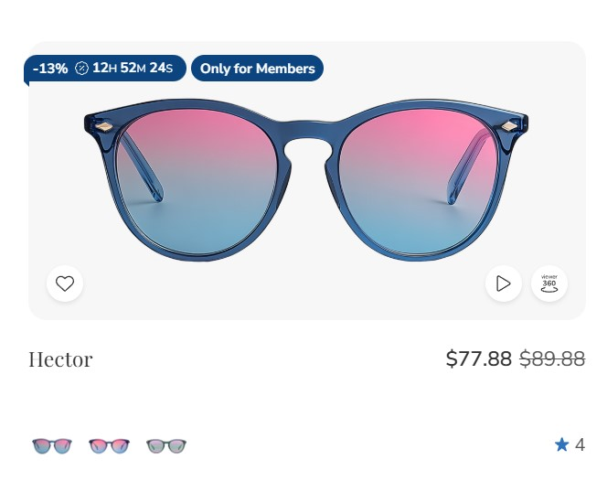{ loading=lazy } | 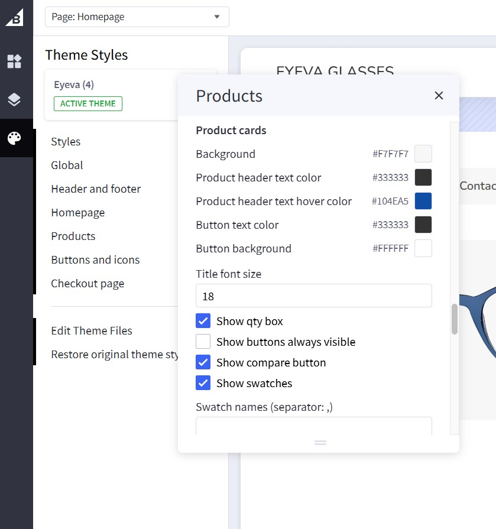{ loading=lazy } | 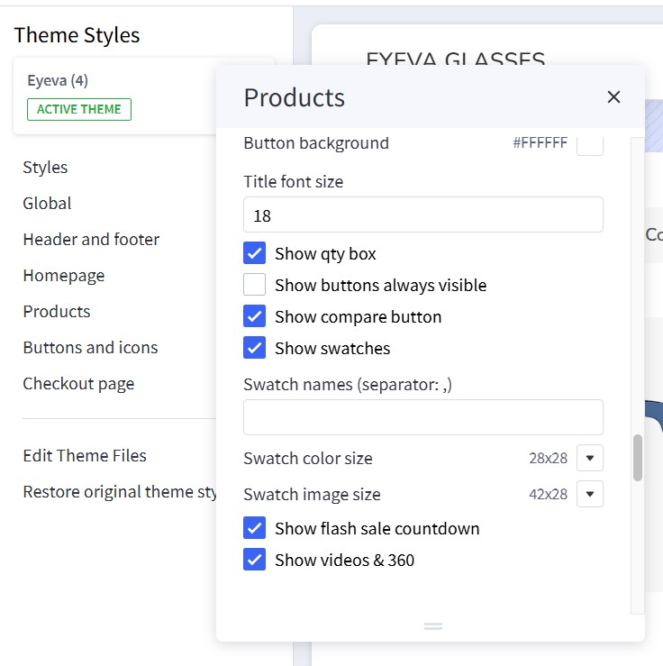{ loading=lazy } |

Configure the display of product cards under **Page Builder** > **Theme Styles** > **Products** > **Product Cards**:


| **Setting**                                           | **Value & Meaning**                                                                                                                                                                                           |
|-------------------------------------------------------|--------------------------------------------------------------------------------------------------------------------------------------------------------------------------------------------------------------|
| **Product Cards**                                      |                                                                                                                                                                                                              |
| Background                                            | **#F7F7F7**<br>Defines the background color of the product cards.                                                                                                                                            |
| Product header text color                              | **#333333**<br>The main color used for product headings (e.g., product name/title).                                                                                                                          |
| Product header text hover color                        | **#104EA5**<br>The color applied to product headings when hovered over by the mouse.                                                                                                                         |
| Button text color                                     | **#333333**<br>The color of text on product card buttons (e.g., “Add to Cart,” “View Details”).                                                                                                              |
| Button background                                     | **#FFFFFF**<br>The background color for product card buttons.                                                                                                                                                |
| Title font size                                       | **18** (px)<br>Font size for the product heading/title.                                                                                                                                                      |
| Show qty box                                          | **Checked**<br>Displays a quantity selector on the product cards (so customers can choose a specific quantity before adding to cart).                                                                        |
| Show buttons always visible                           | **Unchecked**<br>When off, product buttons appear on hover. If turned on, the buttons are displayed at all times.                                                                                            |
| Show compare button                                   | **Checked**<br>Displays a “Compare” button, allowing customers to compare products.                                                                                                                          |
| Show swatches                                         | **Checked**<br>Shows color or image swatches on product cards for variants (e.g., different color options).                                                                                                  |
| Swatch names (separator: , )                         | *(blank)*<br>If you enter text here, swatch names will be displayed alongside swatches, separated by the comma character(s).                                                                                |
| Swatch color size                                     | **28x28**<br>Specifies the width and height (in px) for color swatches.                                                                                                                                       |
| Swatch image size                                     | **42x28**<br>Specifies the width and height (in px) for image swatches.                                                                                                                                       |
| Show flash sale countdown                             | **Checked**<br>Shows a countdown timer if a product is on flash sale (limited-time pricing).                                                                                                                  |
| Show videos & 360                                     | **Checked**<br>Enables display of product videos or 360° spin images if available.                                                                                                                           |

**Notes**:

- All color codes are in hexadecimal format.
- Font sizes are typically measured in **px** unless otherwise specified.
- Checked boxes are **enabled**, unchecked boxes are **disabled** by default.


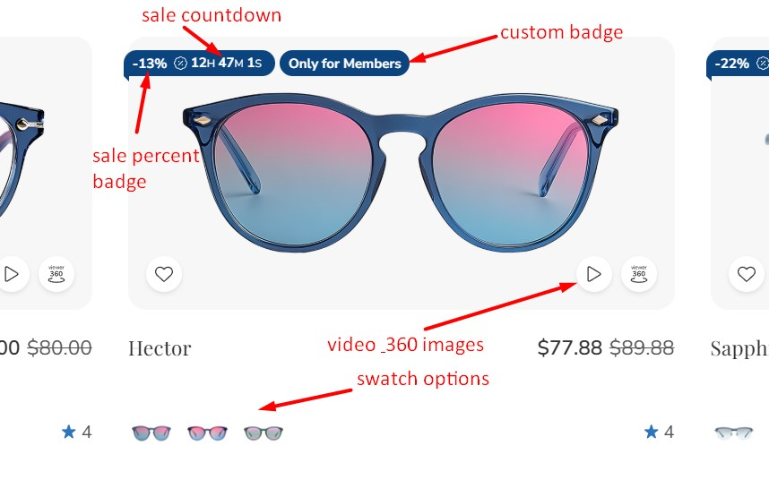{ loading=lazy }


## Hiding Prices for Non-Logged-In Customers

To enable this feature, go to **Settings** > **Display** > **Products Settings** and check the **Hide Product's Price from Guests?** checkbox.

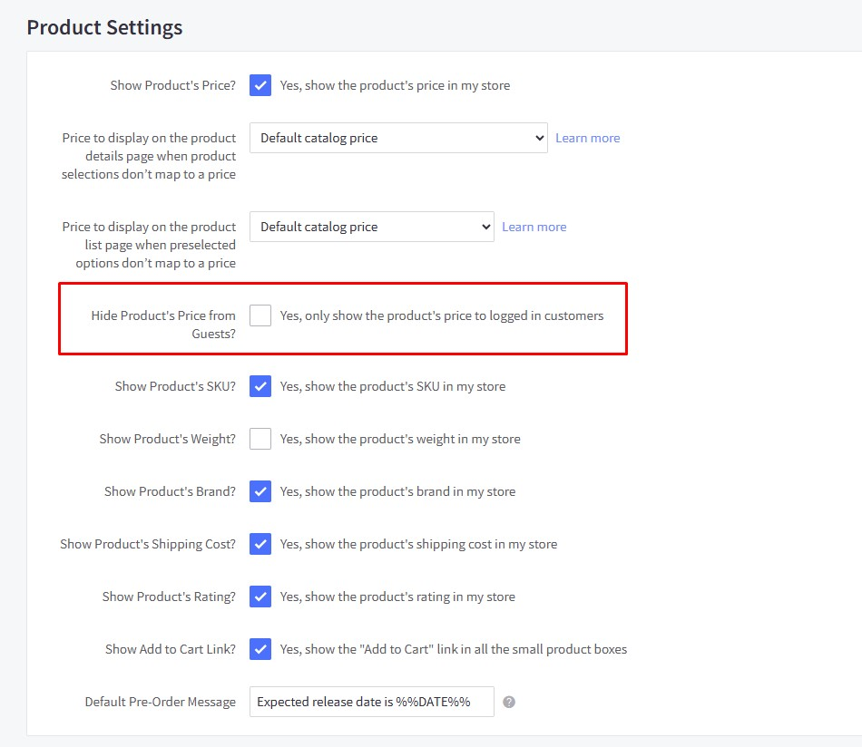{ loading=lazy }

## Showing/Hiding Quick View Button

By default, quick view buttons appear on all product cards. To hide them, go to **Page Builder** > **Theme Styles** > **Products** > **Display Settings** and uncheck the **Show quick view button on product cards** checkbox.

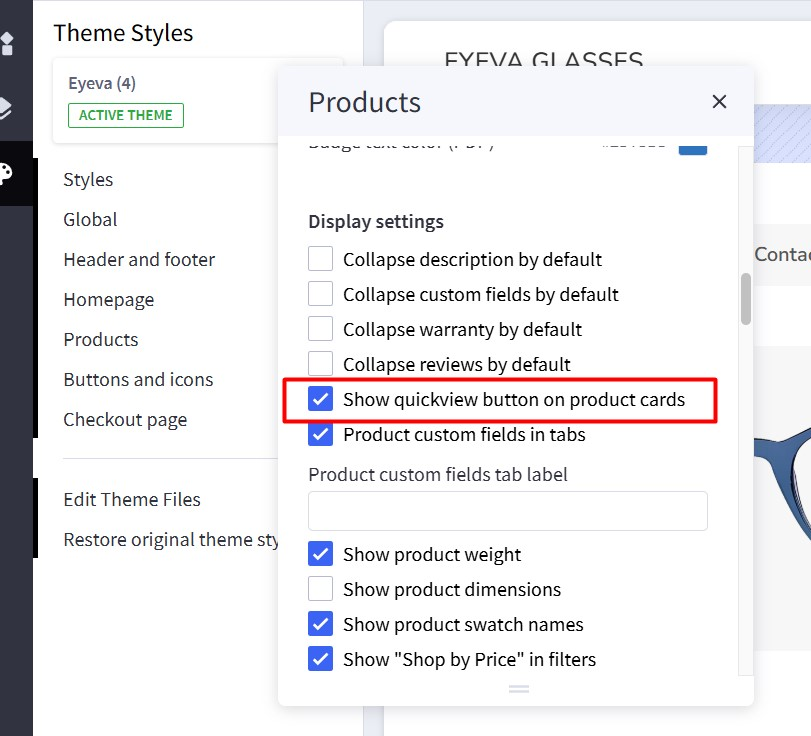{ loading=lazy }

## Displaying Product Weight and Dimensions on PDP

Go to **Page Builder** > **Theme Styles** > **Products** > **Display Settings**.

- Check the **Show product weight** checkbox.
- Check the **Show product dimensions** checkbox.

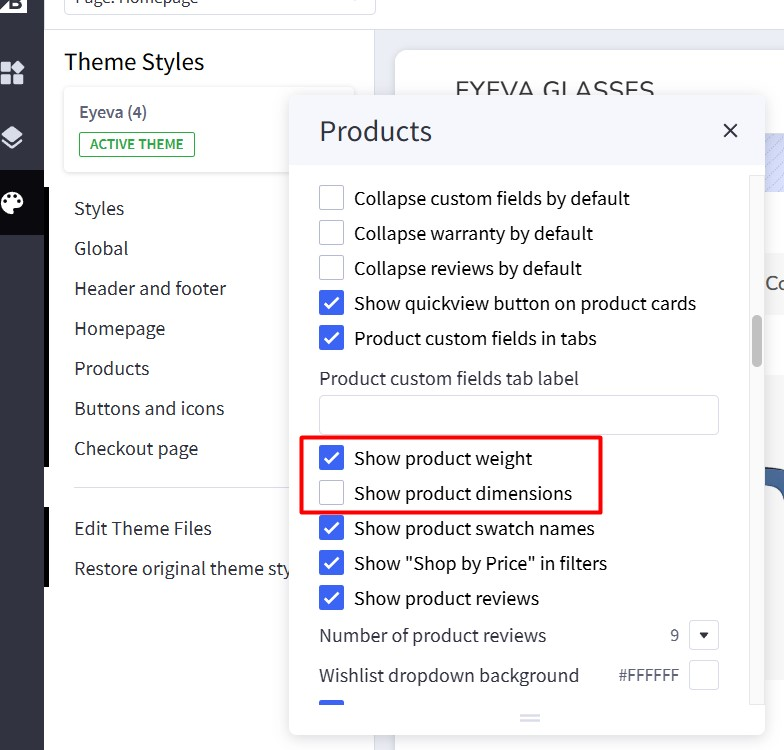{ loading=lazy }

## Displaying Customer Reviews Tab on PDP

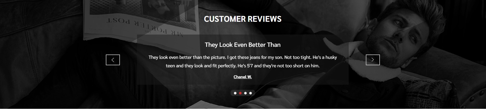{ loading=lazy }

Go to **Page Builder** > **Theme Styles** > **Products** > **Display Settings** and check the **Show product reviews** option.

Specify the number of product reviews to be displayed.

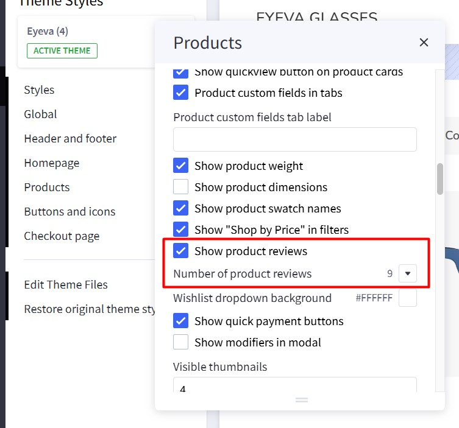{ loading=lazy }

## Display Sale Badges on PDP

Go to **Page Builder** > **Theme Styles** > **Products** > **Product Sale Badges**. In **Show product sale badges**, select the badge type:

-   `Percent`: Displays the badge label with the percentage off.
-   `Label`: Displays only the label.
-   `None`: Hides the badge.

|                                              |                                              |
| :------------------------------------------: | :------------------------------------------: |
| 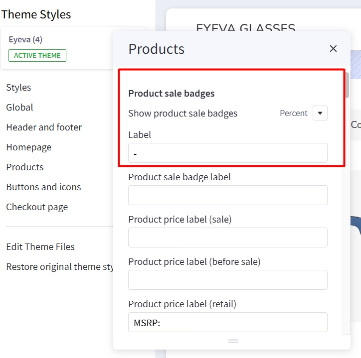{ loading=lazy } | 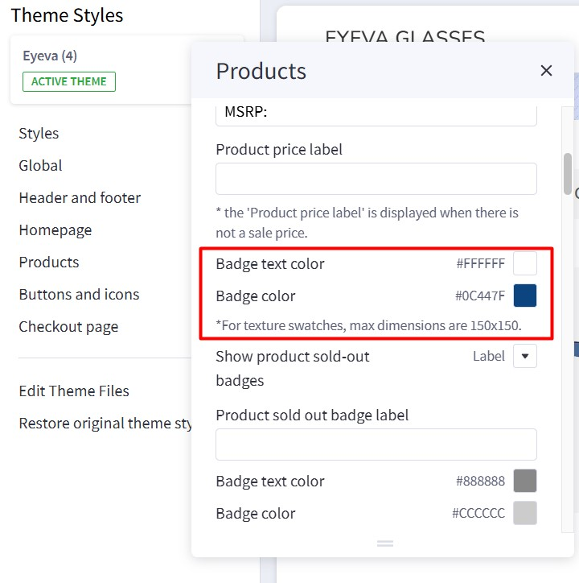{ loading=lazy } |

-   **Label**: Specifies the badge text.
-   **Badge text color**: Specifies the badge text color.
-   **Badge color**: Specifies the badge background color.


## Sold Out Badge

To display a "**Sold Out**" badge, in **Page Builder**, navigate to **Products** and find **Show product sold-out badges**. Select "Label".

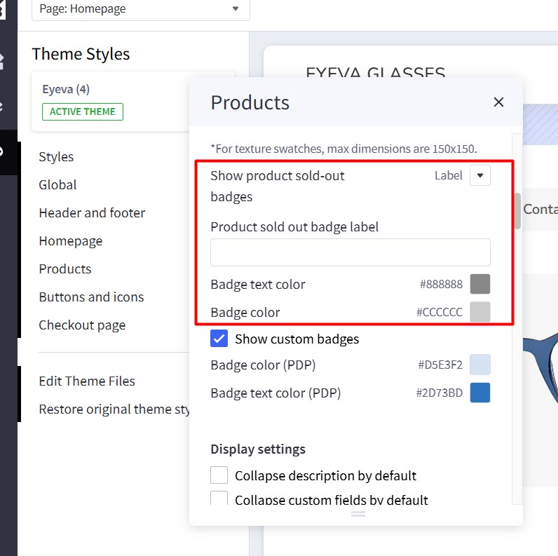{ loading=lazy }

Enter the text to display for the sold-out badge in the **Product sold out badge label** field.

-   **Badge text color**: Specifies the text color.
-   **Badge color**: Specifies the background color.


## Custom Text Badge

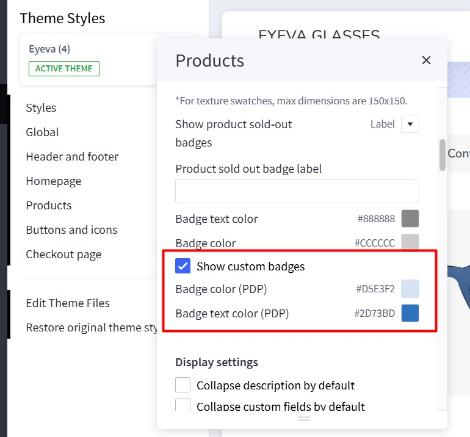{ loading=lazy }

- **Show custom badges**: Enable to display custom badges.
- **Badge color (PDP)**: Background color of the custom badge.
- **Badge text color (PDP)**: Text color of the custom badge.

To add a custom badge to a product, edit the product and add a custom field with the name `__badge`. The value of this field will be the badge text.

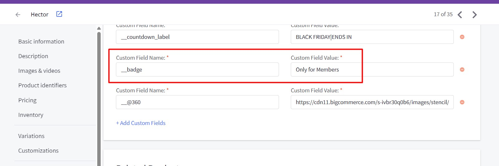{ loading=lazy }

## Customizing Price Labels

You can customize the sale price label, before-sale price label, retail price label, or regular price label in **Page Builder** > **Theme Styles** > **Products** > **Price Labels**.

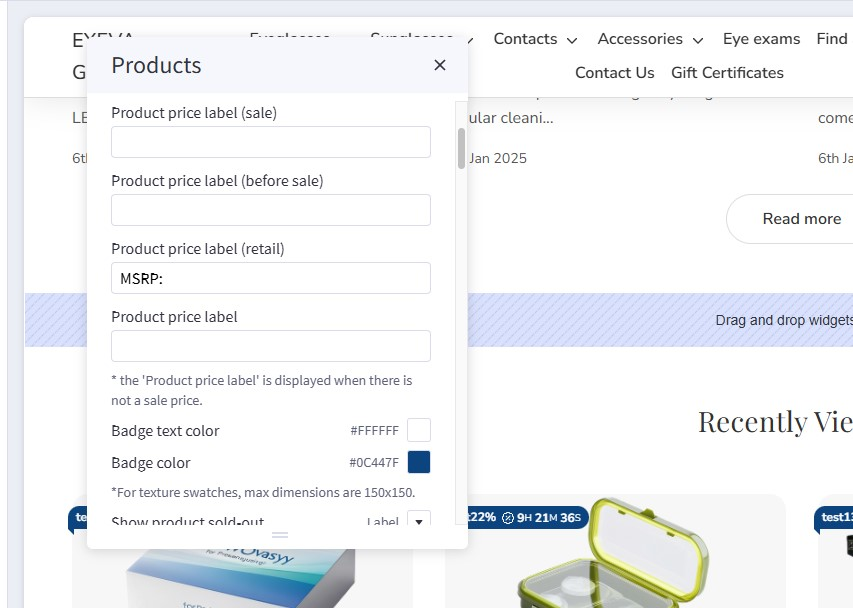{ loading=lazy }

## Displaying Image gallery

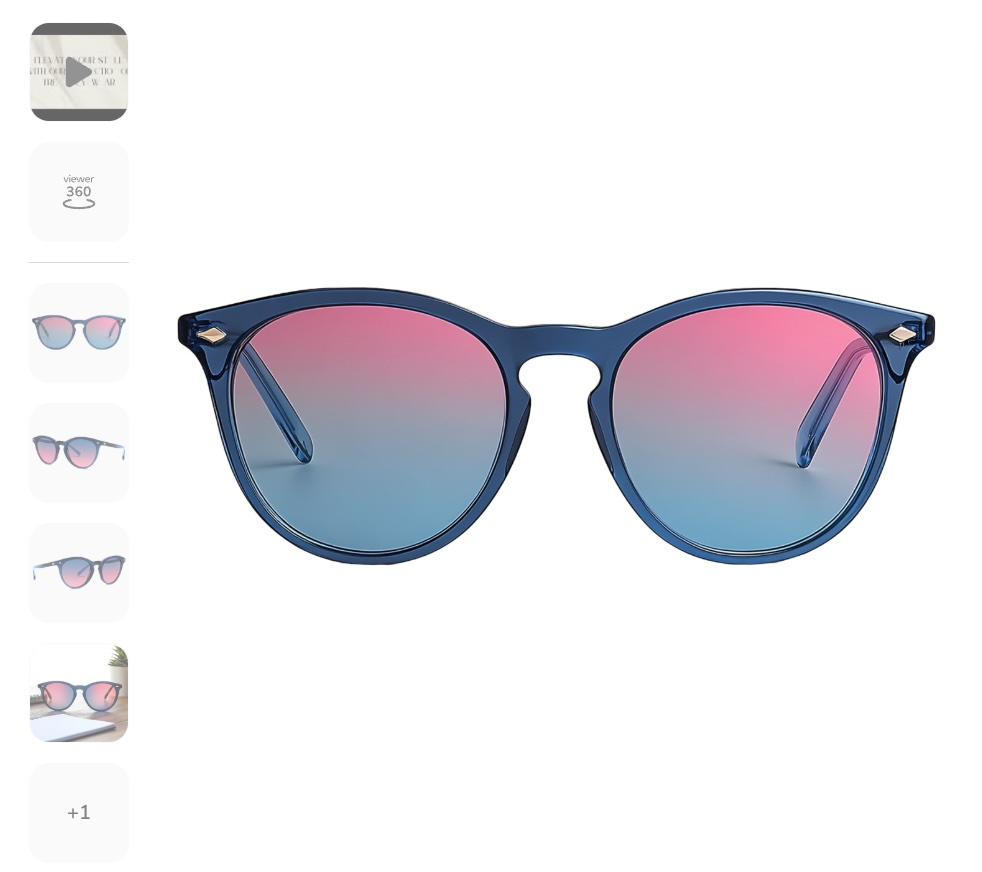{ loading=lazy }

Configure the image gallery in **Page Builder** > **Theme Styles** > **Products** > **Display settings**:

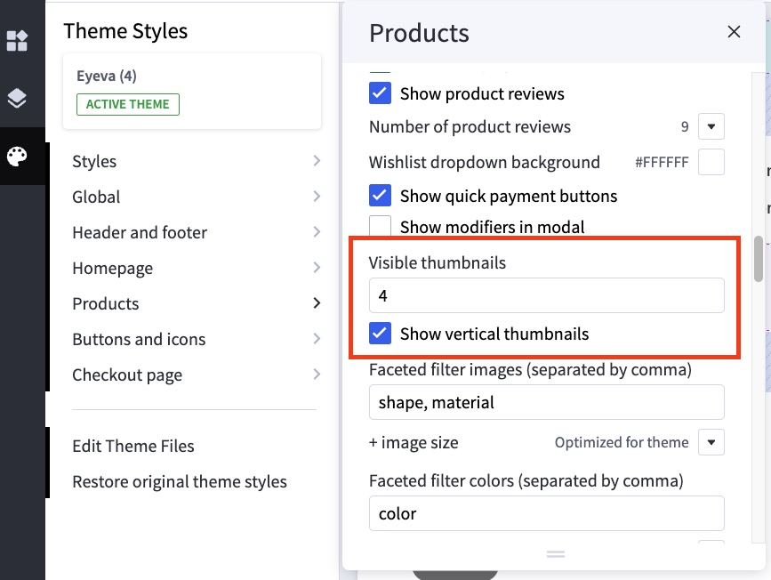{ loading=lazy }


| **Setting**              | **Value & Meaning**                                                                                           |
|--------------------------|----------------------------------------------------------------------------------------------------------------|
| Visible thumbnails       | **4**<br>Specifies how many product thumbnails appear alongside the main product image.                        |
| Show vertical thumbnails | **Checked**<br>Displays product thumbnails in a vertical layout instead of a horizontal row under the main image. |


## Configuring Image Sizes

In **Page Builder** > **Theme Styles** > **Products** > **Image Sizes**, you can configure the following image sizes:

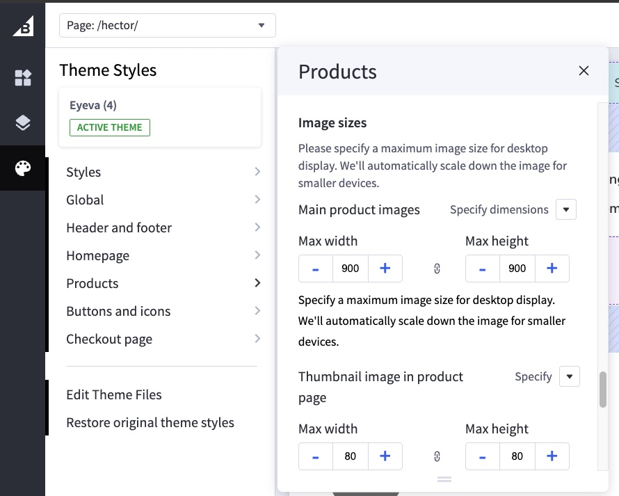{ loading=lazy }

-   **Main product images**: Specify the size of the main product image displayed on the Product Detail Page (PDP).
-   **Thumbnail image**: Specify the size of product thumbnails.
-   **Zoomed image**: Specify the size of the zoomed image.
-   **Image in gallery view**: Specify the size of product card images.

## Shipping Countdown

{ loading=lazy }

To display a shipping countdown on the Product Detail Page (PDP), navigate to **Theme Styles** > **Product Page**. Locate the **Shipping Countdown** field and enter your cut-off time. Find and copy your timezone from Wikipedia ([https://en.wikipedia.org/wiki/List_of_tz_database_time_zones](https://en.wikipedia.org/wiki/List_of_tz_database_time_zones)) and paste it into the **Timezone** field.

To disable the shipping countdown, simply leave the **Shipping Countdown** field empty.

**Note:**

-   Before the cut-off time, the message will display "**Shipping today**"; after the cut-off time, it will display "**Shipping tomorrow**."
-   Weekends are automatically excluded.


## Default states for collapsible elements

In **Page Builder** > **Theme Styles** > **Products** > **Display setting**:

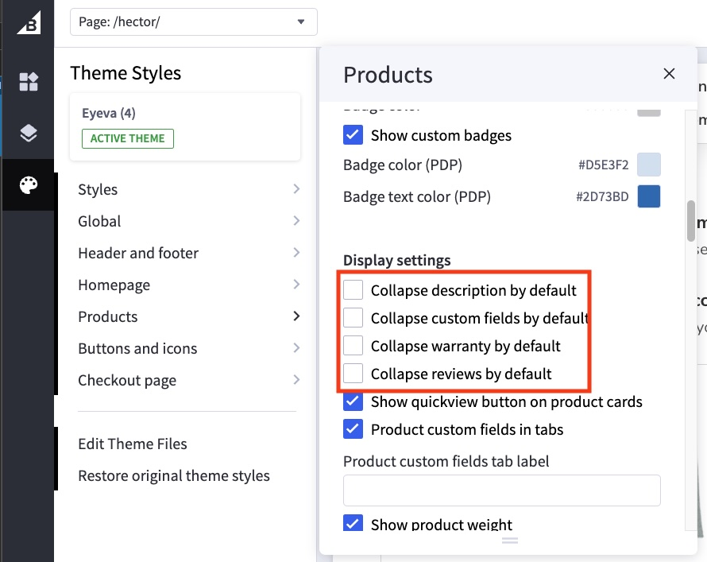{ loading=lazy }


| **Setting**                           | **Value & Meaning**                                                                                      |
|---------------------------------------|-----------------------------------------------------------------------------------------------------------|
| Collapse description by default       | **Unchecked** <br> The product description is expanded by default (not collapsed).                       |
| Collapse custom fields by default     | **Unchecked** <br> Custom fields are expanded by default (not collapsed).                                |
| Collapse warranty by default          | **Unchecked** <br> The product warranty section is expanded by default (not collapsed).                  |
| Collapse reviews by default           | **Unchecked** <br> The reviews section is expanded by default (not collapsed).                           |


## Displaying product custom fields

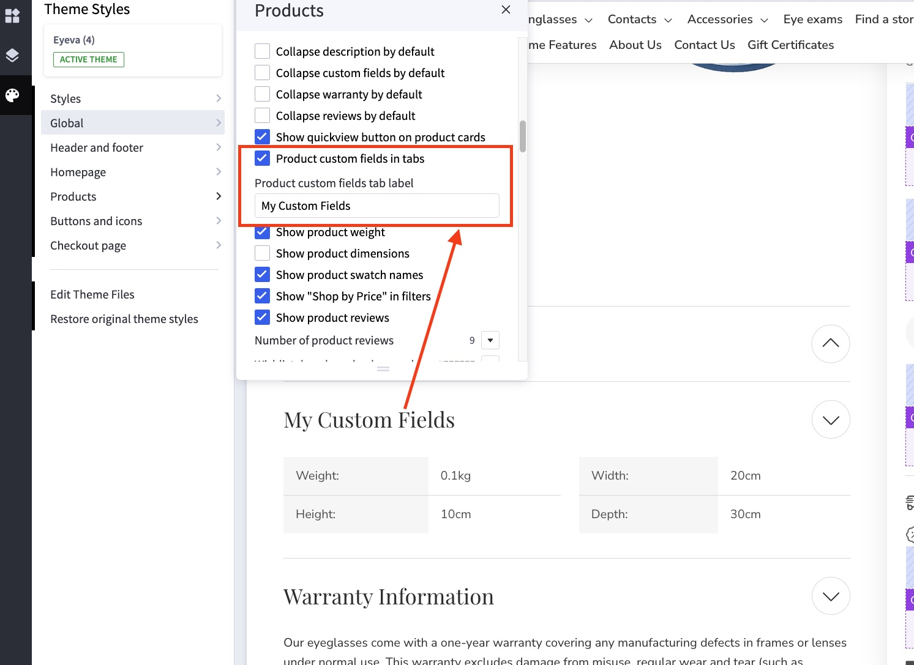{ loading=lazy }

In **Page Builder** > **Theme Styles** > **Products** > **Display setting**:

- Tick **Show custom fields in tab** checkbox.
- Enter the tab title in the next **Product custom fields tab label** box.


## Flash Sales

**On the Product Detail Page (PDP):**

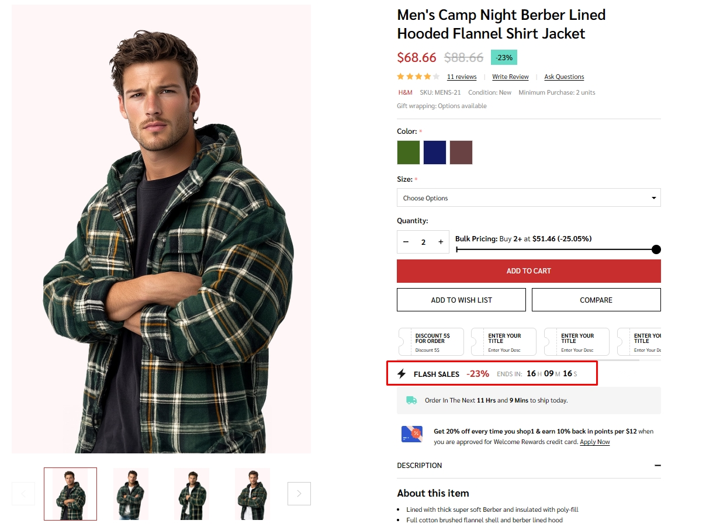{ loading=lazy }

**On the Product Card:**

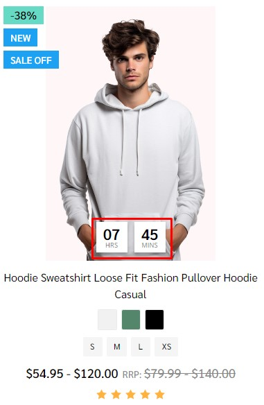{ loading=lazy }

To display flash sales for a product, edit the product and:

1.  Add a product custom field named `__countdown_label` with a value in the format `<your banner name>|<end in>` (e.g., `FLASH SALES|ENDS IN`).
2.  Add a second custom field named `__countdown_date`. The value should be your cut-off time, following this format: `<yyyy>-<mm>-<dd> <hh>:<mm>:<ss><timezone>` (e.g., `2023-03-15 17:00:00-7`).


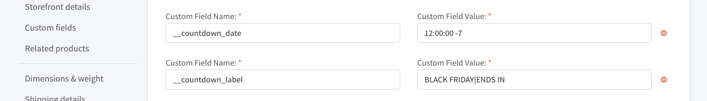{ loading=lazy }

**Note:**

*   `<yyyy>-<mm>-<dd>` is optional. If the date is omitted, the flash sale message will repeat automatically immediately after the cut-off time passes.
*   `<hh>:<mm>:<ss>` uses a 24-hour format.
*   `<timezone>` should only include `+` or `-` followed by a number (e.g., `+7`). If the timezone is not specified, the countdown time may vary across different countries.
*   The product must have a sale price for the Flash Sale to display. Removing the sale price will automatically disable the Flash Sale banner.


## Display Product Modifiers in a Right-Side Modal

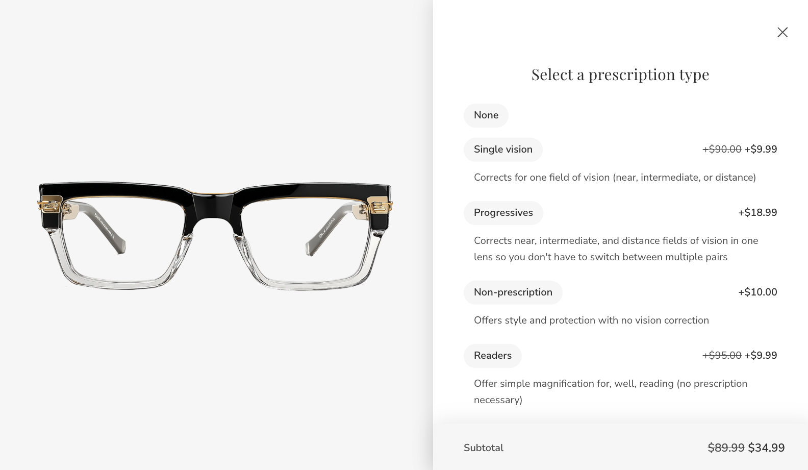{ loading=lazy }

### Enable Product Modifiers Modal

To enable or disable the modifiers modal for specific products, edit the product and add a custom field with the name `__@modifiers_modal` and set its value to `1`.

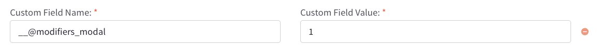{ loading=lazy }

To enable the product modifiers modal for all products without adding a custom field to each, navigate to **Page Builder** > **Products** > **Display Settings** and enable **Show modifiers in modal**.

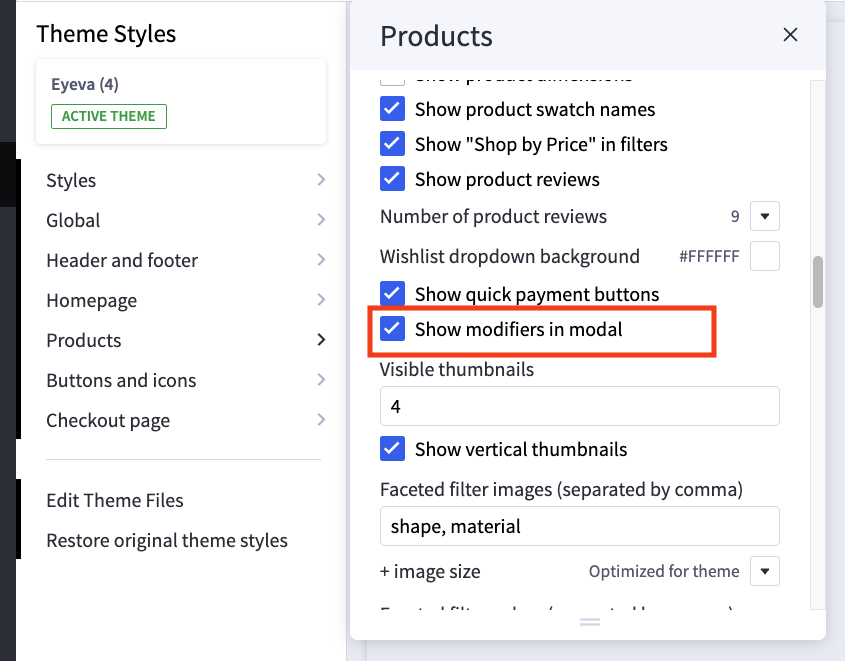{ loading=lazy }


### Customize the "Select Options" Button Text

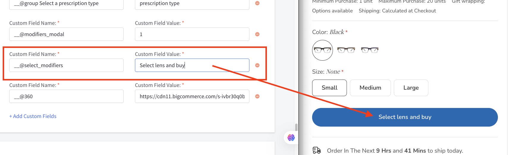{ loading=lazy }

To customize the text of the **"Select Options" button**, add a product custom field named `__@select_modifiers`. Set the value of this field to the desired button text.

### Grouping Modifier Options

By default, each modifier option is displayed step-by-step. To group multiple options into a single step within the option modal, set the **Custom Field Name** to `__@group [title]` and the **Custom Field Value** to a semicolon-separated list of option names you want to group together (e.g., `Option Names;Option Name`).

**Custom field:**

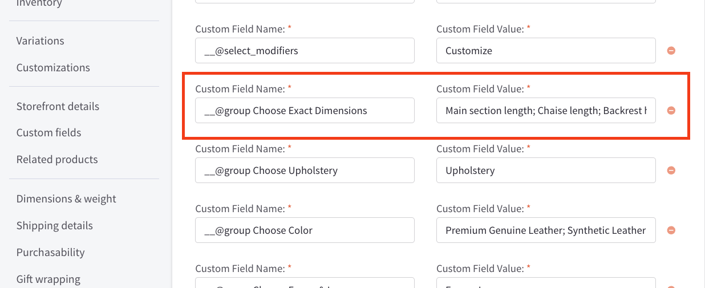{ loading=lazy }

**Result:**

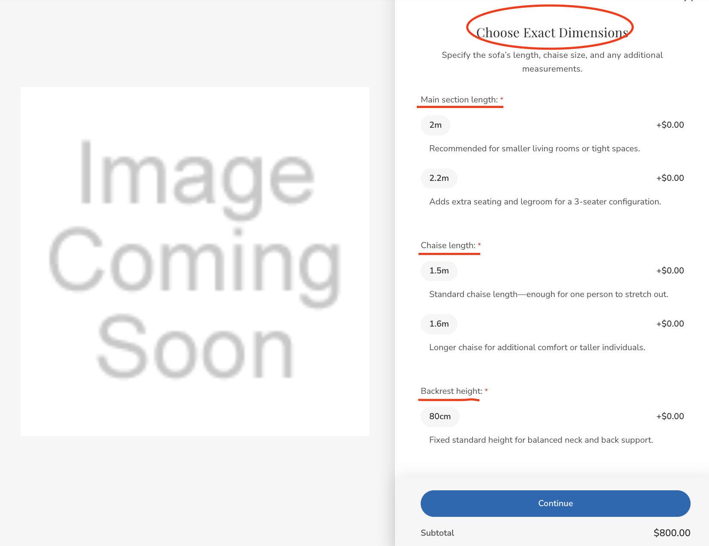{ loading=lazy }

### Customize the Modal Title of Each Modifier Option

By default, the modal title mirrors the modifier option name. To customize the title of a specific modifier option within the modal, create a custom field named `__@rename [title to be changed]` and assign the desired new title as its value.

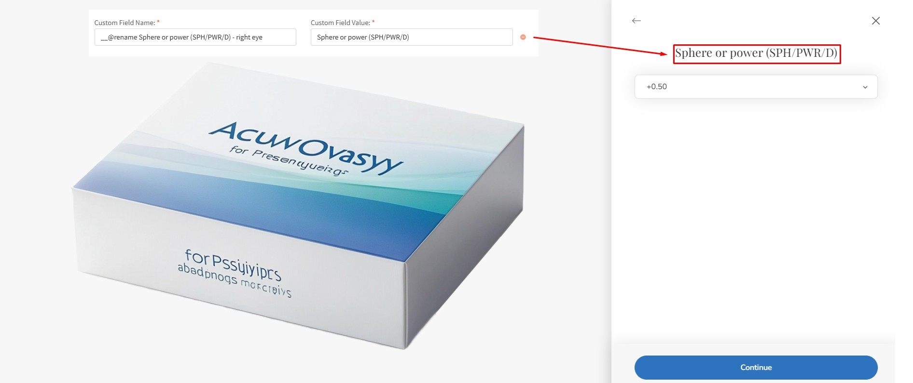{ loading=lazy }


### Add tooltip to Modifier Option Modal

**Display tooltip for option value:**

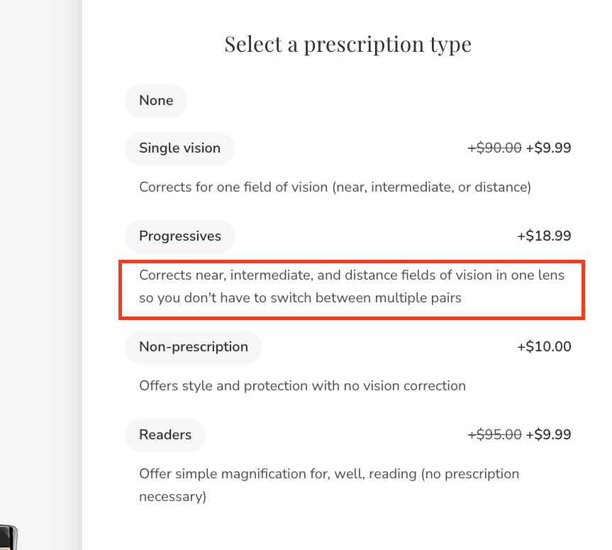{ loading=lazy }

Add custom field name `__@tooltip [Option Name]: [Value]` and set the custom field value to the desired description of the value:

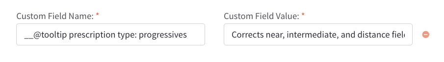{ loading=lazy }

**Display tooltip heading for option value:**

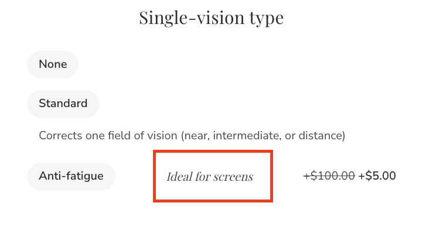{ loading=lazy }

Add custom field name `__@tooltip_heading [Option Name]: [Value]` and set the custom field value to the desired description of the value:

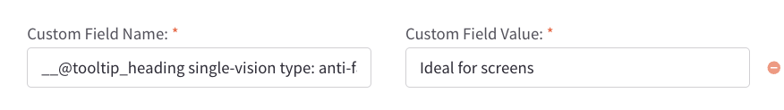{ loading=lazy }

**Display tooltip for option:**

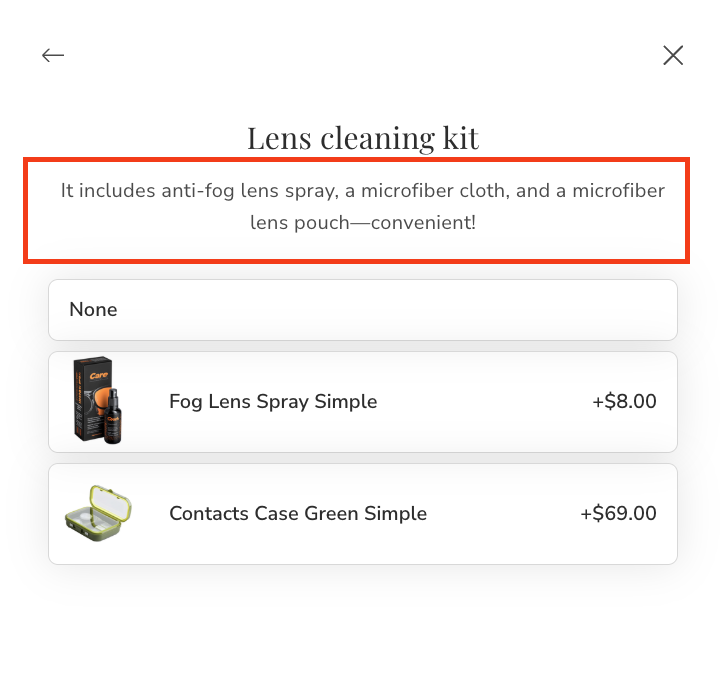{ loading=lazy }

Add custom field name `__@tooltip [Option Name]` and set the custom field value to the desired description of the option:

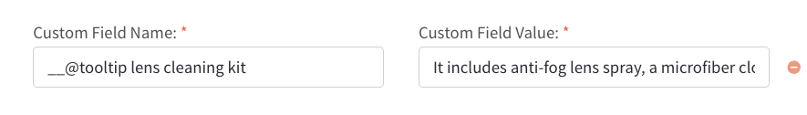{ loading=lazy }


## Displaying 360-Degree Images

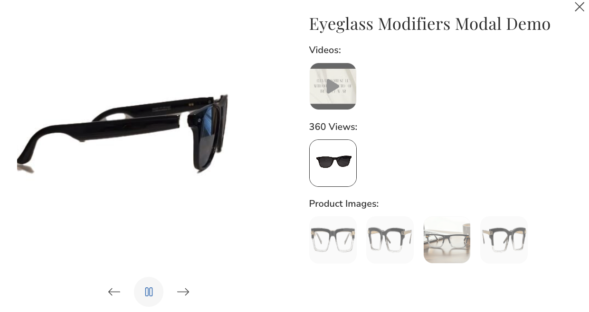{ loading=lazy }

To showcase a 360-degree image gallery on your Product Detail Page (PDP), begin by uploading the 360-degree image to your Image Manager and copying its link:

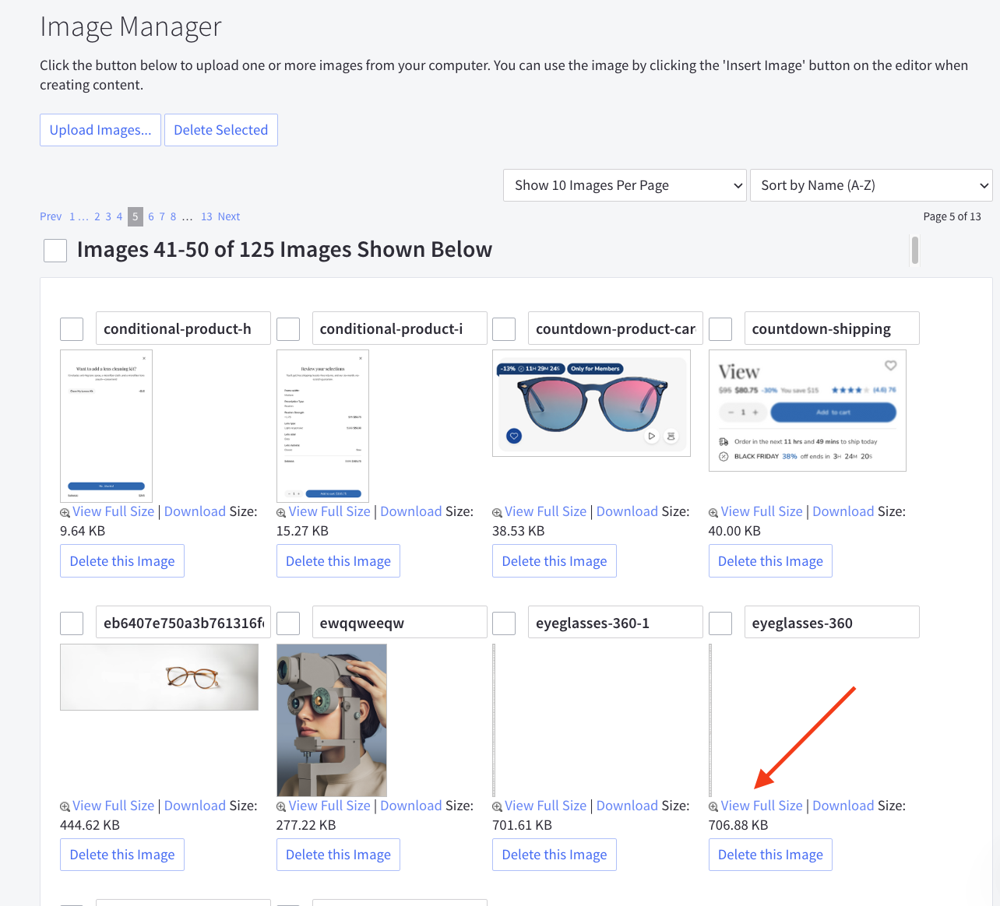{ loading=lazy }

Next, edit the product and add a custom field named `__@360`.  Assign the image link as the value for this field. To display multiple 360-degree images, simply add additional custom fields using the same name.

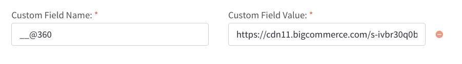{ loading=lazy }

If your image sequence contains, for example, 90 frames, append `#90` to the end of the image link.  For example: `https://cdn11.bigcommerce.com/s-ivbr30q0b6/images/stencil/original/image-manager/eyeglasses-360-1.jpg?t=1736752328#90`

You can download a sample 360-degree image here: [https://cdn11.bigcommerce.com/s-ivbr30q0b6/images/stencil/original/image-manager/eyeglasses-360-1.jpg](https://cdn11.bigcommerce.com/s-ivbr30q0b6/images/stencil/original/image-manager/eyeglasses-360-1.jpg)


## Variant Options Stepper

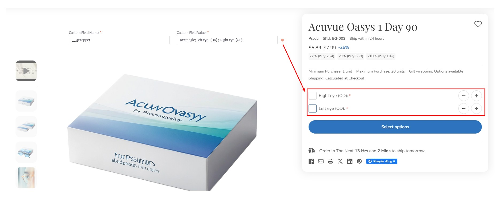{ loading=lazy }

To create variant options with a Rectangle List type, follow these steps:

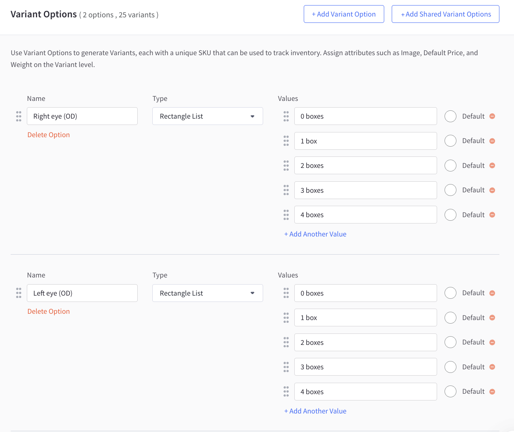{ loading=lazy }

Next, add a custom field named `__@stepper`. The value of this field should contain the option names, separated by semicolons (;).

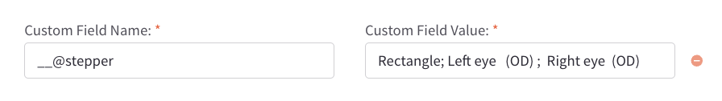{ loading=lazy }

For example:

- Custom Field Name: `__@stepper`
- Custom Field Value: `Left eye (OD); Right eye (OS)`


## Eyeglasses Product Description Template

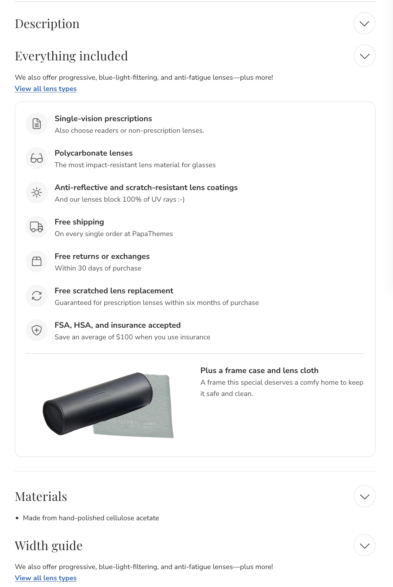{ loading=lazy }

To use our pre-designed eyeglasses product description template, edit your product description, select the **Source code** button, and paste the code provided below:

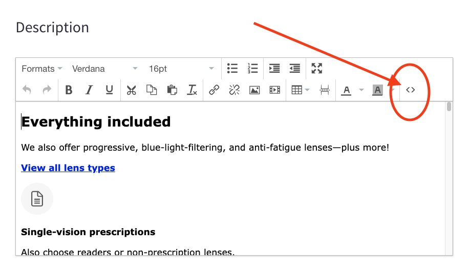{ loading=lazy }

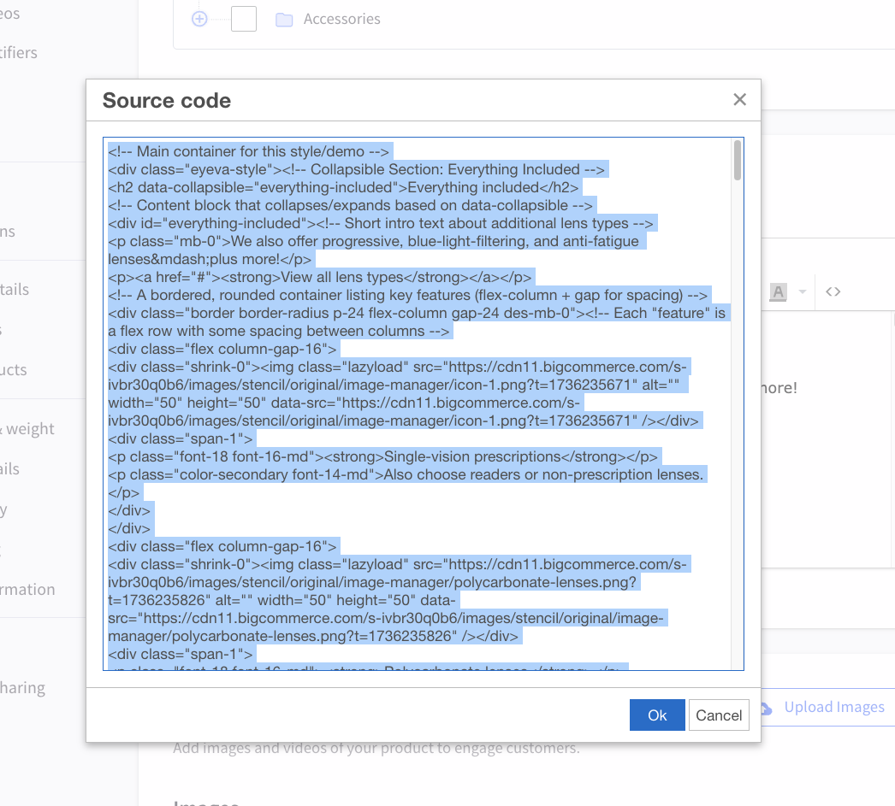{ loading=lazy }


```html
<!-- Main container for this style/demo -->
<div class="eyeva-style"><!-- Collapsible Section: Everything Included -->
<h2 data-collapsible="everything-included">Everything included</h2>
<!-- Content block that collapses/expands based on data-collapsible -->
<div id="everything-included"><!-- Short intro text about additional lens types -->
<p class="mb-0">We also offer progressive, blue-light-filtering, and anti-fatigue lenses&mdash;plus more!</p>
<p><a href="#"><strong>View all lens types</strong></a></p>
<!-- A bordered, rounded container listing key features (flex-column + gap for spacing) -->
<div class="border border-radius p-24 flex-column gap-24 des-mb-0"><!-- Each "feature" is a flex row with some spacing between columns -->
<div class="flex column-gap-16">
<div class="shrink-0"></div>
<div class="span-1">
<p class="font-18 font-16-md"><strong>Single-vision prescriptions</strong></p>
<p class="color-secondary font-14-md">Also choose readers or non-prescription lenses.</p>
</div>
</div>
<div class="flex column-gap-16">
<div class="shrink-0"></div>
<div class="span-1">
<p class="font-18 font-16-md"><strong>Polycarbonate lenses</strong></p>
<p class="color-secondary font-14-md">The most impact-resistant lens material for glasses</p>
</div>
</div>
<div class="flex column-gap-16">
<div class="shrink-0"></div>
<div class="span-1">
<p class="font-18 font-16-md"><strong>Anti-reflective and scratch-resistant lens coatings</strong></p>
<p class="color-secondary font-14-md">And our lenses block 100% of UV rays :-)</p>
</div>
</div>
<div class="flex column-gap-16">
<div class="shrink-0"></div>
<div class="span-1">
<p class="font-18 font-16-md"><strong>Free shipping</strong></p>
<p class="color-secondary font-14-md">On every single order at PapaThemes</p>
</div>
</div>
<div class="flex column-gap-16">
<div class="shrink-0"></div>
<div class="span-1">
<p class="font-18 font-16-md"><strong>Free returns or exchanges</strong></p>
<p class="color-secondary font-14-md">Within 30 days of purchase</p>
</div>
</div>
<div class="flex column-gap-16">
<div class="shrink-0"></div>
<div>
<p class="font-18 font-16-md"><strong>Free scratched lens replacement</strong></p>
<p class="color-secondary font-14-md">Guaranteed for prescription lenses within six months of purchase</p>
</div>
</div>
<div class="flex column-gap-16">
<div class="shrink-0"></div>
<div class="span-1">
<p class="font-18 font-16-md"><strong>FSA, HSA, and insurance accepted</strong></p>
<p class="color-secondary font-14-md">Save an average of $100 when you use insurance</p>
</div>
</div>
<!-- Horizontal rule within the "everything included" section --><hr class="m-0" /><!-- Another feature row with an image and description -->
<div class="flex gap-24">
<div class="span-1"></div>
<div class="span-1">
<p class="font-18 font-16-md"><strong>Plus a frame case and lens cloth</strong></p>
<p class="color-secondary font-14-md">A frame this special deserves a comfy home to keep it safe and clean.</p>
</div>
</div>
</div>
</div>
<!-- /#everything-included --> <!-- Horizontal rule separating sections --><hr /><!-- Collapsible Section: Materials -->
<h2 data-collapsible="materials">Materials</h2>
<div id="materials">
<ul>
<li>Made from hand-polished cellulose acetate</li>
</ul>
</div>
<!-- Collapsible Section: Width Guide -->
<h2 data-collapsible="width-guide">Width guide</h2>
<div id="width-guide">
<p class="mb-0">We also offer progressive, blue-light-filtering, and anti-fatigue lenses&mdash;plus more!</p>
<p><a href="#"><strong>View all lens types</strong></a></p>
<!-- Bordered container for the width guide info -->
<div class="border border-radius mb-16 des-mb-0"><!-- Row with image and text, using .flex for layout -->
<div class="flex p-24 gap-24">
<div class="shrink-0"></div>
<div class="span-1">
<p class="font-18 font-16-md"><strong>Frame widths</strong></p>
<p class="color-secondary font-14-md">Our widths are determined by the overall frame width. Choose a width that best corresponds with your own face. (You won&rsquo;t find this number on glasses.)</p>
</div>
</div>
<!-- A filler line and text about the "Medium" size -->
<div class="fill-alt py-12 px-16 border-y">Medium</div>
<div class="py-12 px-16">137mm</div>
</div>
<!-- /.border-radius -->
<p><a href="#" data-collapsible="other-measurements">Other measurements</a></p>
<!-- Another collapsible area for other measurements -->
<div id="other-measurements" class="border border-radius mb-16 des-mb-0">
<div class="flex flex-column-md p-24 gap-24">
<div class="shrink-0 shrink-1-md"></div>
<div class="span-1">
<p class="font-18 font-16-md"><strong>Compare <code>lens width</code> with <code>bridge - temple length</code> with your glasses</strong></p>
<p class="color-secondary font-14-md">For most glasses, these measurements are found on the inside of the temple arm. If you have a pair you like, compare it to these measurements.</p>
<p class="mb-16"><a href="#" data-collapsible="what-do-these-measurements-mean">What do these measurements mean?</a></p>
<!-- Additional info block with some background shading -->
<div class="fill-alt border-radius p-16 flex-column gap-24"><!-- Repeating features, each with an image and a short description -->
<div class="flex gap-24">
<div class="shrink-0"></div>
<div class="span-1">
<p><strong>Lens width</strong></p>
<p class="color-secondary font-14-md">The horizontal diameter of one lens (and the first measurement in the series)</p>
</div>
</div>
<div class="flex gap-24">
<div class="shrink-0"></div>
<div class="span-1">
<p><strong>Bridge</strong></p>
<p class="color-secondary font-14-md">The width of the bridge (and the second measurement in the series)</p>
</div>
</div>
<div class="flex gap-24">
<div class="shrink-0"></div>
<div class="span-1">
<p><strong>Temple length</strong></p>
<p class="color-secondary font-14-md">The length of the entire temple arm, from the front to the tip (and the last measurement)</p>
</div>
</div>
</div>
<!-- /.fill-alt --></div>
<!-- /.span-1 --></div>
<!-- /.flex --> <!-- A row showing column headers for lens width, bridge, temple length -->
<div class="fill-alt flex child-span-1 border-y color-secondary font-14-md">
<div class="py-12 px-16">&nbsp;</div>
<div class="py-12 px-16 border-left">Lens width</div>
<div class="py-12 px-16 border-left">Bridge</div>
<div class="py-12 px-16 border-left">Temple length</div>
</div>
<!-- A row with actual measurements for "Medium" frame sizing -->
<div class="flex child-span-1 font-14-md">
<div class="fill-alt py-12 px-16 color-secondary">Medium</div>
<div class="py-12 px-16 border-left">50mm</div>
<div class="py-12 px-16 border-left">20mm</div>
<div class="py-12 px-16 border-left">140mm</div>
</div>
</div>
<!-- /#other-measurements --> <!-- A horizontal flex container with a bold heading and a button link -->
<div class="flex flex-column-md border border-radius p-24 gap-24 align-items-center align-items-start-md des-mb-0">
<div class="span-1"><strong class="font-18 font-16-md">Don't have a pair of glasses?</strong></div>
<div class="shrink-0"><a class="button button--outline" href="#"> Measure using a credit card </a></div>
</div>
<!-- Section: Prescription and lens types offered -->
<h2 data-collapsible="prescription-and-lens-types-offered">Prescription and lens types offered</h2>
<div id="prescription-and-lens-types-offered">
<p><a class="button button--outline mb-0" href="#">Learn more in our lens guide</a></p>
<!-- "Prescription type" table-like layout -->
<div class="flex flex-column-md border border-radius mb-16">
<div class="span-1 p-24"><strong class="font-18 font-16-md">Prescription type</strong></div>
<div class="span-2 flex-column border-left font-14-md"><!-- Header row with fill-alt background and two columns -->
<div class="flex child-py-12 child-px-16">
<div class="span-1 fill-alt">&nbsp;</div>
<div class="span-1 fill-alt border-left">Starting price</div>
</div>
<!-- Progressive listing row -->
<div class="flex child-py-12 child-px-16 border-top">
<div class="span-1 fill-alt">Single-vision</div>
<div class="span-1 border-left"><s>$95</s> <strong>$80.75</strong></div>
</div>
<div class="flex child-py-12 child-px-16 border-top">
<div class="span-1 fill-alt">Progressive</div>
<div class="span-1 border-left"><s>$295</s> <strong>$250.75</strong></div>
</div>
<div class="flex child-py-12 child-px-16 border-top">
<div class="span-1 fill-alt">Readers</div>
<div class="span-1 border-left"><s>$95</s> <strong>$80.75</div>
</div>
<div class="flex child-py-12 child-px-16 border-top">
<div class="span-1 fill-alt">Non-prescription</div>
<div class="span-1 border-left"><s>$95</s> <strong>$80.75</strong></div>
</div>
</div>
</div>
<!-- /.flex border --> <!-- "Lens type" table-like layout -->
<div class="flex flex-column-md border border-radius mb-16"><!-- Left label column -->
<div class="span-1 p-24"><strong class="font-18 font-16-md">Lens type</strong></div>
<!-- Right column with stacked rows -->
<div class="span-2 flex-column border-left font-14-md"><!-- Header row with two columns, second has border-left -->
<div class="flex child-py-12 child-px-16">
<div class="span-1 fill-alt">&nbsp;</div>
<div class="span-1 fill-alt border-left">Additional cost</div>
</div>
<!-- Each subsequent row has border-top and two columns -->
<div class="flex child-py-12 child-px-16 border-top">
<div class="span-1 fill-alt">Classic</div>
<div class="span-1 border-left">Free</div>
</div>
<div class="flex child-py-12 child-px-16 border-top">
<div class="span-1 fill-alt">Blue-light filtering</div>
<div class="span-1 border-left"><s>$50</s> <strong>$42.50</strong></div>
</div>
<div class="flex child-py-12 child-px-16 border-top">
<div class="span-1 fill-alt">Anti-fatigue</div>
<div class="span-1 border-left"><s>$50</s> <strong>$42.50</strong></div>
</div>
<div class="flex child-py-12 child-px-16 border-top">
<div class="span-1 fill-alt">Light-responsive</div>
<div class="span-1 border-left"><s>$100</s> <strong>$85</strong></div>
</div>
</div>
<!-- /.span-2.flex-column --></div>
<!-- /Lens type block --> <!-- "Lens material" table-like layout -->
<div class="flex flex-column-md border border-radius"><!-- Left column for title -->
<div class="span-1 p-24"><strong class="font-18 font-16-md">Lens material</strong></div>
<!-- Right column with stacked rows -->
<div class="span-2 flex-column border-left font-14-md"><!-- Header row -->
<div class="flex child-py-12 child-px-16">
<div class="span-1 fill-alt">&nbsp;</div>
<div class="span-1 fill-alt border-left">Additional cost</div>
</div>
<!-- Material row: Polycarbonate -->
<div class="flex child-py-12 child-px-16 border-top">
<div class="span-1 fill-alt">Polycarbonate</div>
<div class="span-1 border-left">Free</div>
</div>
<!-- Material row: 1.67 high-index -->
<div class="flex child-py-12 child-px-16 border-top">
<div class="span-1 fill-alt">1.67 high-index</div>
<div class="span-1 border-left"><s>$50</s> <strong>$42.50</strong></div>
</div>
</div>
<!-- /.span-2.flex-column --></div>
<!-- /Lens material block --></div>
<!-- /#prescription-and-lens-types-offered --></div>
<!-- /#width-guide --> <!-- Collapsible Section: Need a Prescription? -->
<h2 data-collapsible="need-a-prescription">Need a prescription?</h2>
<div id="need-a-prescription"><!-- Option #1: In-person eye exam -->
<div class="border border-radius p-24 flex gap-24 mb-16">
<div class="shrink-0"></div>
<div class="span-1">
<p class="font-18 font-16-md mb-0"><strong>Book an in-person eye exam</strong></p>
<p class="color-secondary font-14-md">Meet with an eye doctor at one of our stores for a new prescription and eye health check.</p>
<a class="button button--outline" href="#">Schedule an exam</a></div>
</div>
</div>
<!-- Option #2: Renew at home -->
<div class="border border-radius p-24 flex gap-24 mb-16">
<div class="shrink-0"></div>
<div class="span-1">
<p class="font-18 font-16-md mb-0"><strong>Renew your prescription at home</strong></p>
<p class="color-secondary font-14-md">If your vision hasn't changed, use Virtual Vision Test on an iPhone to renew your prescription from home.</p>
<a class="button button--outline" href="#">Renew your prescription</a></div>
</div>
</div>
<!-- Already have a prescription? -->
<p class="font-18 font-16-md mb-0"><strong>Already have a non-expired prescription?</strong></p>
<p class="color-secondary font-14-md">During checkout, you'll be able to upload it, have us contact your doctor to retrieve it, or send it after you place your order.</p>
<!-- /#need-a-prescription -->
<p>&nbsp;</p>
```

Save your changes. The product description will now display as shown in the image above.
### HTML Code Details

Here's a breakdown of the classes and attributes used in the HTML code:

| Class / Attribute           | Description / Usage                                                                                                         |
|---------------------------------|--------------------------------------------------------------------------------------------------------------------------------|
| `.eyeva-style` | Main class to apply utility classes. |
| `.flex` | Enables flexbox layout, aligning children in a row or column. |
| `.flex-column-md`           | At tablet screen sizes and smaller, this stacks the flex items vertically.                                        |
| `.gap-24`, `.column-gap-16` | Adds consistent spacing (24px or 16px) between flex items.                                                                         |
| `.shrink-0`, `.shrink-1-md` | Controls how flex items shrink. `.shrink-0` prevents shrinking, while `.shrink-1-md` allows shrinking on tablet screens and below.        |
| `.span-1`, `.span-2`        | Defines the number of columns an element spans within a flex or grid layout.                                         |
| `.child-span-1`            | Applies `.span-1` (or similar) to all direct children of the container.                                                     |
| `.child-py-12`, `.child-px-16` | Adds uniform vertical (12px) or horizontal (16px) padding to all direct children.                                           |
| `.border`, `.border-radius` | Adds a 1px border and rounds the corners of an element.                                                                           |
| `.border-y`, `.border-left`, `.border-top` | Applies a border to specific sides: top/bottom, left, or top.                                                   |
| `.fill-alt`                 | Used for alternate background colors, often a light shade to distinguish rows or blocks.                            |
| `.p-24`, `.py-12`, `.px-16` | Utility classes for padding: `.p-24` adds 24px padding on all sides; `.py-12` adds 12px to top/bottom; `.px-16` adds 16px to left/right.                 |
| `.mb-0`, `.des-mb-0`        | Removes bottom margin (`margin-bottom: 0`). The `des-` prefix might target descendent elements.                        |
| `.font-18`, `.font-16-md`, `.font-14-md` | Utility classes for font sizes at different screen sizes (e.g., 18px on desktop, 16px on tablet and below).                    |
| `.color-secondary`          | Applies a secondary color to text.                                                                                             |
| `.button.button--outline`   | Styles an element as an outlined button.                                                                           |
| `data-collapsible="example"` | A custom attribute that toggles collapsible sections. JavaScript typically targets elements with this attribute and shows/hides the corresponding content. |

**How `data-collapsible` Works:**

- Each heading or link with `data-collapsible="section-id"` is linked to a `<div id="section-id">` block.
- Clicking the heading/link toggles the visibility of the `div` with the matching `id`.

These classes and the `data-collapsible` attribute work together to create a well-structured, responsive, and collapsible layout, minimizing the need for extensive custom CSS or JavaScript.
